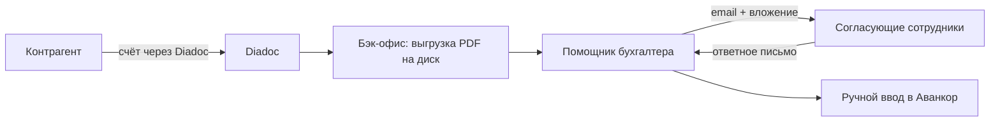
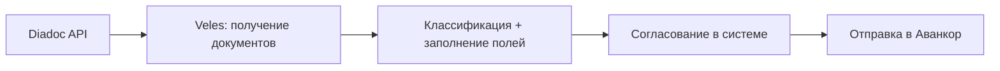
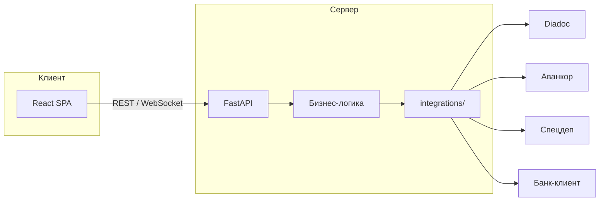

# Veles — автоматизация документооборота УК ПИФ

> Справочный документ проекта. Использовать как контекст при разработке прототипа.

## 1. Обзор

**Veles** — IT-продукт для автоматизации рутинных операций управляющей компании паевых инвестиционных фондов (ПИФ).

**Роль консультанта:** разработка **прототипа** (Streamlit) и проектирование **продакшен-сервиса** (FastAPI + React), который сокращает ручной труд бухгалтерского отдела и отдела сопровождения операций.

**Масштаб:** в управлении компании находится около **20 фондов**. Автоматизация распознавания и внесения документов критична для скорости работы и масштабирования бизнеса.

---

## 2. Контекст бизнеса

Управляющая компания занимается управлением недвижимостью, в том числе **коммерческой недвижимостью**.

### 2.1. Блок: обслуживание зданий

- Найм персонала (обслуживание, охрана, ремонт торговых помещений)
- Оплата коммунальных и прочих расходов (вода, газ, электричество и т.д.)
- Прочие операционные расходы по объектам

### 2.2. Блок: сдача помещений в аренду

- Взаимодействие с арендаторами
- Выставление счетов
- Подписание актов и прочих документов с арендаторами

---

## 3. Текущий процесс (as-is)



### Шаги

1. Подрядчик или контрагент присылает счёт (или другой документ) через **Diadoc** (используются защищённые цифровые подписи — поэтому выбран именно этот канал).
2. Сотрудники бэк-офиса **выгружают PDF** из Diadoc в папку на диске.
3. PDF передаётся **помощнику бухгалтера**.
4. Помощник бухгалтера **отправляет файл по email** на согласование нескольким сотрудникам и **ждёт ответного письма** с согласованием.
5. После согласования помощник бухгалтера **вручную заводит счёт** в **Аванкор** (программа на базе 1С, специализированная для управления ПИФами).

### Проблемы

- Лишние операции пересылки файлов по почте
- Согласование через email без единого статуса и истории
- Ручной ввод данных из PDF в Аванкор
- Процесс плохо масштабируется при росте числа фондов и документов

---

## 4. Целевое решение (to-be)

Единый веб-сервис, который:

1. Получает документы из **Diadoc** по API
2. Показывает список документов и позволяет классифицировать их
3. Отображает PDF и форму для ввода/проверки реквизитов
4. Отправляет документ на **согласование** внутри системы (без email)
5. После согласования создаёт документ в **Аванкор**, уведомляет **Спецдеп**, инициирует оплату через **банк-клиент**

**Стек:** функционал отрабатывается в **Streamlit-прототипе** (текущий репозиторий); промышленная версия — **FastAPI + React** (раздел 7).



---

## 5. Функциональные требования прототипа

### 5.1. Получение документов из Diadoc

- Кнопка «Получить документы»
- Отображение списка входящих документов на веб-форме
- Diadoc предоставляет API для получения и отправки документов

### 5.2. Классификация документа

Пользователь выбирает тип документа:

| Тип | Примечание |
|-----|------------|
| Счёт | |
| Акт | |
| УПД | Универсальный передаточный документ |
| Товарооборот | |

Для разных типов — **разный набор полей** формы.

### 5.3. Просмотр и заполнение реквизитов

- Отображение PDF документа
- Поля для ручного ввода (на первом этапе), например:
  - **Юр. лицо**
  - **Сумма счёта**
  - **Период по счёту**
- Кнопка «Согласовать» — документ уходит на согласование нескольким пользователям

### 5.4. Согласование

- Несколько согласующих получают задачу в системе (не по email)
- Инициатор видит статус согласования
- После полного согласования доступна следующая операция

### 5.5. Отправка в Аванкор

- Кнопка «Отправить в Аванкор»
- Сервис создаёт соответствующий документ в **«Аванкор: Паевые фонды»**
- Способ интеграции: HTTP-сервис в 1С (рекомендуется) — см. [INTEGRATION_AVANKOR.md](6.%20Интеграция%20с%20Аванкор.md)

### 5.6. Спецдепозитарий

- После согласования — передача первичных документов и сведений об операции в специализированный депозитарий фонда
- Статус: «Отправлено в Спец.Деп»
- Канал: СЭД НРД, WEB-кабинет Спецдепа или через Аванкор — см. [INTEGRATION_SPEC_DEP.md](8.%20Интеграция%20со%20Спецдепозитарием.md)

### 5.7. Банк-клиент

- После согласования и отправки в Аванкор — передача платёжного поручения в банк-клиент
- Статусы: «Загружено» → «Оплачено»; календарь платежей по ~20 ЗПИФам
- Двухэтапная модель: бухгалтер инициирует отправку, главный бухгалтер финально согласовывает оплату
- Способ интеграции: через Аванкор / 1С «Клиент-банк» или API банка — см. [INTEGRATION_BANK_CLIENT.md](7.%20Интеграция%20с%20Банк-клиентом.md)

### 5.8. Авторизация

- Настройка аутентификации пользователей
- Разграничение ролей — см. [Роли пользователей](9.%20Роли%20пользователей.md)

---

## 6. Будущее развитие (не прототип, но заложить в архитектуру)

### 6.1. Распознавание документов (OCR / VLM)

- **Прототип:** локальный **Ollama** + vision-модель **Qwen VL** (`integrations/ollama_recognition.py`)
- **Продакшен:** качества локальной модели недостаточно — рекомендуются облачные сервисы (**Cloud.ru** Foundation Models, **GigaChat** от Сбера) после юридического анализа — см. [Применение ИИ](10.%20Применение%20ИИ.md)
- Поля формы заполняются автоматически; пользователь **валидирует** распознанные данные и подтверждает

### 6.2. Масштабирование на ~20 фондов

- Привязка документа к конкретному фонду / юр. лицу
- Единый процесс для всех фондов с фильтрацией и маршрутизацией

---

## 7. Технический стек

Veles разрабатывается в **два этапа**: сначала прототип для проверки бизнес-процессов и интеграций, затем промышленная реализация для эксплуатации УК.

### 7.1. Прототип (текущий репозиторий) — Streamlit

| Компонент | Выбор | Назначение |
|-----------|-------|------------|
| UI / веб-приложение | **Streamlit** | Быстрая сборка экранов, демо для заказчика, отладка workflow |
| Backend | Python (внутри Streamlit) | Бизнес-логика, интеграции, доступ к БД |
| Diadoc | REST API (Kontur) | См. [INTEGRATION_DIADOC.md](5.%20Интеграция%20с%20Diadoc.md) |
| Аванкор | HTTP-сервис 1С | См. [INTEGRATION_AVANKOR.md](6.%20Интеграция%20с%20Аванкор.md) |
| Спецдепозитарий | СЭД НРД / WEB-кабинет | См. [INTEGRATION_SPEC_DEP.md](8.%20Интеграция%20со%20Спецдепозитарием.md) |
| Банк-клиент | 1С «Клиент-банк» или API банка | См. [INTEGRATION_BANK_CLIENT.md](7.%20Интеграция%20с%20Банк-клиентом.md) |
| Распознавание | **Ollama + Qwen VL** (локально) | Автозаполнение полей из PDF на dev |
| Авторизация | Заглушка (логин/пароль) | Достаточно для прототипа |

**Зачем Streamlit на этапе прототипа:** минимальный time-to-market, один язык (Python), удобная связка с ML/VLM, быстрая итерация по feedback бухгалтерии без затрат на вёрстку.

### 7.2. Продакшен (целевая реализация) — FastAPI + React

| Компонент | Выбор | Назначение |
|-----------|-------|------------|
| Frontend | **React** (TypeScript) | Интерфейс для бухгалтеров и согласующих: таблицы, PDF, формы, статусы в реальном времени |
| Backend API | **FastAPI** (Python) | REST/WebSocket API, бизнес-логика, RBAC, интеграции |
| БД | PostgreSQL | Документы, согласования, аудит (~20 фондов) |
| Интеграции | Diadoc, Аванкор, Спецдеп, банк-клиент | Те же контуры, что отработаны в прототипе |
| Авторизация | JWT / OIDC (SSO, LDAP) | Разграничение ролей — см. [Роли пользователей](9.%20Роли%20пользователей.md) |
| Распознавание | **Cloud.ru** / **GigaChat** (облако) или on-prem GPU | Отдельный recognition-сервис; см. [Применение ИИ](10.%20Применение%20ИИ.md) |



Код прототипа (`models/`, `integrations/`, доменная логика) **переносится** в backend FastAPI; Streamlit-UI заменяется React-компонентами с тем же функционалом.

### 7.3. Преимущества FastAPI + React для продакшена

| Преимущество | Описание |
|--------------|----------|
| **Разделение frontend и backend** | API описывается один раз (OpenAPI/Swagger); React, мобильные клиенты и интеграции могут использовать те же endpoints |
| **UX под задачи бухгалтерии** | React даёт полный контроль над UI: сложные таблицы с фильтрами, split-view PDF + форма, drag-and-drop, без ограничений виджетной модели Streamlit |
| **Производительность** | Нет полного перезапуска скрипта при каждом клике (как в Streamlit); асинхронный FastAPI для I/O (Diadoc, 1С, БД); статика React отдаётся через nginx/CDN |
| **Масштабирование** | Горизонтальное масштабирование API-инстансов; фронтенд — статические файлы; удобно при росте до ~20 фондов и большого потока документов |
| **Статус согласования в реальном времени** | WebSocket или SSE из FastAPI — согласующие и инициатор видят обновления без ручного обновления страницы |
| **RBAC и безопасность** | Полноценная модель ролей (бухгалтер, согласующий, главбух, директор); JWT/OIDC, аудит действий, CORS, rate limiting |
| **Параллельная разработка** | Frontend- и backend-команды работают по контракту API независимо |
| **Тестируемость** | Unit-тесты бизнес-логики в FastAPI; e2e-тесты React (Playwright/Cypress); контрактные тесты API |
| **Эксплуатация** | Стандартный деплой: Docker-контейнеры API + nginx со статикой React; health-check, метрики, логирование — привычный стек для DevOps |
| **Переиспользование прототипа** | Отработанные `integrations/`, модели документов и сценарии согласования не выбрасываются — переносятся в FastAPI-слой |

**Почему не Streamlit в prod:** Streamlit оптимален для внутренних дашбордов и POC, но ограничен в кастомизации UI, многопользовательской модели сессий, fine-grained RBAC и production-grade производительности при десятках одновременных пользователей.

---

## 8. Интеграции — открытые вопросы

- [ ] Доступ к **Diadoc API** — см. [INTEGRATION_DIADOC.md](5.%20Интеграция%20с%20Diadoc.md)
- [ ] HTTP-сервис в **«Аванкор: Паевые фонды»** — см. [INTEGRATION_AVANKOR.md](6.%20Интеграция%20с%20Аванкор.md)
- [ ] Интеграция с **банк-клиентом** — см. [INTEGRATION_BANK_CLIENT.md](7.%20Интеграция%20с%20Банк-клиентом.md)
- [ ] Интеграция со **Спецдепозитарием** — см. [INTEGRATION_SPEC_DEP.md](8.%20Интеграция%20со%20Спецдепозитарием.md)
- [ ] Маппинг полей формы → сущности Аванкор (имя документа, реквизиты)
- [ ] Список согласующих: фиксированный по типу документа / по фонду / настраиваемый
- [ ] Хранение PDF и метаданных (локально / S3 / БД)
- [ ] Требования к аудиту и журналу действий

---

## 9. Пользователи и роли

Подробное описание — в [Роли пользователей](9.%20Роли%20пользователей.md).

| Роль | Действия |
|------|----------|
| Бухгалтер | Получение документов, классификация, заполнение полей, запуск согласования, отправка в Аванкор, Спецдеп и банк-клиент |
| Согласующий | Просмотр документа, approve / reject |
| Главный бухгалтер | Согласование в маршруте, финальное согласование оплаты в банк-клиенте |
| Директор | Согласующий + супер-пользователь (согласование за любого) |
| Администратор | Пользователи, маршруты согласования, настройки интеграций |

---

## 10. Этапы разработки

### Фаза A — Прототип (Streamlit, текущий репозиторий)

#### Этап 1 — Каркас

- Streamlit-приложение, базовая навигация
- Заглушка авторизации
- Модель данных документа (тип, статус, поля, PDF)

#### Этап 2 — Diadoc

- Интеграция с Diadoc API: список входящих, скачивание PDF
- UI: кнопка «Получить документы», таблица документов

#### Этап 3 — Обработка документа

- Выбор типа документа
- Просмотр PDF + форма полей (разные наборы по типу)
- Сохранение черновика

#### Этап 4 — Согласование

- Workflow согласования внутри приложения
- Статусы: новый → на согласовании → согласован → отклонён

#### Этап 5 — Аванкор

- Исследование интеграции
- Создание документа в Аванкор по кнопке

#### Этап 6 (опционально) — VLM (прототип)

- Автозаполнение полей из PDF через **Ollama + Qwen VL**
- UI подтверждения распознанных данных

### Фаза B — Продакшен (FastAPI + React)

| Этап | Содержание |
|------|------------|
| B1 — API-каркас | FastAPI: auth, RBAC, CRUD документов, OpenAPI |
| B2 — Перенос интеграций | `integrations/` → сервисный слой FastAPI (Diadoc, Аванкор, Спецдеп, банк) |
| B3 — React UI | Экраны: входящие, обработка, согласование, календарь платежей |
| B4 — Real-time | WebSocket/SSE для статусов согласования |
| B5 — Prod infra | Docker, CI/CD, мониторинг, SSO, нагрузочное тестирование |
| B6 — Recognition prod | Облачный API (Cloud.ru / GigaChat) или on-prem GPU; юридическое заключение — см. [Применение ИИ](10.%20Применение%20ИИ.md) |

---

## 11. Структура репозитория

### Текущая (прототип)

```
veles/
├── PROJECT.md          # этот файл
├── README.md           # краткое описание и запуск прототипа
├── app/                # Streamlit-приложение (прототип UI)
├── integrations/       # Diadoc, Аванкор, Спецдеп, банк-клиент
├── models/             # доменные модели, типы документов
├── config/             # настройки, секреты (.env)
└── tests/
```

### Целевая (продакшен)

```
veles/
├── backend/            # FastAPI: API, бизнес-логика, integrations/
├── frontend/           # React (TypeScript): SPA
├── models/             # общие доменные модели (или backend/app/models)
├── integrations/       # клиенты внешних систем (перенос из прототипа)
└── tests/
```

---

## 12. Глоссарий

| Термин | Описание |
|--------|----------|
| **ПИФ** | Паевой инвестиционный фонд |
| **УК** | Управляющая компания |
| **Diadoc** | Система электронного документооборота с ЭЦП |
| **Аванкор** | «Аванкор: Паевые фонды» — ПО на базе 1С для учёта ПИФ |
| **УПД** | Универсальный передаточный документ |
| **VLM** | Vision Language Model — модель для понимания изображений/PDF |

---

*Последнее обновление: 2025-06-14*
