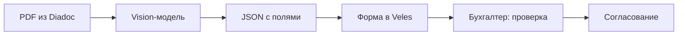
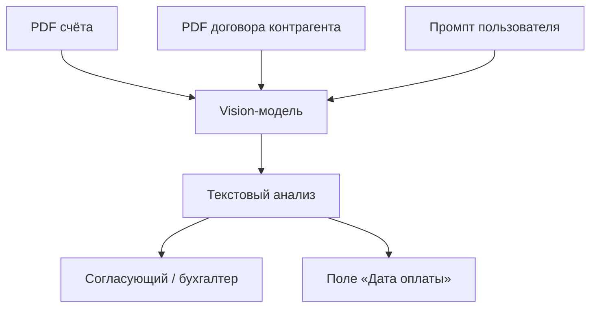
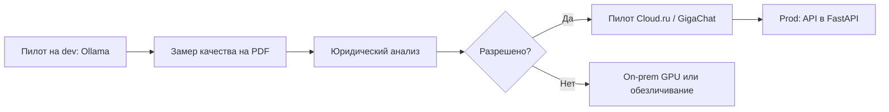
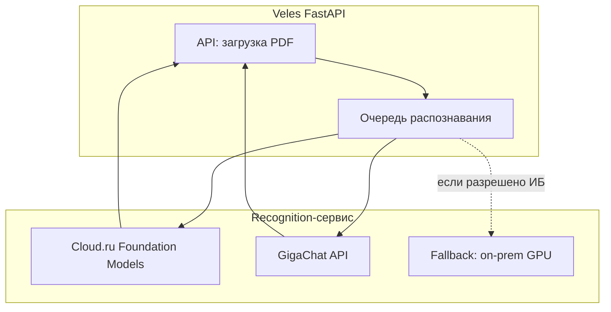

# Применение ИИ в Veles

> Распознавание реквизитов из PDF-счетов и первичных документов: прототип (Ollama + Qwen VL) и рекомендации для продакшена.  
> Связанные материалы: [PROJECT.md](1.%20Описание%20проекта.md) · [TECHNICAL_REQUIREMENTS.md](4.%20Технические%20требования%20и%20инфраструктура.md) (раздел 5)

---

## 1. Задача для Veles

| Задача                   | Описание                                                                                           |
| ------------------------ | -------------------------------------------------------------------------------------------------- |
| **Автозаполнение полей** | Из PDF (счёт, акт, УПД) извлечь: контрагент, ИНН, сумму, период, назначение платежа, тип документа |
| **Сверка с договором**   | При согласовании счёта — сравнить сумму и условия оплаты с договором контрагента; рекомендовать дату оплаты «как можно позже» в рамках договора |
| **Валидация человеком**  | Бухгалтер проверяет и при необходимости исправляет распознанные данные перед согласованием         |
| **Масштаб**              | ~20 ЗПИФов, разные форматы документов от сотен контрагентов                                        |

ИИ **не заменяет** бухгалтера и согласующих — он сокращает ручной ввод реквизитов из PDF в форму Veles.



---

## 2. Прототип — Ollama + Qwen VL

### 2.1. Что используется

| Компонент | Описание |
|-----------|----------|
| **Ollama** | Локальный runtime для запуска vision-моделей на сервере разработчика / GPU-станции |
| **Qwen VL** (семейство Qwen3-VL) | Vision Language Model — анализирует изображения страниц PDF и отвечает текстом |
| **Модель `veles-vl`** | Кастомная сборка на базе `qwen3-vl:4b-instruct` с оптимизацией под GPU 8 GB VRAM |

Настройка: `scripts/setup-ollama-gpu.sh`, конфигурация — `ollama/Modelfile.qwen3-vl-4b-gpu`.

### 2.2. Как это работает в коде

Модуль `integrations/ollama_recognition.py`:

1. PDF рендерится в PNG (первые 1–2 страницы через PyMuPDF).
2. Изображения и промпт отправляются в Ollama (`OLLAMA_HOST`, модель `OLLAMA_MODEL`).
3. Модель возвращает **JSON** с полями: тип документа, контрагент, ИНН, сумма, период, назначение.
4. Veles заполняет форму на странице «Обработка»; бухгалтер проверяет результат.

Переменные окружения (`.env`):

| Переменная | По умолчанию | Назначение |
|------------|--------------|------------|
| `OLLAMA_HOST` | `http://127.0.0.1:11434` | Адрес Ollama API |
| `OLLAMA_MODEL` | `veles-vl` | Имя модели |
| `OLLAMA_NUM_CTX` | `2048` | Размер контекста |

### 2.3. Зачем Ollama + Qwen VL на этапе прототипа

| Преимущество | Описание |
|--------------|----------|
| **Бесплатный локальный запуск** | Нет платы за API-токены на этапе POC |
| **Конфиденциальность на dev** | PDF не покидают инфраструктуру разработчика |
| **Быстрая итерация** | Можно менять промпты и модель без согласования с облачным провайдером |
| **Vision из коробки** | Qwen VL понимает layout счетов, таблицы, печати |

### 2.4. Ограничения прототипного решения

| Ограничение | Последствие |
|-------------|-------------|
| **Компактная модель (4B)** | Ошибки на сложных счетах: несколько таблиц, нестандартная вёрстка, рукописные пометки |
| **Нестабильный JSON** | Модель иногда возвращает невалидный JSON (неэкранированные кавычки в названиях организаций) |
| **Локальный GPU** | Требуется видеокарта (ориентир: ≥ 8 GB VRAM); нет отказоустойчивости и SLA |
| **Нет централизованного мониторинга качества** | Нет метрик точности по типам документов и фондам |
| **Один инстанс Ollama** | Не масштабируется на десятки одновременных пользователей и сотни документов в день |
| **Ручная настройка** | Квантизация, контекст, промпты — ответственность команды разработки, не вендора |

**Вывод:** связка Ollama + Qwen VL **достаточна для прототипа и демонстрации**, но **не рекомендуется как prod-решение** для УК с ~20 фондами без существенной доработки и без оценки качества на реальных документах.

### 2.5. Сверка счёта с договором (прототип)

При согласовании счетов на оплату сотрудникам приходится **открывать договор с контрагентом** и вручную проверять:

- соответствует ли **сумма в счёте** условиям договора (лимит, тариф, период);
- какой **срок оплаты** установлен договором;
- есть ли **дополнительные условия** (аванс, штрафы, особый порядок).

Для **УК ЗПИФ** важна ещё одна бизнес-логика: **платить как можно позже**, но в пределах срока по договору. Если в договоре указано «оплата в течение 14 календарных дней», нет смысла ставить дату оплаты «сегодня».

#### UI на странице «Обработка»

| Блок | Расположение | Содержание |
|------|--------------|------------|
| **PDF счёта** | Слева, сверху | Документ из Diadoc |
| **PDF договора** | Слева, под счётом | Договор выбранного контрагента (из справочника) |
| **Анализ ИИ** | Справа | Суммаризация и вывод модели по счёту и договору |
| **Промпт** | Справа, свёрнут по умолчанию | Редактируемый промпт для модели |

Кнопка **«Сверить с договором»** отправляет в vision-модель изображения страниц **счёта и договора** и возвращает текстовый анализ.

#### Пример вывода модели

```
Подрядчик ООО «Пример» прислал счёт на 125 000,00 ₽ от 15.06.2025.
Сумма соответствует условиям договора № ДУ-124/2024 (ежемесячная абонентская плата).
По договору оплатить счёт нужно в течение 14 календарных дней с даты счёта.
Рекомендуемая дата оплаты (как можно позже в рамках договора): 29.06.2025.
Дополнительно: предоплата не требуется; НДС включён в сумму счёта.
```

#### Схема



Код: `integrations/ollama_recognition.py` (`analyze_contract_against_invoice`), UI — `app/components/contract_analysis.py`, `app/views/document.py`.

ИИ **не принимает решение об оплате** — он сокращает ручную сверку; финальное решение остаётся за человеком.

---

## 3. Продакшен — почему локальная модель недостаточна

Для промышленной эксплуатации Veles (FastAPI + React) требования к распознаванию выше:

| Требование | Ollama + Qwen VL (4B) | Ожидание prod |
|------------|----------------------|---------------|
| Точность извлечения полей | 70–85% (оценочно, зависит от документов) | **≥ 95%** с human-in-the-loop |
| Доступность | Зависит от одного GPU-сервера | SLA 99%+, резервирование |
| Масштабирование | Вертикальное (больше GPU) | Горизонтальное, очередь задач |
| Поддержка | Силами команды проекта | Контракт с провайдером |
| Юридическая определённость | Данные локально, но нет enterprise-DPA | **Договор** с гарантиями обработки данных |
| Обновление моделей | Ручной `ollama pull` | Управляемые релизы от вендора |

На prod рекомендуется **облачный managed-сервис** с более мощными моделями и корпоративным договором.

---

## 4. Рекомендуемые варианты для продакшена

### 4.0. PDF и Vision — не одно и то же

У провайдеров **два разных механизма** работы с документами. Для Veles это критично: многие счета из Diadoc — PDF со сканами или сложной вёрсткой.

| Механизм | Что делает | Когда подходит |
|----------|------------|----------------|
| **Vision (VLM)** | Модель «смотрит» на **изображение** страницы (PNG/JPEG) и понимает layout, таблицы, печати | Счета со сканами, нестандартная вёрстка — **как в прототипе** (PDF → PNG → модель) |
| **PDF как текстовый документ** | Из PDF извлекается **текстовый слой** (OCR или встроенный текст), далее LLM работает с текстом | PDF с нормальным текстовым слоем (не скан) |
| **OCR-пайплайн** | Отдельный OCR → текст → LLM (два шага) | Массовая обработка, RAG, когда не нужен единый VLM-запрос |

**Рекомендация для Veles:** сохранить схему прототипа — **рендер 1–2 страниц PDF в PNG** и отправка в **Vision-модель**. Это работает и с GigaChat, и с Cloud.ru Foundation Models.

---

### 4.1. Cloud.ru (Foundation Models + Managed RAG)

**Суть:** облако [Cloud.ru](https://cloud.ru/) (эволюция SberCloud) — доступ к LLM через OpenAI-совместимый API и отдельные сервисы для документов.

**Источники:** [каталог моделей](https://cloud.ru/docs/foundation-models/ug/topics/overview__available__models) · [быстрый старт API](https://cloud.ru/docs/foundation-models/ug/topics/quickstart) · [Managed RAG: гибридный OCR для PDF](https://cloud.ru/docs/rag/ug/topics/tutorials__hybrid-ocr)

#### Vision (изображения страниц PDF)

| Параметр | Значение |
|----------|----------|
| **API** | `POST https://foundation-models.api.cloud.ru/v1/chat/completions` (OpenAI-compatible) |
| **Формат** | В `messages[].content` — массив с `type: "text"` и `type: "image_url"` (base64 или URL) |
| **Модели с Vision** | В каталоге отмечены флагом **Vision**, напр.: `Qwen/Qwen3.5-397B-A17B`, `Qwen/Qwen3.6-35B-A3B`, `ai-sage/GigaChat3-*`, Claude, Gemini, GPT и др. |
| **PDF напрямую** | ❌ Не как единый vision-вход — нужен **рендер страниц в PNG** (как в `ollama_recognition.py`) |

#### PDF (без единого VLM-запроса)

| Путь | Описание |
|------|----------|
| **DeepSeek-OCR-2** | Специализированная OCR-модель (`deepseek-ai/DeepSeek-OCR-2`) в каталоге Foundation Models |
| **Managed RAG** | PDF-экстрактор с методом **«Гибридный OCR»** — для смешанных PDF (текст + изображения); результат — база знаний / чанки, не прямой «промпт → JSON» |
| **Внутренние модели** | По документации Cloud.ru: данные не логируются и не хранятся (для моделей с пометкой «внутренняя») |

| Плюсы | Минусы |
|-------|--------|
| Vision-модели из коробки (Qwen VL, GigaChat3 и др.) | PDF «из коробки» — через OCR/RAG, не один VLM-вызов |
| OpenAI-compatible API — простая миграция с прототипа | Стоимость зависит от модели и токенов |
| Managed RAG для сложных многостраничных PDF | RAG-пайплайн сложнее интеграции «один запрос → JSON» |
| Дата-центры в РФ, enterprise-договоры | Нужен выбор конкретной Vision-модели из каталога |

**Для Veles:** ближайший аналог прототипа — **Qwen3.6-35B-A3B (Vision)** + PNG страниц счёта + промпт на JSON.

---

### 4.2. GigaChat (Сбер)

**Суть:** корпоративный API [GigaChat](https://developers.sber.ru/docs/ru/gigachat/api/overview) — отдельный продукт Сбера (не путать с Cloud.ru Foundation Models, хотя в Cloud.ru тоже доступны модели GigaChat3).

**Источники:** [работа с файлами](https://developers.sber.ru/docs/ru/gigachat/guides/working-with-files) · [GigaChat 2 Pro](https://developers.sber.ru/docs/ru/gigachat/models/gigachat-2-pro) · [GigaChat 2 Max](https://developers.sber.ru/docs/ru/gigachat/models/gigachat-2-max)

#### PDF (текстовый документ)

| Параметр | Значение |
|----------|----------|
| **Загрузка** | `POST /api/v1/files`, MIME `application/pdf`, до **40 МБ** |
| **Обработка** | Встроенная функция **`get_file_content`** — извлечение **текста**, не vision-анализ PDF |
| **Запрос** | `attachments` + `"function_call": "auto"` в `chat/completions` |
| **Модели** | GigaChat 2 **Pro** / **Max** — «Обработка текстовых документов» |
| **Ограничение** | Сканированные PDF и счета без текстового слоя **могут работать плохо** — нужен vision-путь |

#### Vision (изображения)

| Параметр | Значение |
|----------|----------|
| **Форматы** | JPEG, PNG, TIFF, BMP — до **15 МБ** на файл |
| **Загрузка** | Тот же `POST /api/v1/files`, затем `attachments` в `chat/completions` |
| **Лимиты** | До **10 изображений** в одном запросе; 1 изображение на сообщение |
| **Модели** | GigaChat 2 **Pro**, **Max** — «Анализ изображений»; Lite — без vision |
| **Тарификация** | Изображение → до **1792 токенов** на картинку |

| Плюсы | Минусы |
|-------|--------|
| PDF и vision **документированы** в официальном API | PDF ≠ vision: два разных пути |
| Опыт Сбера с финсектором, enterprise-подключение | Подключение и согласование занимают время |
| Pro/Max: документы + изображения + аудио | Для сканов счетов — рендер в PNG, как в прототипе |

**Для Veles:** для типичного счёта из Diadoc — **PNG страниц + GigaChat 2 Pro/Max** (vision); PDF-upload — только если документ с нормальным текстовым слоем.

---

### 4.3. Yandex Cloud (альтернатива)

**Суть:** [Yandex Cloud](https://cloud.yandex.ru/) — отдельный провайдер; vision и PDF реализованы **разными сервисами**.

| Сервис | PDF / Vision |
|--------|--------------|
| [Yandex Vision OCR](https://yandex.cloud/ru/docs/vision/concepts/ocr/) | OCR для PDF и изображений → текст |
| YandexGPT / Foundation Models | Текст; vision для изображений — через отдельный config в AI Studio |

**Для Veles:** двухшаговый pipeline **Vision OCR → YandexGPT** (структурирование в JSON), либо пилот параллельно с Cloud.ru / GigaChat.

---

### 4.4. Сравнение подходов для задачи Veles

| Критерий | Ollama + Qwen VL | Cloud.ru Foundation Models | GigaChat (Сбер) |
|----------|------------------|---------------------------|-----------------|
| Этап | **Прототип** | Prod (кандидат) | Prod (кандидат) |
| Vision (PNG страниц) | ✅ Qwen3-VL | ✅ Модели с флагом Vision (Qwen, GigaChat3…) | ✅ Pro/Max, до 10 img/запрос |
| PDF напрямую | — (рендер в PNG) | ⚠️ OCR / Managed RAG, не VLM | ⚠️ Текст через `get_file_content` |
| API | Ollama REST | OpenAI-compatible | GigaChat REST |
| Схема как в прототипе | Да | **Да** (PNG + chat/completions) | **Да** (upload PNG + attachments) |
| Enterprise / РФ | Dev only | ✅ | ✅ |

> **Примечание:** перед выбором провайдера необходим **пилот** на реальных PDF заказчика (счета, УПД, акты) с замером точности по каждому полю. Официальная документация подтверждает **vision для изображений**; для PDF-счетов со сканами надёжнее **рендер в PNG**, а не загрузка PDF «как есть».

---

## 5. Юридические аспекты (обязательно)

Передача PDF-счетов и реквизитов в облачную модель затрагивает **финансовую информацию**, **персональные данные** (ФИО в документах, если есть) и **коммерческую тайну** УК и фондов.

### 5.1. Задача для юристов

**Требуется анализ юристов заказчика** (и при необходимости — DPO / ИБ) до подключения любого облачного ИИ-сервиса:

| Вопрос | Зачем |
|--------|-------|
| Можно ли передавать содержимое PDF в облако Cloud.ru / GigaChat / Yandex? | Соответствие 152-ФЗ, политике УК, договорам с пайщиками |
| Достаточны ли договорные гарантии провайдера? | Защита от использования данных в обучении моделей |
| Нужно ли обезличивание / маскирование полей до отправки? | Минимизация рисков |
| Где физически обрабатываются данные (РФ)? | Требования регулятора и внутренних политик |
| Нужно ли согласие субъектов ПДн? | Если в документах есть персональные данные |

### 5.2. Договорные гарантии провайдеров

Cloud.ru, Сбер (GigaChat) и Yandex при **корпоративном** подключении к облачным моделям, как правило, заключают с компаниями **договоры**, в которых прописывают:

- **Запрет** использования данных клиента (промптов, загруженных документов, ответов модели) для **обучения** и дообучения публичных моделей
- **Конфиденциальность** переданной информации
- **Локализацию** обработки данных на территории РФ (для соответствующих тарифов)
- **SLA**, порядок удаления данных, аудит

Это снижает риск **утечки финансовой информации** и **персональных данных**, но **не снимает** необходимость внутреннего правового заключения: формулировки договора нужно сопоставить с политикой УК и спецификой ПИФ.

### 5.3. Рекомендуемый порядок действий



1. Зафиксировать baseline качества Ollama + Qwen VL на выборке реальных документов.
2. Получить **правовое заключение** по облачным провайдерам.
3. Провести **технический пилот** Cloud.ru Foundation Models и/или GigaChat (sandbox).
4. Сравнить точность, стоимость, latency, условия договора.
5. Внедрить в prod как отдельный **recognition-сервис** (HTTP API), вызываемый из FastAPI.

---

## 6. Целевая архитектура (prod)



Принципы:

- PDF и промпты **не логируются** в prod без политики retention.
- Бухгалтер **всегда** подтверждает поля перед согласованием (human-in-the-loop).
- Провайдер и модель — **конфигурируемые** (`RECOGNITION_PROVIDER=cloudru|gigachat|yandex|ollama`).
- Код `integrations/ollama_recognition.py` — **референс**; для prod — абстракция `RecognitionClient` с адаптерами.

---

## 7. Этапы внедрения ИИ

| Этап | Содержание | Стек |
|------|------------|------|
| **A (текущий)** | Кнопка «Распознать» на странице обработки, автозаполнение формы; сверка счёта с договором | Ollama + Qwen VL |
| **B1** | Метрики качества: precision/recall по полям на тестовой выборке | Ollama + ручная разметка |
| **B2** | Юридическое заключение по облачным провайдерам | Юристы заказчика |
| **B3** | Пилот Cloud.ru / GigaChat | Sandbox API |
| **B4** | Prod recognition-сервис в FastAPI | Выбранный провайдер |
| **B5** | Дообучение / fine-tuning промптов по типам документов | ML-инженер |

---

## 8. Чеклист перед prod

- [ ] Собрана тестовая выборка PDF (счета, УПД, акты) по всем типам контрагентов
- [ ] Замерена точность Ollama + Qwen VL (baseline)
- [ ] Получено **правовое заключение** по передаче данных в Cloud.ru, GigaChat и/или Yandex Cloud
- [ ] Согласован **enterprise-договор** с выбранным провайдером (запрет обучения на данных клиента)
- [ ] Проведён технический пилот облачного API
- [ ] Определена политика хранения и удаления PDF/промптов
- [ ] Human-in-the-loop сохранён в UI (React): пользователь подтверждает поля
- [ ] Recognition-сервис вынесен из Streamlit-прототипа в FastAPI backend

---

## 9. Связанные документы

- [PROJECT.md](1.%20Описание%20проекта.md) — раздел 6.1 (распознавание), этап A6 / B
- [TECHNICAL_REQUIREMENTS.md](4.%20Технические%20требования%20и%20инфраструктура.md) — раздел 5 (GPU-сервер)
- [INTEGRATION_DIADOC.md](5.%20Интеграция%20с%20Diadoc.md) — источник PDF
- Код: `integrations/ollama_recognition.py`, `app/components/contract_analysis.py`, `scripts/setup-ollama-gpu.sh`
