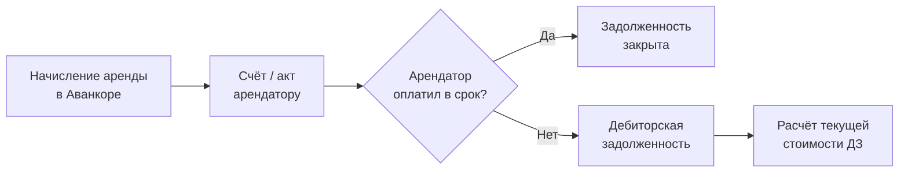
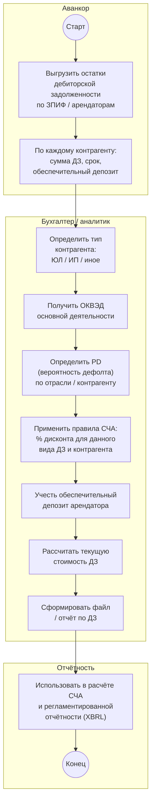
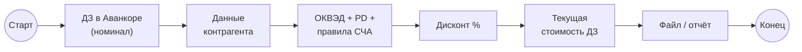
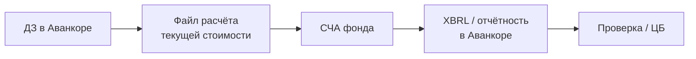
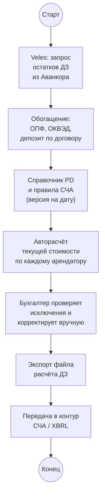

# Отчёт по дебиторской задолженности: Аванкор → расчёт стоимости ДЗ → отчётность по СЧА

> Схема текущего (as-is) ручного процесса: от учёта дебиторской задолженности арендаторов в Аванкоре до расчёта **текущей стоимости** задолженности с учётом дисконта по правилам СЧА. Диаграммы в формате [Mermaid](https://mermaid.js.org/) — отображаются в Obsidian (Reading view / Live Preview), GitHub и Cursor.

## Участники

| Роль | Описание |
| ----------------------------------- | --------------------------------------------------------------------------------------------------------- |
| **Аванкор** | Учётная система фонда; в ней ведутся начисления аренды, платежи арендаторов и **номинальная** дебиторская задолженность |
| **Бухгалтер фонда** | Один из **трёх бухгалтеров**, закреплённых за ЗПИФ; готовит расчёт и отчёт по ДЗ |
| **Главный бухгалтер** | Контролирует методику расчёта, корректность дисконта и использование результата в отчётности |
| **Арендаторы** | Контрагенты, не оплатившие аренду в срок — источник дебиторской задолженности |
| **ЦБ / XBRL** | Конечный потребитель данных: отчётность по **стоимости чистых активов (СЧА)** фонда |

## Контекст

**Дебиторская задолженность (ДЗ)** в учёте УК возникает, когда **арендатор не заплатил аренду в срок**. В Аванкоре фиксируется **номинальная сумма** долга — например, 1 000 ₽, которые арендатор обязан погасить позже.

Для целей **оценки активов фонда и отчётности по СЧА** номинальная сумма недостаточна: деньги, которые поступят позже, **стоят меньше** сегодняшних. Поэтому нужен **отдельный расчёт текущей стоимости ДЗ** — с **дисконтированием** по правилам Банка России и с учётом риска неплатежа контрагента.

Процесс связан с блоком **сдачи помещений в аренду** (~20 ЗПИФов, сотни арендаторов). Не каждый арендатор имеет просрочку — отчёт формируется по **фактическим остаткам ДЗ** в Аванкоре на дату расчёта.

**Отдельная задача** (озвучена главным бухгалтером): создать **файл с расчётом** дебиторской задолженности — «сколько она стоит сейчас», а не только «сколько должны».

## Откуда берётся дебиторская задолженность

Типовая цепочка до появления ДЗ:

1. В Аванкоре настроены **параметры договора аренды** (фиксированная аренда, плата с оборота и т.д.).
2. Формируются документы **«Начисление аренды»** (в том числе групповое формирование).
3. Арендатору выставляется счёт; при просрочке оплаты в учёте остаётся **дебиторская задолженность**.

Смежные процессы (товарообороты, коммунальные платежи) влияют на **сумму начисления**, но сам объект расчёта — **непогашенная задолженность арендатора** в Аванкоре.

## Основная схема расчёта (с дорожками)

## Упрощённая схема

## Шаги процесса

1. **Бухгалтер** (или аналитик под его контролем) получает из **Аванкора** остатки **дебиторской задолженности** по фонду на отчётную дату — по арендаторам, договорам, периодам просрочки.
2. По каждому контрагенту с ненулевой ДЗ определяется **организационно-правовая форма**: юридическое лицо (ЮЛ), индивидуальный предприниматель (ИП) и т.д.
3. Для контрагента уточняется **ОКВЭД** — код основного вида деятельности; по нему относится задолженность к отраслевой группе риска.
4. На основании отрасли и/или данных по контрагенту определяется **PD (Probability of Default)** — **вероятность дефолта** (неисполнения обязательства).
5. По **правилам расчёта СЧА** (требования Банка России к оценке активов ПИФ) выбирается **процент дисконта** для данного вида дебиторской задолженности и категории контрагента.
6. Из расчёта **не исключается обеспечительный депозит** арендатора: депозит и ДЗ учитываются **совместно** — депозит может частично или полностью покрывать риск по задолженности (логика уточняется по регламенту УК и правилам СЧА).
7. Рассчитывается **текущая стоимость** каждой позиции ДЗ (номинал минус дисконт / с учётом PD и депозита — по принятой методике).
8. Результаты сводятся в **файл с расчётом** (отчёт по дебиторской задолженности) для использования в **СЧА** и при подготовке **XBRL-отчётности** в Аванкоре.

## Логика расчёта (номинал vs текущая стоимость)

| Понятие | Смысл | Пример |
|---------|-------|--------|
| **Номинальная ДЗ** | Сумма, которую арендатор должен по договору на дату учёта | 1 000 ₽ — «должен заплатить позже» |
| **Текущая стоимость ДЗ** | Сколько эта задолженность **стоит сейчас** для целей СЧА | Меньше 1 000 ₽ после дисконта |
| **Дисконт** | Процент или коэффициент снижения стоимости из‑за срока и риска | Задаётся правилами СЧА + PD + ОКВЭД |
| **Обеспечительный депозит** | Залог арендатора по договору; снижает чистый риск по ДЗ | Учитывается при расчёте покрытия |

**Идея:** если арендатор задолжал 1 000 ₽, но заплатит только через время и с риском неплатежа, для стоимости активов фонда сегодня эта сумма **оценивается ниже** номинала.

## Входные данные для расчёта

| Источник | Данные | Назначение |
|----------|--------|------------|
| **Аванкор** | Остаток ДЗ по арендатору, договор, период, ЗПИФ | База расчёта (номинал) |
| **Аванкор / договор** | Сумма **обеспечительного депозита** | Покрытие риска |
| **ЕГРЮЛ / карточка контрагента** | ОПФ (ЮЛ, ИП), **ОКВЭД** | Классификация для правил СЧА |
| **Справочник PD / отраслевые ставки** | Вероятность дефолта по отрасли | Надбавка к риску |
| **Правила СЧА (ЦБ)** | Допустимые методы и % дисконта по видам активов | Нормативная база расчёта |

## Особые правила

| Условие | Действие |
|---------|----------|
| Источник номинальной ДЗ | Только **Аванкор** — начисления и оплаты аренды |
| Причина ДЗ | Как правило — **просрочка арендной платы** (в т.ч. после начисления с оборота) |
| Тип контрагента | Различаются **ЮЛ**, **ИП**; методика дисконта может отличаться |
| ОКВЭД | Определяет **отрасль** и связанный **PD** |
| PD | **Probability of Default** — вероятность дефолта; влияет на оценку |
| Правила СЧА | Задают **допустимый дисконт** и порядок включения ДЗ в активы |
| Обеспечительный депозит | Учитывается **вместе** с ДЗ при оценке риска |
| Результат | **Файл расчёта** + использование в **СЧА / XBRL** |
| Периодичность | Уточняется регламентом УК (как правило — **на дату расчёта СЧА**, часто ежемесячно / ежеквартально) |

## Связь с отчётностью XBRL

Завершающий этап учётного цикла — **регламентированная отчётность для ЦБ**. Отчёты готовятся в **Аванкоре** (в том числе **XBRL**): часть формируется **по кнопке**, часть требует **ручных правок**.

Расчёт текущей стоимости ДЗ **предшествует или сопровождает** этот этап: некорректный дисконт искажает **СЧА** и отчётность фонда.

## Соответствие символам BPMN

| Элемент на схеме | Символ BPMN | Роль в процессе |
|------------------|-------------|-----------------|
| `((Старт))` | Стартовое событие | Наступила дата расчёта СЧА / запрос отчёта по ДЗ |
| Прямоугольники | Задача (Task) | Выгрузка из Аванкора, сбор ОКВЭД, расчёт дисконта, формирование файла |
| `((Конец))` | Конечное событие | Отчёт передан в контур СЧА / XBRL |
| Блоки `subgraph` | Pool / Lane | Аванкор, бухгалтер, отчётность |

## Проблемы текущего процесса

- **Ручная выгрузка из Аванкора** — нет автоматического отчёта «текущая стоимость ДЗ»; бухгалтер собирает данные сам.
- **Ручной поиск ОКВЭД и PD** — по каждому контрагенту; при сотнях арендаторов трудоёмко и подвержено ошибкам.
- **Правила СЧА применяются вручную** — риск неверного процента дисконта или пропуска обеспечительного депозита.
- **Нет единого файла-шаблона** — расчёт воспроизводится «с нуля»; сложно проверить историю и изменения методики.
- **Разрыв между расчётом и XBRL** — файл расчёта и отчётность в Аванкоре не связаны автоматически; правки вносятся отдельно.
- **Не масштабируется** — при росте числа фондов и арендаторов ручной расчёт отнимает непропорционально много времени.

## Целевой вариант (для сравнения)

При автоматизации в **Veles** можно сократить ручной труд на сбор данных и применение методики; **нормативные правила СЧА** остаются эталоном, их должен утверждать главный бухгалтер:

**Потенциальный функционал Veles:**

| Функция | Описание |
|---------|----------|
| Выгрузка ДЗ из Аванкора | По ЗПИФ, дате, арендатору |
| Карточка контрагента | ОКВЭД, ОПФ, депозит, история просрочек |
| Справочник дисконта | Правила СЧА + PD по ОКВЭД (редактируемый, с версионированием) |
| Расчётный лист | Номинал → дисконт → текущая стоимость; итог по фонду |
| Экспорт | Excel / CSV для главного бухгалтера и XBRL-контура |

**Вне scope Veles (на текущем этапе):** замена Аванкора как системы формирования XBRL; юридическая интерпретация норм СЧА — остаётся за главным бухгалтером и аудитором.

## Связанные документы

- [PROJECT.md](1.%20Описание%20проекта.md) — общий as-is / to-be процесс документооборота УК
- [2.1 Маршруты Документов — входящий Счёт на оплату](2.1%20Маршруты%20Документов%20-%20входящий%20Счет%20на%20оплату.md) — смежный процесс взаиморасчётов с контрагентами
- [2.2 Маршруты Документов — размещение депозита](2.2%20Маршруты%20Документов%20-%20размещение%20Депозита.md) — другой процесс согласования и учёта депозитных операций
- [INTEGRATION_AVANKOR.md](6.%20Интеграция%20с%20Аванкор.md) — учёт аренды, начисления, выгрузка данных из Аванкора
- [Роли пользователей](9.%20Роли%20пользователей.md) — полномочия бухгалтера и главного бухгалтера
- [Информация по процессам](Информация%20по%20процессам.md) — исходные заметки по процессам УК (раздел «Расчёт дебиторской задолженности»)
