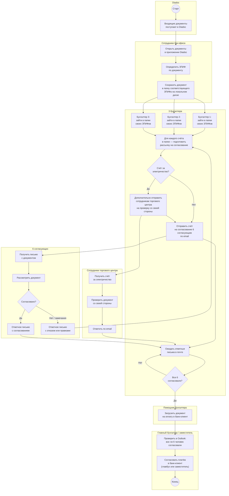
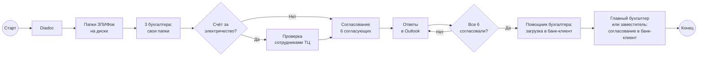
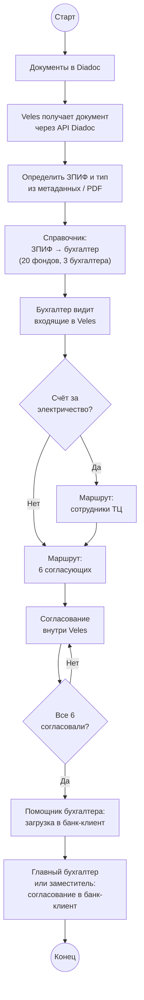

# Маршрутизация документов: Diadoc → диск → бухгалтер → согласование → банк-клиент

> Схема текущего (as-is) ручного процесса: от поступления документов в Diadoc до оплаты через банк-клиент после согласования. Диаграммы в формате [Mermaid](https://mermaid.js.org/) — отображаются в Obsidian (Reading view / Live Preview), GitHub и Cursor.

## Участники

| Роль                                | Описание                                                                                                  |
| ----------------------------------- | --------------------------------------------------------------------------------------------------------- |
| **Diadoc**                          | Канал поступления электронных документов от контрагентов                                                  |
| **Сотрудники бэк-офиса**            | Сохраняют документы из Diadoc в папки соответствующих ЗПИФов на локальном диске                           |
| **3 бухгалтера**                    | Каждый ведёт несколько ЗПИФов из **20 фондов**; заходит в «свои» папки и отправляет счета на согласование |
| **6 согласующих**                   | Фиксированная группа из шести сотрудников; каждый отвечает по email                                       |
| **Сотрудники торгового центра**     | Дополнительная проверка **только для счетов за электричество**                                            |
| **Помощник бухгалтера**             | После согласования всеми шестью загружает документ на оплату в банк-клиент, в Аванкор                     |
| **Сотрудники бэк-офиса**            | Дополнительно выделено двое сотрудников для загрузки всех документов в Спец.Депозитарий                   |
| **Главный бухгалтер / заместитель** | Сверяет в Outlook, что все 6 согласовали; **согласовывает** платёж в банк-клиент (один из двух)           |

## Распределение ЗПИФов

Все **20 ЗПИФов** распределены между **тремя бухгалтерами**. Каждый бухгалтер знает какими ЗПИФ ему поручили заниматься. документ попадает в нужную папку на этапе сохранения бэк-офисом.

## Основная схема (с дорожками)

## Упрощённая схема

## Шаги процесса

1. Контрагент направляет документ через **Diadoc**.
2. **Сотрудники бэк-офиса** открывают документы в приложении Diadoc.
3. По содержимому или реквизитам определяется **ЗПИФ**.
4. Документ **сохраняется в папку соответствующего ЗПИФа** на локальном диске (всего ~20 папок фондов).
5. Каждый из **трёх бухгалтеров** заходит в **папки тех ЗПИФов, за которыми он закреплён**.
6. Бухгалтер **обрабатывает каждый счёт** в своих папках и готовит рассылку на согласование.
7. Если счёт — **за электричество**, бухгалтер **дополнительно отправляет** его **сотрудникам торгового центра** для проверки со своей стороны.
8. Бухгалтер **отправляет счёт на согласование по email шести согласующим**.
9. **6 согласующих** (и при необходимости сотрудники ТЦ) рассматривают документ и отвечают письмом.
10. При замечаниях бухгалтер **корректирует и повторяет** рассылку.
11. Когда **все 6 человек согласовали**, **помощник бухгалтера** **загружает документ на оплату в банк-клиент**.
12. **Главный бухгалтер или его заместитель** вручную **сверяет ответы в Outlook** и только после этого **согласовывает** платёж **в банк-клиент**.

## Особые правила

| Условие | Действие |
|---------|----------|
| Сохранение на диск | Бэк-офис кладёт документ **в папку нужного ЗПИФа** из ~20 фондов |
| Работа бухгалтеров | Каждый из **3 бухгалтеров** работает только с **своими** папками ЗПИФов |
| Любой счёт | Обязательное согласование **6 согласующими** по email |
| Счёт за электричество | Дополнительно — проверка **сотрудниками торгового центра** |
| После согласования | **Помощник бухгалтера** загружает документ **на оплату в банк-клиент** |
| Завершение процесса | **Главный бухгалтер или заместитель** вручную сверяет ответы в Outlook и только после этого **согласовывает в банк-клиент** |

## Соответствие символам BPMN

| Элемент на схеме | Символ BPMN | Роль в процессе |
|------------------|-------------|-----------------|
| `((Старт))` | Стартовое событие | Поступление документов в Diadoc |
| Прямоугольники | Задача (Task) | Сохранение в папку, рассылка, согласование, оплата |
| Ромбы `{...}` | Шлюз (Gateway) | Тип документа, проверка согласований |
| `((Конец))` | Конечное событие | Платёж согласован главным бухгалтером или заместителем в банк-клиент |
| Блоки `subgraph` | Pool / Lane | Diadoc, бэк-офис, бухгалтеры, ТЦ, согласующие, помощник, главбух / зам. |

## Проблемы текущего процесса

- **Папки на диске** — нет единой системы; бэк-офис должен не ошибиться с выбором папки ЗПИФа.
- **20 ЗПИФов на 3 бухгалтеров** — распределение закреплено неформально; при смене сотрудника знание теряется.
- Бухгалтеры **сами заходят в папки** и ищут новые счета — нет уведомлений о поступлении.
- **Согласование 6 людей через email** — главбух или заместитель вручную сверяет ответы в Outlook, легко пропустить письмо или перепутать цепочку.
- Для **счетов за электричество** добавляется ещё один ручной контур (ТЦ) без единого статуса.
- **Задержки** при ожидании ответов; нет единого реестра «кто уже согласовал».
- **Два ручных шага в банк-клиенте** — сначала загрузка помощником, затем согласование главбухом или заместителем; нет единого статуса платежа.
- **Зависимость от главного бухгалтера или заместителя** — финальное согласование оплаты только у них.

## Целевой вариант (для сравнения)

При автоматизации в **Veles** правила маршрутизации и согласования задаются в системе:

## Связанные документы

- [PROJECT.md](1.%20Описание%20проекта.md) — общий as-is / to-be процесс документооборота
- [INTEGRATION_DIADOC.md](5.%20Интеграция%20с%20Diadoc.md) — интеграция с Diadoc API
- [INTEGRATION_AVANKOR.md](6.%20Интеграция%20с%20Аванкор.md) — отправка согласованных документов в учётную систему
- [INTEGRATION_SPEC_DEP.md](8.%20Интеграция%20со%20Спецдепозитарием.md) — передача документов в специализированный депозитарий
- [INTEGRATION_BANK_CLIENT.md](7.%20Интеграция%20с%20Банк-клиентом.md) — отправка платежей в банк-клиент после согласования
- [Роли пользователей](9.%20Роли%20пользователей.md) — полномочия бухгалтера и главного бухгалтера на этапе оплаты
