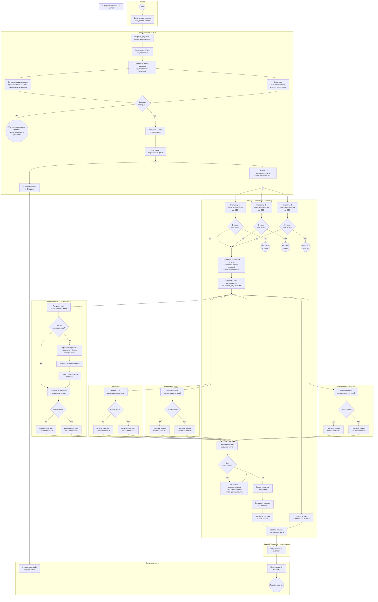
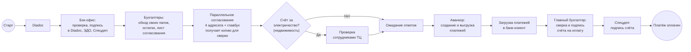
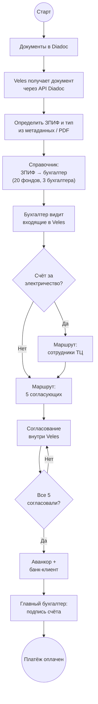

# Маршрутизация документов: Diadoc → диск → бухгалтер → согласование → банк-клиент

> Схема текущего (as-is) ручного процесса: от поступления документов в Diadoc до оплаты через банк-клиент после согласования.
> - **Mermaid** — для просмотра в Obsidian, GitHub и Cursor без дополнительных инструментов.
> - **BPMN 2.0** — формальная нотация (дорожки, шлюзы, User Task); исходник [`.bpmn`](diagrams/2.1-invoice-payment.bpmn), редактирование в [bpmn.io](https://demo.bpmn.io).

## Участники

| Роль                                | Описание                                                                                                  |
| ----------------------------------- | --------------------------------------------------------------------------------------------------------- |
| **Diadoc**                          | Канал поступления электронных документов от контрагентов                                                  |
| **Сотрудники бэк-офиса**            | Открывают документы в Diadoc, определяют ЗПИФ, **отправляют счёт на проверку недвижимости и бухгалтеру**; после проверки **подписывают в Diadoc**, **скачивают файл**; параллельно **сохраняют в папку ЗПИФа на ЭДО** и **отправляют файл в Спецдеп** |
| **Недвижимость**                    | На этапе проверки — **правомерность платежа**, факт выполнения работ / оказания услуг; **как согласующий** — получает лист по email, при счёте за электричество запрашивает проверку ТЦ, **проверяет документ со своей стороны**, отвечает письмом (один из **4 согласующих** в цикле ожидания ответов) |
| **Помощник бухгалтера / бухгалтер** | На этапе проверки — **корректность заполнения счёта** и **условия по договору**; **каждый из трёх бухгалтеров** заходит в **свои папки на ЭДО** — при наличии счёта проверяет остатки, составляет лист согласования и рассылает его; **ожидает ответы**, при необходимости **корректирует лист**; после согласования — **создание и выгрузка платежей в Аванкор**, загрузка в банк-клиент |
| **Контролёр**                       | Согласование листа согласования по email (один из **4 согласующих** в цикле ожидания ответов)              |
| **Финансовый директор**             | Согласование листа согласования по email (один из **4 согласующих** в цикле ожидания ответов)              |
| **Генеральный директор**            | Согласование листа согласования по email (один из **4 согласующих** в цикле ожидания ответов)              |
| **Главный бухгалтер / заместитель** | Получает лист по email **параллельно с согласующими** (для сверки в Outlook); после загрузки платежей в банк-клиент — **сверка платежей с письмами** и **подпись счёта на оплату** в банк-клиент |
| **Сотрудники торгового центра**     | Проверка электричества **только для счетов за электричество** (по запросу недвижимости)                    |
| **Спецдепозитарий**                 | **Ранний этап:** получает файл от бэк-офиса; **финальный этап:** **подписывает счёт на оплату** после подписи главного бухгалтера — процесс завершается событием «Платёж оплачен» |

## Распределение ЗПИФов

Все **20 ЗПИФов** распределены между **тремя бухгалтерами** (роль «Помощник бухгалтера / бухгалтер») — у каждого **свои папки** на ЭДО. После проверки бэк-офис подписывает документ в Diadoc и скачивает файл; **параллельно** сохраняет его в папку ЗПИФа на ЭДО (откуда его подхватывают бухгалтеры) и **отправляет копию в Спецдеп**.

## Основная схема (с дорожками)

## Схема BPMN 2.0

Формальная диаграмма процесса: pool с дорожками ролей, exclusive/parallel gateways, User Task и Service Task.

Откройте [diagrams/2.1-invoice-payment.bpmn](diagrams/2.1-invoice-payment.bpmn) в [bpmn.io](https://demo.bpmn.io) (File → Open) или Camunda Modeler. Для вставки в markdown: File → Export as SVG → сохранить как `diagrams/2.1-invoice-payment.bpmn.svg`.

| Файл | Назначение |
|------|------------|
| [diagrams/2.1-invoice-payment.bpmn](diagrams/2.1-invoice-payment.bpmn) | Исходник BPMN 2.0 XML |
| [diagrams/2.1-invoice-payment.png](diagrams/2.1-invoice-payment.png) | Экспорт PNG для просмотра в markdown |
| `diagrams/2.1-invoice-payment.bpmn.svg` | Экспорт SVG (создаётся вручную или скриптом) |
| [scripts/export_bpmn_svg.sh](scripts/export_bpmn_svg.sh) | Автоэкспорт через Docker: `./scripts/export_bpmn_svg.sh diagrams/2.1-invoice-payment.bpmn` |

## Упрощённая схема

## Шаги процесса

1. Контрагент направляет документ через **Diadoc**.
2. **Сотрудники бэк-офиса** открывают документы в приложении Diadoc.
3. По содержимому или реквизитам определяется **ЗПИФ**.
4. **Сотрудник бэк-офиса** отправляет счёт **на проверку недвижимости и бухгалтеру**.
5. **Сотрудник недвижимости** проверяет **правомерность платежа** и то, что **работы выполнены или услуги оказаны**.
6. **Бухгалтер** проверяет **корректность заполнения счёта** и **условия по договору**; оба проверяющих работают параллельно. Если проверка **не пройдена** — **уточнить возможные причины несогласования и действия** (процесс по этому счёту не продолжается).
7. После успешной проверки бэк-офис **заходит в Diadoc и подписывает** документ и **скачивает подписанный файл**. Дальше **два параллельных процесса**:
   - **Сохранение на ЭДО** → документ кладётся в **соответствующую папку ЗПИФа на ЭДО** → **бухгалтеры** заходят в свои папки;
   - **Отправка в Спецдеп** → **спецдепозитарий получает файл**.
8. **Каждый из трёх бухгалтеров** (роль «Помощник бухгалтера / бухгалтер») заходит в **свои папки** на ЭДО; если **в папке есть счёт** (у остальных двоих счёта нет — они не участвуют):
   - **Проверяет остатки на счету**, **составляет список платежей на оплату и лист согласования** (один шаг);
   - **Отправляет лист согласования по email** пяти адресатам с приложением документов (договор, допсоглашения, счета, УПД и т.д.).
   Если счёта в папке **нет** — ветка завершается (терминальное событие «Нет счёта в папке»).
9. **Пять адресатов** получают **одну и ту же рассылку параллельно**:
   - **Недвижимость**, **контролёр**, **финансовый директор**, **генеральный директор** — отвечают по email; при отказе — письмо «не согласовано»; недвижимость при счёте за электричество **до проверки документа** запрашивает у **сотрудников ТЦ** проверку электричества, затем **проверяет документ со своей стороны**;
   - **Главный бухгалтер / заместитель** — получает копию **для сверки в Outlook**, **не участвует** в шлюзе «Все согласовали?».
10. Бухгалтер **ожидает ответные письма** в почте; цикл повторяется, пока **все 4 согласующих не согласуют**.
11. Если **не все согласовали**, бухгалтер **корректирует лист согласования и повторяет рассылку**.
12. После согласования всех четверых **помощник бухгалтера / бухгалтер** **создаёт платежи в Аванкор** и **выгружает** их.
13. Платежи **загружаются в банк-клиент**.
14. **Главный бухгалтер или заместитель** **сверяет платежи с письмами** в Outlook и **подписывает счёт на оплату** в банк-клиент.
15. **Спецдепозитарий подписывает счёт на оплату** — процесс завершается событием **«Платёж оплачен»**.

## Особые правила

| Условие | Действие |
|---------|----------|
| Проверка перед сохранением | Бэк-офис отправляет счёт **недвижимости** (правомерность, работы/услуги) и **бухгалтеру** (заполнение счёта, договор) |
| Проверка не пройдена | **Уточнить возможные причины несогласования и действия** — отдельная ветка, основной процесс не продолжается |
| После проверки | Бэк-офис **подписывает в Diadoc**, **скачивает файл**; параллельно: **сохранение в папку ЗПИФа на ЭДО** (→ бухгалтеры) и **отправка файла в Спецдеп** (→ спецдеп получает файл) |
| Работа бухгалтеров | **Каждый** из трёх бухгалтеров (роль «Помощник бухгалтера / бухгалтер») обходит **свои папки на ЭДО**; счёт обрабатывает тот, **у кого он оказался в папке**; один шаг — **остатки, список платежей и лист согласования** |
| Нет счёта в папке | **Терминальное завершение** ветки (не сливается с активной веткой) |
| Лист согласования | Рассылка **5 адресатам** по email с **договором, допсоглашениями, счетами, УПД** и др. |
| Согласование | **4 согласующих** в цикле ожидания: недвижимость, контролёр, фин. директор, ген. директор; **главный бухгалтер** получает копию для сверки, но **не входит** в шлюз «Все согласовали?» |
| Счёт за электричество | **Недвижимость** запрашивает проверку **сотрудниками ТЦ**, получает **ответ с результатом**, затем **проверяет документ со своей стороны** |
| После всех согласований | **Аванкор** — создание и выгрузка платежей → **банк-клиент** |
| Подпись платежа | **Главный бухгалтер или заместитель** подписывает **счёт на оплату** в банк-клиент после сверки с письмами; затем **спецдепозитарий** подписывает счёт |
| Спецдепозитарий | Получает файл **параллельно с ЭДО** на раннем этапе; **финально подписывает** счёт на оплату после главного бухгалтера |
| Завершение процесса | **Платёж оплачен** — конечное событие после подписи спецдепозитария |

## Соответствие символам BPMN

| Элемент на схеме | Символ BPMN | Роль в процессе |
|------------------|-------------|-----------------|
| `((Старт))` | Стартовое событие | Поступление документов в Diadoc |
| Прямоугольники | Задача (Task) | Сохранение в папку, рассылка, согласование, оплата |
| Ромбы `{...}` | Шлюз (Gateway) | Тип документа, проверка согласований |
| `((Конец))` | Конечное событие | Платёж оплачен после подписи счёта спецдепозитарием (предварительно — подпись главного бухгалтера в банк-клиент) |
| Блоки `subgraph` | Pool / Lane | Diadoc, бэк-офис, недвижимость, ТЦ, контролёр, фин. директор, главбух, ген. директор, помощник / бухгалтер, спецдепозитарий |

## Проблемы текущего процесса

- **Проверка счёта недвижимостью и бухгалтером** — два разных критерия проверки, нет единого чек-листа; при несогласовании нет формализованного маршрута доработки — только ручное уточнение причин.
- **Папки на ЭДО** — нет единой системы; бэк-офис должен не ошибиться с выбором папки ЗПИФа.
- **20 ЗПИФов на 3 бухгалтеров** — распределение закреплено неформально; при смене сотрудника знание теряется.
- Бухгалтер **узнаёт о счёте только при обходе папок** — нет автоматического уведомления; счёт может долго оставаться незамеченным.
- **Согласование 4 ролей через email** (плюс отдельный контур главбуха для сверки) — главбух или заместитель вручную сверяет ответы в Outlook, легко пропустить письмо или перепутать цепочку.
- Для **счетов за электричество** проверка ТЦ инициируется **недвижимостью** на этапе согласования — ещё один ручной контур без единого статуса.
- **Задержки** при ожидании ответов; нет единого реестра «кто уже согласовал».
- **Ручная работа с Аванкор и банк-клиентом** — создание, выгрузка и загрузка платежей; нет единого статуса платежа.
- **Разрыв между согласованием и оплатой** — несколько систем (почта, Аванкор, банк-клиент) без сквозного контроля.

## Целевой вариант (для сравнения)

При автоматизации в **Veles** правила маршрутизации и согласования задаются в системе:

## Связанные документы

- [PROJECT.md](1.%20Описание%20проекта.md) — общий as-is / to-be процесс документооборота
- [INTEGRATION_DIADOC.md](5.%20Интеграция%20с%20Diadoc.md) — интеграция с Diadoc API
- [INTEGRATION_AVANKOR.md](6.%20Интеграция%20с%20Аванкор.md) — отправка согласованных документов в учётную систему
- [INTEGRATION_SPEC_DEP.md](8.%20Интеграция%20со%20Спецдепозитарием.md) — передача документов в специализированный депозитарий
- [INTEGRATION_BANK_CLIENT.md](7.%20Интеграция%20с%20Банк-клиентом.md) — отправка платежей в банк-клиент после согласования
- [Роли пользователей](9.%20Роли%20пользователей.md) — полномочия бухгалтера и главного бухгалтера на этапе оплаты
