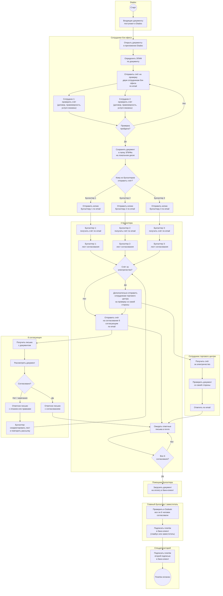
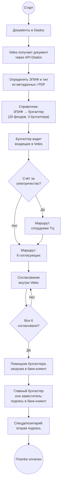

# Маршрутизация документов: Diadoc → диск → бухгалтер → согласование → банк-клиент

> Схема текущего (as-is) ручного процесса: от поступления документов в Diadoc до оплаты через банк-клиент после согласования.
> - **Mermaid** — для просмотра в Obsidian, GitHub и Cursor без дополнительных инструментов.
> - **BPMN 2.0** — формальная нотация (дорожки, шлюзы, User Task); исходник [`.bpmn`](diagrams/2.1-invoice-payment.bpmn), редактирование в [bpmn.io](https://demo.bpmn.io).

## Участники

| Роль                                | Описание                                                                                                  |
| ----------------------------------- | --------------------------------------------------------------------------------------------------------- |
| **Diadoc**                          | Канал поступления электронных документов от контрагентов                                                  |
| **Сотрудники бэк-офиса**            | Определяют ЗПИФ, **отправляют счёт на проверку двум коллегам** (соответствие договору, правомерность платежа), затем сохраняют в папку ЗПИФа и **отправляют копию по email одному из трёх бухгалтеров** (выбор вручную) |
| **3 бухгалтера**                    | Каждый ведёт несколько ЗПИФов из **20 фондов**; заходит в «свои» папки и отправляет счета на согласование |
| **6 согласующих**                   | Фиксированная группа из шести сотрудников; каждый отвечает по email                                       |
| **Сотрудники торгового центра**     | Дополнительная проверка **только для счетов за электричество**                                            |
| **Помощник бухгалтера**             | После согласования всеми шестью загружает документ на оплату в банк-клиент, в Аванкор                     |
| **Сотрудники бэк-офиса**            | Дополнительно выделено двое сотрудников для загрузки всех документов в Спец.Депозитарий                   |
| **Главный бухгалтер / заместитель** | Сверяет в Outlook, что все 6 согласовали; **подписывает** платёж в банк-клиент первой подписью (один из двух) |
| **Спецдепозитарий**                 | После подписи главного бухгалтера **подписывает платёж второй подписью** в банк-клиент; после двух подписей платёж оплачен |

## Распределение ЗПИФов

Все **20 ЗПИФов** распределены между **тремя бухгалтерами**. Бэк-офис после внутренней проверки двумя коллегами сохраняет документ в папку ЗПИФа и **отправляет копию по email выбранному бухгалтеру**; двое остальных в обработке этого счёта не участвуют.

## Основная схема (с дорожками)

## Схема BPMN 2.0

Формальная диаграмма процесса: pool с дорожками ролей, exclusive/parallel gateways, User Task и Service Task.

Откройте [diagrams/2.1-invoice-payment.bpmn](diagrams/2.1-invoice-payment.bpmn) в [bpmn.io](https://demo.bpmn.io) (File → Open) или Camunda Modeler. Для вставки в markdown: File → Export as SVG → сохранить как `diagrams/2.1-invoice-payment.bpmn.svg`.

| Файл | Назначение |
|------|------------|
| [diagrams/2.1-invoice-payment.bpmn](diagrams/2.1-invoice-payment.bpmn) | Исходник BPMN 2.0 XML |
| `diagrams/2.1-invoice-payment.bpmn.svg` | Экспорт для просмотра в markdown (создаётся вручную или скриптом) |
| [scripts/export_bpmn_svg.sh](scripts/export_bpmn_svg.sh) | Автоэкспорт через Docker: `./scripts/export_bpmn_svg.sh diagrams/2.1-invoice-payment.bpmn` |

## Упрощённая схема

```mermaid
flowchart LR
    A((Старт)) --> B["Diadoc"]
    B --> C["Папки ЗПИФов<br/>на диске"]
    C --> BO["Бэк-офис:<br/>проверка двумя коллегами,<br/>сохранение + email<br/>одному бухгалтеру"]
    BO --> D["Бухгалтер:<br/>лист согласования"]
    D --> E{"Счёт за<br/>электричество?"}
    E -->|Да| F["Проверка<br/>сотрудниками ТЦ"]
    E -->|Нет| G
    F --> G["Согласование<br/>6 согласующих"]
    G --> H["Ответы<br/>в Outlook"]
    H --> I{"Все 6<br/>согласовали?"}
    I -->|Нет| H
    I -->|Да| J["Помощник бухгалтера:<br/>загрузка в банк-клиент"]
    J --> K["Главный бухгалтер<br/>или заместитель:<br/>подпись в банк-клиент"]
    K --> SD["Спецдепозитарий:<br/>вторая подпись"]
    SD --> L(("Платёж оплачен"))
```

## Шаги процесса

1. Контрагент направляет документ через **Diadoc**.
2. **Сотрудники бэк-офиса** открывают документы в приложении Diadoc.
3. По содержимому или реквизитам определяется **ЗПИФ**.
4. **Сотрудник бэк-офиса** отправляет счёт **двум коллегам того же отдела** по email на проверку: соответствие счёта договору, правомерность платежа, факт оказания услуг или выполнения работ.
5. **Два сотрудника бэк-офиса** параллельно проверяют счёт; при замечаниях процесс возвращается к отправке на проверку.
6. После успешной проверки документ **сохраняется в папку соответствующего ЗПИФа** на локальном диске (всего ~20 папок фондов).
7. **Сотрудник бэк-офиса** **выбирает**, какому из **трёх бухгалтеров** отправить **копию счёта по email**.
8. **Выбранный бухгалтер** получает счёт в почте и **составляет лист согласования** для рассылки (двое остальных не участвуют).
9. Если счёт — **за электричество**, бухгалтер **дополнительно отправляет** его **сотрудникам торгового центра** для проверки со своей стороны.
10. Бухгалтер **отправляет счёт на согласование по email шести согласующим**.
11. **6 согласующих** (и при необходимости сотрудники ТЦ) рассматривают документ и отвечают письмом.
12. При замечаниях бухгалтер **корректирует и повторяет** рассылку.
13. Когда **все 6 человек согласовали**, **помощник бухгалтера** **загружает документ на оплату в банк-клиент**.
14. **Главный бухгалтер или его заместитель** вручную **сверяет ответы в Outlook** и **подписывает** платёж **в банк-клиент** (первая подпись).
15. **Спецдепозитарий** **подписывает платёж второй подписью** в банк-клиент.
16. После **двух подписей** (главный бухгалтер и спецдепозитарий) **платёж оплачен**.

## Особые правила

| Условие | Действие |
|---------|----------|
| Проверка в бэк-офисе | Счёт отправляется **двум сотрудникам бэк-офиса**; проверяют соответствие договору, правомерность платежа и факт оказания услуг / выполнения работ |
| Сохранение на диск | После успешной проверки бэк-офис кладёт документ **в папку нужного ЗПИФа** из ~20 фондов |
| Уведомление бухгалтера | Бэк-офис **вручную выбирает** бухгалтера и **отправляет копию счёта по email** |
| Работа бухгалтеров | Счёт получает **один** бухгалтер по почте — только он ведёт документ, **двое остальных не участвуют** |
| Любой счёт | Обязательное согласование **6 согласующими** по email |
| Счёт за электричество | Дополнительно — проверка **сотрудниками торгового центра** |
| После согласования | **Помощник бухгалтера** загружает документ **на оплату в банк-клиент** |
| Подпись платежа | **Главный бухгалтер или заместитель** подписывает платёж в банк-клиент **первой подписью** |
| Вторая подпись | **Спецдепозитарий** подписывает платёж **второй подписью** в банк-клиент |
| Завершение процесса | После **двух подписей** платёж **оплачен** |

## Соответствие символам BPMN

| Элемент на схеме | Символ BPMN | Роль в процессе |
|------------------|-------------|-----------------|
| `((Старт))` | Стартовое событие | Поступление документов в Diadoc |
| Прямоугольники | Задача (Task) | Сохранение в папку, рассылка, согласование, оплата |
| Ромбы `{...}` | Шлюз (Gateway) | Тип документа, проверка согласований |
| `((Конец))` | Конечное событие | Платёж оплачен после двух подписей в банк-клиент |
| Блоки `subgraph` | Pool / Lane | Diadoc, бэк-офис, бухгалтеры, ТЦ, согласующие, помощник, главбух / зам., спецдепозитарий |

## Проблемы текущего процесса

- **Проверка счёта в бэк-офисе** — два сотрудника проверяют по email без единого чек-листа и статуса; при замечаниях цикл повторяется вручную.
- **Папки на диске** — нет единой системы; бэк-офис должен не ошибиться с выбором папки ЗПИФа.
- **20 ЗПИФов на 3 бухгалтеров** — распределение закреплено неформально; при смене сотрудника знание теряется.
- Бухгалтер **узнаёт о счёте только из письма бэк-офиса** — нет автоматической привязки ЗПИФ → бухгалтер; бэк-офис может ошибиться с выбором адресата.
- **Согласование 6 людей через email** — главбух или заместитель вручную сверяет ответы в Outlook, легко пропустить письмо или перепутать цепочку.
- Для **счетов за электричество** добавляется ещё один ручной контур (ТЦ) без единого статуса.
- **Задержки** при ожидании ответов; нет единого реестра «кто уже согласовал».
- **Два ручных шага в банк-клиенте** — сначала загрузка помощником, затем две подписи (главбух и спецдепозитарий); нет единого статуса платежа.
- **Зависимость от двух подписантов** — оплата возможна только после подписи главного бухгалтера (или заместителя) и спецдепозитария в банк-клиент.

## Целевой вариант (для сравнения)

При автоматизации в **Veles** правила маршрутизации и согласования задаются в системе:

## Связанные документы

- [PROJECT.md](1.%20Описание%20проекта.md) — общий as-is / to-be процесс документооборота
- [INTEGRATION_DIADOC.md](5.%20Интеграция%20с%20Diadoc.md) — интеграция с Diadoc API
- [INTEGRATION_AVANKOR.md](6.%20Интеграция%20с%20Аванкор.md) — отправка согласованных документов в учётную систему
- [INTEGRATION_SPEC_DEP.md](8.%20Интеграция%20со%20Спецдепозитарием.md) — передача документов в специализированный депозитарий
- [INTEGRATION_BANK_CLIENT.md](7.%20Интеграция%20с%20Банк-клиентом.md) — отправка платежей в банк-клиент после согласования
- [Роли пользователей](9.%20Роли%20пользователей.md) — полномочия бухгалтера и главного бухгалтера на этапе оплаты
