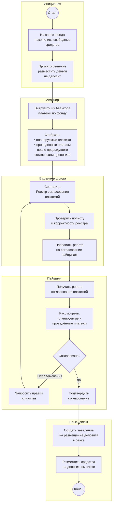
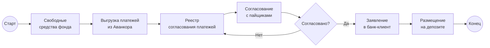
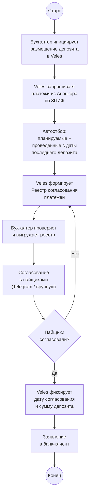

# Размещение депозита: Аванкор → реестр → согласование с пайщиками → банк

> Схема текущего (as-is) ручного процесса: от решения о размещении свободных средств фонда на депозит до оформления заявления в банке после согласования с пайщиками. Диаграммы в формате [Mermaid](https://mermaid.js.org/) — отображаются в Obsidian (Reading view / Live Preview), GitHub и Cursor.

## Участники

| Роль | Описание |
| ----------------------------------- | --------------------------------------------------------------------------------------------------------- |
| **Аванкор** | Учётная система фонда; в ней ведутся все платежи — планируемые и проведённые |
| **Бухгалтер фонда** | Один из **трёх бухгалтеров**, закреплённых за ЗПИФ; готовит реестр и инициирует размещение |
| **Пайщики** | Участники фонда; согласовывают размещение депозита и состав платежей в реестре |
| **Банк-клиент** | Канал оформления **заявления на размещение депозита** в банке |
| **Главный бухгалтер / руководство** | При необходимости — внутренний контроль перед отправкой реестра пайщикам |

## Контекст

Размещение депозита — операция по временному размещению **свободных денежных средств** фонда на депозитном счёте в банке. Пример: фонд **«Медиа-траст»** — деньги могут лежать на депозите некоторое время до следующих расходов.

Операция **требует согласования с пайщиками**: перед размещением нужно показать, какие платежи планируются и какие уже были проведены с момента предыдущего согласования депозита.

Процесс **не по всем ~20 ЗПИФам** — выполняется для тех фондов, где на счёте накапливаются свободные средства и принято решение о депозите.

## Основная схема (с дорожками)

## Упрощённая схема

## Шаги процесса

1. На расчётном счёте **ЗПИФа** накапливаются **свободные средства**, которые можно временно разместить на депозите.
2. **Бухгалтер**, закреплённый за фондом, принимает решение о подготовке **размещения депозита**.
3. Бухгалтер **выгружает платежи из Аванкора** по данному фонду.
4. В выгрузку попадают:
   - **все планируемые платежи** на ближайший период;
   - **все проведённые платежи** с момента **предыдущего согласования депозита**.
5. На основе выгрузки составляется **Реестр согласования платежей**.
6. Реестр **направляется пайщикам** на согласование.
7. **Пайщики** рассматривают реестр: проверяют, что планируемые расходы и уже проведённые операции соответствуют их ожиданиям, и подтверждают или отклоняют размещение депозита.
8. При замечаниях бухгалтер **корректирует реестр** и повторяет согласование.
9. После согласования пайщиками в **банк-клиенте** создаётся **заявление на размещение депозита**.
10. Средства **размещаются на депозитном счёте** в банке до наступления планируемых расходов.

## Содержание реестра согласования платежей

| Раздел реестра | Что включает |
|----------------|--------------|
| **Планируемые платежи** | Все платежи, которые фонд планирует провести в ближайший период (из Аванкора) |
| **Проведённые платежи** | Все платежи, исполненные **после предыдущего** согласования размещения депозита |
| **Контекст для пайщиков** | Обоснование: какие средства остаются свободными и могут быть размещены на депозите |

Реестр связывает **текущую платёжную нагрузку фонда** с решением о временном размещении остатка — пайщики видят, что деньги на депозите не блокируют обязательные расходы.

## Особые правила

| Условие | Действие |
|---------|----------|
| Источник данных о платежах | Только **Аванкор** — реестр собирается из выгрузки системы |
| Период «проведённых платежей» | С даты **предыдущего** согласования размещения депозита |
| Согласование | Обязательно **с пайщиками**; без их подтверждения депозит не размещается |
| Канал согласования с пайщиками | Часто **вручную через Telegram** — отдельный неформальный канал |
| После согласования | **Заявление в банк-клиенте** на размещение депозита |
| Не все фонды | Процесс актуален только для фондов со **свободным остатком** на счёте |

## Согласование с пайщиками (отдельный контур)

Согласование размещения депозитов с пайщиками выполняется **вне стандартного email-маршрута** из [2.1](2.1%20Маршруты%20Документов%20-%20входящий%20Счет%20на%20оплату.md):

- пайщики периодически согласовывают реестр **вручную**, в том числе через **Telegram**;
- этот контур **пока не планируется автоматизировать** в Veles — достаточно зафиксировать as-is процесс и точки, где система может помочь бухгалтеру (сбор реестра из Аванкора).

## Соответствие символам BPMN

| Элемент на схеме | Символ BPMN | Роль в процессе |
|------------------|-------------|-----------------|
| `((Старт))` | Стартовое событие | Решение о размещении свободных средств на депозите |
| Прямоугольники | Задача (Task) | Выгрузка из Аванкора, составление реестра, заявление в банке |
| Ромбы `{...}` | Шлюз (Gateway) | Согласование пайщиками |
| `((Конец))` | Конечное событие | Средства размещены на депозитном счёте |
| Блоки `subgraph` | Pool / Lane | Аванкор, бухгалтер, пайщики, банк-клиент |

## Проблемы текущего процесса

- **Ручная выгрузка из Аванкора** — бухгалтер сам формирует реестр; нет шаблона и автоматического отбора «с предыдущего согласования».
- **Нет единого реестра** — каждый раз реестр собирается заново; история предыдущих согласований депозита не централизована.
- **Согласование с пайщиками через Telegram** — нет формального статуса «кто согласовал»; сложно восстановить историю.
- **Разрыв между реестром и банком** — заявление в банк-клиенте создаётся отдельно, без связи с реестром в системе.
- **Зависимость от памяти бухгалтера** — дата «предыдущего согласования депозита» не всегда зафиксирована явно.
- **Не масштабируется** — при росте числа фондов с депозитными операциями ручной сбор реестра отнимает всё больше времени.

## Целевой вариант (для сравнения)

При частичной автоматизации в **Veles** можно упростить подготовку реестра; **согласование с пайщиками остаётся ручным**:

**Вне scope Veles (на текущем этапе):** автоматизация переписки с пайщиками в Telegram и онлайн-голосование пайщиков.

## Связанные документы

- [PROJECT.md](1.%20Описание%20проекта.md) — общий as-is / to-be процесс документооборота
- [2.1 Маршруты Документов — входящий Счёт на оплату](2.1%20Маршруты%20Документов%20-%20входящий%20Счет%20на%20оплату.md) — смежный процесс согласования и оплаты счетов
- [INTEGRATION_AVANKOR.md](6.%20Интеграция%20с%20Аванкор.md) — выгрузка платежей и учёт операций по фонду
- [INTEGRATION_BANK_CLIENT.md](7.%20Интеграция%20с%20Банк-клиентом.md) — оформление заявления на размещение депозита
- [Роли пользователей](9.%20Роли%20пользователей.md) — полномочия бухгалтера и главного бухгалтера
- [Информация по процессам](Информация по процессам.md) — исходные заметки по процессам УК
