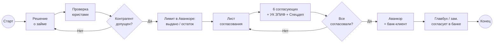
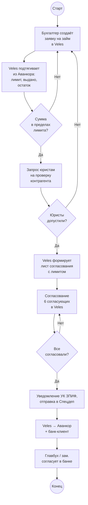

# Выдача займа: договор → юристы → лимит → согласование → Аванкор → банк-клиент

> Схема текущего (as-is) ручного процесса: от решения о выдаче займа контрагенту до перечисления средств через банк-клиент после проверки юристами, согласования лимита по договору и многоступенчатого согласования. Диаграммы в формате [Mermaid](https://mermaid.js.org/) — отображаются в Obsidian (Reading view / Live Preview), GitHub и Cursor.

## Участники

| Роль | Описание |
| ----------------------------------- | --------------------------------------------------------------------------------------------------------- |
| **Diadoc / бумага** | Канал поступления документов по договору займа и сопутствующих документов от контрагента |
| **Сотрудники бэк-офиса** | Выгружают документы из Diadoc, сохраняют в папки ЗПИФов, отправляют в **Спец.Депозитарий** |
| **3 бухгалтера** | Каждый ведёт несколько ЗПИФов; готовит лист согласования, проверяет лимит по договору займа |
| **Юристы** | **Каждый раз** проверяют контрагента, которому выдаётся займ |
| **6 согласующих** | Фиксированная группа сотрудников; согласуют выдачу займа по email |
| **УК ЗПИФ** | Для части фондов — дополнительное согласование (как для платежей) |
| **Спец.Депозитарий** | Получает документы по операции; **согласовывает платёж в банковском кабинете** |
| **Помощник бухгалтера** | После согласования создаёт платёжное поручение и загружает в банк-клиент |
| **Главный бухгалтер / заместитель** | Сверяет согласования в Outlook и **согласовывает платёж в банк-клиент** |
| **Аванкор** | Учёт займов: лимит по договору, сумма уже выданная, остаток лимита |

## Контекст

Выдача займа — операция по предоставлению **денежных средств фонда** контрагенту на условиях **договора займа**. С частью организаций уже **настроено постоянное взаимодействие**; процесс повторяется при каждой новой выдаче или транше.

Процесс **значительно сложнее обычной платежки** ([2.1](2.1%20Маршруты%20Документов%20-%20входящий%20Счет%20на%20оплату.md)):

- обязательная **проверка контрагента юристами** при каждой выдаче;
- **лист согласования** включает не только сумму платежа, но и **лимит по договору**, **сколько уже выдано** и **остаток лимита**;
- цепочка согласований шире: внутренние согласующие → **УК ЗПИФ** → **Спецдеп** (в том числе в банковском кабинете).

По объёму трудозатрат процесс **отнимает много времени** у бухгалтерии.

## Основная схема (с дорожками)

```mermaid
flowchart TB
    subgraph trigger["Инициация"]
        E1((Старт))
        E1 --> T1["Принято решение<br/>выдать займ<br/>контрагенту"]
    end

    subgraph lawyers["Юристы"]
        T1 --> T2["Бухгалтер направляет<br/>запрос юристам"]
        T2 --> T3["Юристы проверяют<br/>контрагента-получателя<br/>займа"]
        T3 --> G1{"Контрагент<br/>допущен?"}
        G1 -->|Нет| T4["Отказ / доработка"]
        G1 -->|Да| T5["Заключение<br/>юристов"]
        T4 --> T1
    end

    subgraph avankor["Аванкор"]
        T5 --> T6["Проверить договор займа:<br/>лимит, выдано,<br/>остаток лимита"]
        T6 --> G2{"Сумма займа<br/>в пределах<br/>остатка?"}
        G2 -->|Нет| T7["Согласовать<br/>превышение / отказ"]
        G2 -->|Да| T8
        T7 --> T1
    end

    subgraph accountant["Бухгалтер фонда"]
        T8["Подготовить сложный<br/>лист согласования:<br/>лимит, выдано,<br/>остаток, сумма займа"]
        T8 --> T9["Отправить на<br/>внутреннее согласование<br/>6 согласующим по email"]
        T9 --> T10["Ожидать ответные<br/>письма в Outlook"]
        T10 --> G3{"Все 6<br/>согласовали?"}
        G3 -->|Нет| T10
        G3 -->|Да| T11["Согласование<br/>с УК ЗПИФ"]
        T11 --> T12["Уведомить Спецдеп,<br/>отправить документы"]
    end

    subgraph approvers["6 согласующих"]
        T9 --> T_A1["Получить лист<br/>согласования"]
        T_A1 --> T_A2["Проверить сумму<br/>и лимит по договору"]
        T_A2 --> G4{"Согласовано?"}
        G4 -->|Да| T_A3["Ответное письмо<br/>с согласованием"]
        G4 -->|Нет| T_A4["Отказ / замечания"]
        T_A3 --> T10
        T_A4 --> T8
    end

    subgraph backoffice["Сотрудники бэк-офиса"]
        T12 --> T_BO1["Выгрузить документы<br/>из Diadoc / папки ЗПИФ"]
        T_BO1 --> T_BO2["Отправить документы<br/>в Спец.Депозитарий"]
    end

    subgraph specdep["Спец.Депозитарий"]
        T_BO2 --> T_SD1["Получить документы<br/>по операции"]
        T_SD1 --> T_SD2["Согласовать платёж<br/>в банковском кабинете"]
    end

    subgraph assistant["Помощник бухгалтера"]
        T_SD2 --> T_ASST1["Занести операцию<br/>в Аванкор"]
        T_ASST1 --> T_ASST2["Создать платёжное<br/>поручение в банк-клиент"]
    end

    subgraph chief["Главный бухгалтер / заместитель"]
        T_ASST2 --> T_GB1["Проверить в Outlook:<br/>все ли согласовали"]
        T_GB1 --> T_GB2["Согласовать платёж<br/>в банк-клиент"]
        T_GB2 --> E2((Конец))
    end
```

## Упрощённая схема

## Шаги процесса

1. Принимается решение **выдать займ** контрагенту в рамках действующего **договора займа** (с организациями, с которыми уже налажено взаимодействие).
2. **Бухгалтер** направляет **юристам** запрос на проверку **контрагента-получателя** займа.
3. **Юристы проверяют контрагента каждый раз** — без их заключения выдача не продолжается.
4. Бухгалтер в **Аванкоре** сверяет **лимит по договору займа**: сколько **уже выдано** и какой **остаток лимита** доступен для новой выдачи.
5. Если сумма займа **превышает остаток лимита**, требуется отдельное решение или отказ; иначе процесс продолжается.
6. Бухгалтер составляет **сложный лист согласования** с данными:
   - контрагент и договор займа;
   - **лимит** по договору;
   - **сумма уже выданная**;
   - **остаток лимита**;
   - **сумма текущей выдачи**.
7. Лист направляется **6 согласующим по email** (аналогично обычным платежам).
8. **6 согласующих** рассматривают документ и отвечают письмом; при замечаниях бухгалтер **корректирует и повторяет** рассылку.
9. После внутреннего согласования выполняется согласование с **УК ЗПИФ** (для соответствующих фондов).
10. **Бэк-офис** выгружает документы из **Diadoc** (или из папки ЗПИФ) и **отправляет в Спец.Депозитарий**.
11. **Спецдеп** получает документы и **согласовывает платёж в банковском кабинете** (отдельное уведомление от бухгалтерии).
12. **Помощник бухгалтера** заносит операцию в **Аванкор** и создаёт **платёжное поручение** в **банк-клиенте**.
13. **Главный бухгалтер или заместитель** сверяет в **Outlook**, что все согласовали, и **согласует платёж в банк-клиент**.
14. Средства **перечисляются контрагенту**; в Аванкоре обновляется **остаток лимита** по договору займа.

## Содержание листа согласования по договору займа

| Раздел листа | Что включает |
|--------------|--------------|
| **Контрагент** | Наименование и реквизиты получателя займа |
| **Договор займа** | Номер, дата, условия |
| **Лимит по договору** | Максимальная сумма займа по договору |
| **Уже выдано** | Сумма ранее выданных траншей (из Аванкора) |
| **Остаток лимита** | Разница между лимитом и уже выданным |
| **Текущая выдача** | Сумма предлагаемого платежа |
| **Заключение юристов** | Результат проверки контрагента |

Лист согласования по займу **сложнее**, чем для обычного счёта: согласующие должны видеть не только сумму платежа, но и **влияние на лимит** по договору.

## Особые правила

| Условие | Действие |
|---------|----------|
| Проверка контрагента | **Юристы проверяют каждый раз** — обязательный шаг перед согласованием |
| Лимит по договору | Сверка в **Аванкоре**: лимит, выдано, остаток |
| Внутреннее согласование | **6 согласующих** по email — как для платежей |
| УК ЗПИФ | Дополнительное согласование для части фондов |
| Спецдеп | Документы отправляются в депозитарий; **согласование платежа в банковском кабинете** |
| Отправка в Спецдеп | Факт отправки документов означает, что сотрудник **согласовал** операцию со своей стороны |
| Учёт | Операция заносится в **Аванкор** до или параллельно с оплатой |
| Оплата | **Помощник** создаёт платёжку → **главбух / зам.** согласует в банк-клиент |
| Контрагенты | С частью организаций взаимодействие **уже настроено**; для новых — полный цикл проверок |

## Отличия от обычной платежки (2.1)

| Аспект | Обычный счёт (2.1) | Выдача займа (2.3) |
|--------|-------------------|-------------------|
| Проверка контрагента | По договору бухгалтером | **+ юристы каждый раз** |
| Лист согласования | Сумма, договор, назначение | **+ лимит, выдано, остаток** |
| Согласование УК ЗПИФ | Для части платежей | **Обязательно** для соответствующих фондов |
| Спецдеп в банке | Для платежей | **Согласование в банковском кабинете** |
| Трудозатраты | Стандартные | **Значительно выше** |

## Соответствие символам BPMN

| Элемент на схеме | Символ BPMN | Роль в процессе |
|------------------|-------------|-----------------|
| `((Старт))` | Стартовое событие | Решение о выдаче займа контрагенту |
| Прямоугольники | Задача (Task) | Проверка юристами, лист согласования, оплата |
| Ромбы `{...}` | Шлюз (Gateway) | Допуск контрагента, лимит, согласования |
| `((Конец))` | Конечное событие | Средства перечислены, лимит обновлён в Аванкоре |
| Блоки `subgraph` | Pool / Lane | Юристы, бухгалтер, согласующие, Спецдеп, банк |

## Проблемы текущего процесса

- **Юристы проверяют контрагента каждый раз вручную** — нет единого реестра проверенных контрагентов с датой и результатом.
- **Лимит по договору сверяется вручную** в Аванкоре — риск ошибки при расчёте остатка.
- **Сложный лист согласования собирается вручную** — данные о лимите, выданном и остатке копируются из разных источников.
- **Согласование 6 людей через email** — главбух вручную сверяет ответы в Outlook; для займов цепочка ещё длиннее (УК ЗПИФ, Спецдеп).
- **Спецдеп согласует отдельно в банковском кабинете** — нет единого статуса «все согласовали, включая Спецдеп».
- **Много ручных шагов** — Diadoc → папка → email → Аванкор → банк-клиент; процесс **отнимает много времени**.
- **Нет связи между заключением юристов и листом согласования** — документы живут в почте и папках.
- **Два ручных шага в банк-клиенте** — помощник загружает, главбух согласует; нет единого статуса платежа.

## Целевой вариант (для сравнения)

При автоматизации в **Veles** можно сократить ручной сбор данных; **проверка юристами** на первом этапе остаётся отдельным контуром:

**Уже отражено в прототипе Veles:** форма «Займы» — выбор ЗПИФ, счёта, получателя, суммы; реестр платежей; согласование акционерами (демо-контур).

**Вне scope Veles (на текущем этапе):** полная автоматизация юридической проверки контрагента и согласования Спецдепа в банковском кабинете.

## Связанные документы

- [PROJECT.md](1.%20Описание%20проекта.md) — общий as-is / to-be процесс документооборота
- [2.1 Маршруты Документов — входящий Счёт на оплату](2.1%20Маршруты%20Документов%20-%20входящий%20Счет%20на%20оплату.md) — базовый процесс согласования и оплаты платежей
- [2.2 Маршруты Документов — размещение депозита](2.2%20Маршруты%20Документов%20-%20размещение%20Депозита.md) — смежный процесс с реестром и согласованием
- [INTEGRATION_AVANKOR.md](6.%20Интеграция%20с%20Аванкор.md) — учёт займов, лимиты и операции по фонду
- [INTEGRATION_SPEC_DEP.md](8.%20Интеграция%20со%20Спецдепозитарием.md) — передача документов и согласование в банковском кабинете
- [INTEGRATION_BANK_CLIENT.md](7.%20Интеграция%20с%20Банк-клиентом.md) — создание и согласование платёжного поручения
- [Роли пользователей](9.%20Роли%20пользователей.md) — полномочия бухгалтера, юристов и главного бухгалтера
- [Информация по процессам](Информация по процессам.md) — исходные заметки по процессам УК
