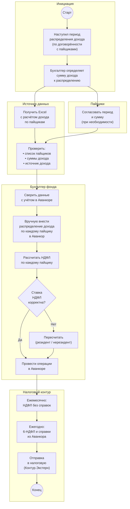
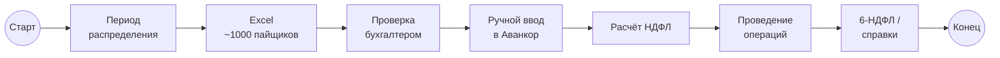
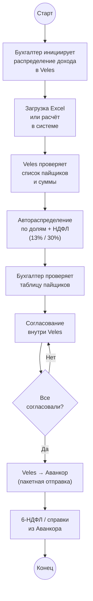

# Распределение дохода между пайщиками: Excel → Аванкор → НДФЛ → выплата

> Схема текущего (as-is) ручного процесса: от начисления дохода по фонду до внесения распределения между пайщиками в Аванкоре и расчёта НДФЛ. Диаграммы в формате [Mermaid](https://mermaid.js.org/) — отображаются в Obsidian (Reading view / Live Preview), GitHub и Cursor.

## Участники

| Роль | Описание |
| ----------------------------------- | --------------------------------------------------------------------------------------------------------- |
| **Аванкор** | Учётная система фонда; в ней **вручную вносятся** операции распределения дохода между пайщиками |
| **Бухгалтер фонда** | Один из **трёх бухгалтеров**, закреплённых за ЗПИФ; готовит и проводит распределение |
| **Пайщики** | Участники фонда; **определяют периодичность** выплаты дохода (раз в месяц, реже или чаще) |
| **Внешний источник данных** | Присылает **Excel-файл** с расчётом дохода по пайщикам (до **~1000 строк** на фонд) |
| **Главный бухгалтер** | Контроль начислений; связанный контур **6-НДФЛ** и справок о доходах пайщиков |
| **1С ЗУП** | Кадровый и налоговый контур для части операций по НДФЛ |
| **Контур.Экстерн** | Отправка отчётности и документов в **налоговую** |

## Контекст

Распределение дохода — регулярная операция по **перечислению начисленного дохода пайщикам** ЗПИФа. Доход формируется из деятельности фонда (аренда, проценты и др.) и распределяется **пропорционально долям** пайщиков.

**Периодичность не фиксирована:** по желанию пайщиков доход распределяется **раз в месяц**, **реже** или **чаще** — как они решат.

Типовой регламент — **раз в месяц** внести распределение дохода на пайщиков. Все операции в Аванкоре на этом этапе выполняются **вручную**.

Процесс **трудоёмкий** из‑за большого числа пайщиков (в некоторых ЗПИФ): в Excel-файле может быть **около 1000 строк** — по каждому пайщику нужно указать сумму дохода и провести операцию в системе.

## Основная схема (с дорожками)

## Упрощённая схема

## Шаги процесса

1. Наступает **срок распределения дохода** — по договорённости с пайщиками (обычно **раз в месяц**, но период может быть другим).
2. **Бухгалтер**, закреплённый за фондом, определяет **общую сумму дохода**, подлежащую распределению.
3. При необходимости **согласуется период и сумма** с пайщиками (часто **вручную**, в том числе через **Telegram**).
4. Поступает **Excel-файл** с расчётом: список пайщиков, суммы дохода, источник начисления — **до ~1000 строк** на один фонд.
5. Бухгалтер **проверяет** файл: соответствие списка пайщиков, сумм и источников дохода данным фонда.
6. Бухгалтер **сверяет** расчёт с учётом в **Аванкоре**.
7. Каждую строку распределения бухгалтер **вручную вносит в Аванкор** — операции распределения дохода на пайщиков.
8. По каждому пайщику рассчитывается **НДФЛ**:
   - **13%** — для резидентов;
   - **30%** — для нерезидентов (до подтверждения статуса резидента).
9. Если пайщик **подтверждает резидентство**, ставку нужно **пересчитать с 30% на 13%** и скорректировать все начисления.
10. Операции **проводятся в Аванкоре**; формируются данные для выплат пайщикам.
11. **Ежемесячно** — НДФЛ удерживается и перечисляется **без выдачи справок** пайщикам.
12. **Ежегодно** — из Аванкора формируются **справки о доходах пайщиков** для декларации **6-НДФЛ** (до **~1157 справок**); отчётность подаётся в налоговую через **Контур.Экстерн**.
13. Часть данных по НДФЛ дополнительно обрабатывается в **1С ЗУП**.

## Содержание Excel-файла с расчётом

| Раздел | Что включает |
|--------|--------------|
| **Пайщик** | ФИО / наименование, ИНН |
| **Доля / количество паёв** | Основание для пропорционального распределения |
| **Сумма дохода** | Начисленный доход по данному пайщику |
| **Источник дохода** | Откуда сформирован доход (аренда, проценты и т.д.) |
| **НДФЛ** | Сумма налога к удержанию (13% или 30%) |
| **К выплате** | Сумма после удержания НДФЛ |

Файл может содержать **до ~1000 строк** — ручной перенос в Аванкор занимает значительное время.

## Особые правила

| Условие | Действие |
|---------|----------|
| Периодичность | По **желанию пайщиков**: раз в месяц, реже или чаще |
| Типовой регламент | **Раз в месяц** — внести распределение дохода |
| Источник расчёта | **Excel-файл** от внешнего источника |
| Ввод в систему | Только **вручную в Аванкоре** — автоматической загрузки нет |
| НДФЛ — резидент | Ставка **13%** |
| НДФЛ — нерезидент | Ставка **30%**; при подтверждении резидентства — **пересчёт на 13%** |
| Ежемесячно | НДФЛ удерживается **без справок** |
| Ежегодно | **6-НДФЛ** + справки о доходах из **Аванкора** → **Контур.Экстерн** → налоговая |
| Согласование с пайщиками | Часто **вручную через Telegram** — отдельный неформальный канал |
| Масштаб | До **~1000 пайщиков** на фонд |

## Налоговый контур (связанные операции)

Распределение дохода тесно связано с **налогообложением пайщиков**:

| Операция | Периодичность | Система |
|----------|---------------|---------|
| Удержание и перечисление НДФЛ | Ежемесячно | **Аванкор** |
| Справки о доходах пайщиков | Ежегодно | **Аванкор** → **6-НДФЛ** |
| Подача декларации в ФНС | Ежегодно | **Контур.Экстерн** |
| Кадровый / налоговый учёт | По необходимости | **1С ЗУП** |

При смене статуса пайщика (нерезидент → резидент) требуется **полный пересчёт** начислений по ставке **13%**.

## Согласование с пайщиками (отдельный контур)

Периодичность и условия распределения дохода определяются **по желанию пайщиков** и согласовываются **вне стандартного email-маршрута** из [2.1](2.1%20Маршруты%20Документов%20-%20входящий%20Счет%20на%20оплату.md):

- пайщики могут запросить распределение **чаще или реже** стандартного месячного цикла;
- согласование часто выполняется **вручную**, в том числе через **Telegram**;
- этот контур **пока не планируется автоматизировать** в Veles.

## Соответствие символам BPMN

| Элемент на схеме | Символ BPMN | Роль в процессе |
|------------------|-------------|-----------------|
| `((Старт))` | Стартовое событие | Наступление периода распределения дохода |
| Прямоугольники | Задача (Task) | Получение Excel, ввод в Аванкор, расчёт НДФЛ |
| Ромбы `{...}` | Шлюз (Gateway) | Проверка ставки НДФЛ, согласование |
| `((Конец))` | Конечное событие | Операции проведены, налоговая отчётность сформирована |
| Блоки `subgraph` | Pool / Lane | Бухгалтер, пайщики, Аванкор, налоговый контур |

## Проблемы текущего процесса

- **Ручной ввод ~1000 строк в Аванкор** — основная трудоёмкость; высокий риск ошибок при переносе из Excel.
- **Нет автоматической загрузки** из Excel — каждый раз данные вбиваются заново.
- **Неясный источник дохода** в Excel — бухгалтеру нужно вручную проверять, откуда берётся доход каждого пайщика.
- **Пересчёт НДФЛ при смене резидентства** — ручная корректировка всех начислений при переходе с 30% на 13%.
- **1157 справок для 6-НДФЛ** — масштабная ежегодная операция; данные формируются из Аванкора, но процесс требует ручного контроля.
- **Разрозненные системы** — Аванкор, 1С ЗУП, Контур.Экстерн; нет единого статуса операции.
- **Согласование с пайщиками через Telegram** — нет формального реестра решений о периодичности.
- **Не масштабируется** — при росте числа фондов и пайщиков ручной ввод становится непосильным.

## Целевой вариант (для сравнения)

При автоматизации в **Veles** можно снять основную нагрузку — **загрузку Excel и перенос в Аванкор**; согласование периодичности с пайщиками остаётся ручным:

**Уже отражено в прототипе Veles:** раздел «Доход» — выбор ЗПИФ, сумма дохода, таблица пайщиков с расчётом доли, НДФЛ и суммы к выплате; согласование; кнопка «Отправить в Аванкор» (демо).

**Вне scope Veles (на текущем этапе):** автоматическая подача 6-НДФЛ через Контур.Экстерн; согласование периодичности с пайщиками в Telegram.

## Связанные документы

- [PROJECT.md](1.%20Описание%20проекта.md) — общий as-is / to-be процесс документооборота
- [2.1 Маршруты Документов — входящий Счёт на оплату](2.1%20Маршруты%20Документов%20-%20входящий%20Счет%20на%20оплату.md) — смежный процесс учёта и оплаты
- [2.2 Маршруты Документов — размещение депозита](2.2%20Маршруты%20Документов%20-%20размещение%20Депозита.md) — смежный процесс с согласованием пайщиками
- [2.3 Маршруты Документов — выдача займа](2.3%20Маршруты%20Документов%20-%20выдача%20Займа.md) — другой процесс с многоступенчатым согласованием
- [INTEGRATION_AVANKOR.md](6.%20Интеграция%20с%20Аванкор.md) — учёт операций и выгрузка данных по пайщикам
- [11. Отчет по дебиторской задолженности](11. Отчет по дебиторской задолженности.md) — смежный расчётный процесс
- [Роли пользователей](9.%20Роли%20пользователей.md) — полномочия бухгалтера и главного бухгалтера
- [Информация по процессам](Информация по процессам.md) — исходные заметки по процессам УК
