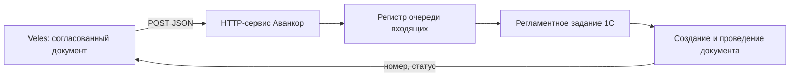
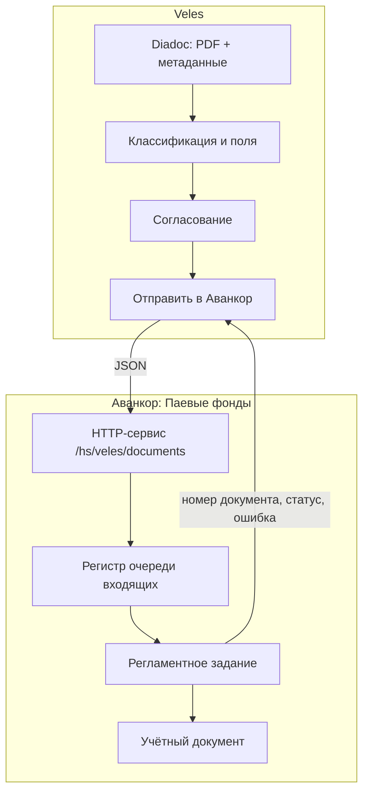
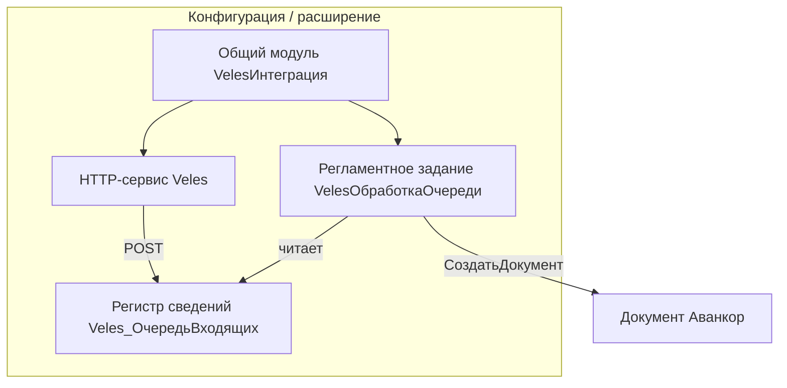

# Интеграция с Аванкор

> Документ описывает способы передачи данных из **Veles** в учётную систему заказчика.  
> Связанные материалы: [PROJECT.md](1.%20Описание%20проекта.md) · [INTEGRATION_SPEC_DEP.md](8.%20Интеграция%20со%20Спецдепозитарием.md) · [INTEGRATION_BANK_CLIENT.md](7.%20Интеграция%20с%20Банк-клиентом.md)

---

## 1. Продукт заказчика

| Параметр | Значение |
|----------|----------|
| **Название** | Аванкор: Паевые фонды |
| **Производитель** | [Аванкор (Avancore)](https://www.avancore.ru/services/pif/) |
| **Платформа** | 1С:Предприятие 8 |
| **Архитектура** | Клиент-сервер, тонкий клиент |
| **СУБД** | PostgreSQL (или Postgres Pro / PostgreSQL с патчем 1С) |

«Аванкор: Паевые фонды» — конфигурация для автоматизации учёта ПИФ: финансовые инструменты, **нефинансовые активы (недвижимость)**, аренда, коммунальные расходы, регламентированная отчётность (в т.ч. XBRL).

**Важно:** в типовой поставке **нет готового API** для загрузки счетов из внешних систем. На сайте производителя указано: *«Интеграция с другими системами в типовом варианте не предусмотрена»*. Интеграция реализуется через механизмы платформы 1С или кастомную доработку конфигурации.

---

## 2. Задача интеграции для Veles

После согласования документа в Veles пользователь нажимает **«Отправить в Аванкор»**. Сервис должен создать соответствующий учётный документ в «Аванкор: Паевые фонды» на основании данных, извлечённых из PDF (Diadoc).

### Типы документов Veles → Аванкор

| Тип в Veles | Назначение | Блок Аванкор (предположительно) |
|-------------|------------|----------------------------------|
| Счёт | Счета подрядчиков (охрана, ремонт, обслуживание) | Взаиморасчёты с контрагентами |
| Счёт | Коммунальные услуги (вода, газ, электричество) | Учёт коммунальных расходов |
| Акт | Акты выполненных работ | Взаиморасчёты / первичные документы |
| УПД | Универсальный передаточный документ | Взаиморасчёты, НДС |
| Товарооборот | Товарные операции | Уточнить у бухгалтерии |

> **Точные имена документов 1С** (объекты метаданных) необходимо зафиксировать при наблюдении за ручным вводом у заказчика — см. [раздел 9](#9-чеклист-перед-реализацией).

### Релевантный функционал «Аванкор: Паевые фонды»

По описанию продукта для сценария заказчика (управление коммерческой недвижимостью) наиболее релевантны:

- **Учёт нефинансовых активов** — недвижимость, земельные участки, права требования (аренды)
- **Взаиморасчёты по аренде недвижимости** — графики платежей, начисления, акты, счета-фактуры
- **Учёт коммунальных расходов**, установка тарифов
- **Взаиморасчёты с контрагентами** — контроль задолженности, учёт авансов
- **Разграничение прав по фондам** — ~20 фондов в одной системе

---

## 3. Методы интеграции

### 3.1. Рекомендуемый: HTTP-сервис в 1С (расширение Аванкор)

**Суть:** в конфигурации (или расширении) создаётся HTTP-сервис. Veles отправляет `POST` с JSON; обработчик на языке 1С создаёт документ штатными методами платформы.



**Почему рекомендуется:**

- Документ создаётся через бизнес-логику 1С (проверки, проводки, нумерация, блокировки)
- Veles (FastAPI backend) остаётся независимым Python-сервисом; UI — React SPA
- Устойчивость при нагрузке (очередь + фоновая обработка)

**Требования:**

- 1С-разработчик, знакомый с «Аванкор: Паевые фонды» у заказчика
- Публикация базы на веб-сервере (IIS / Apache)
- Настройка аутентификации (Basic / токен / mutual TLS)

**Документация платформы:** [HTTP-сервисы 1С](https://v8.1c.ru/platforma/http-servisy/)

**Пример URL:** `https://<host>/<base>/hs/veles/invoice`

---

### 3.2. OData REST (стандартный интерфейс 1С)

**Суть:** база публикуется с включённым OData. Veles создаёт документ через `POST` на эндпоинт вида:

```
POST .../odata/standard.odata/Document_<ИмяДокумента>?$format=json
POST .../odata/standard.odata/Document_<ИмяДокумента>(guid'...')/Post
```

**Плюсы:** минимальная доработка конфигурации (настройка состава OData)  
**Минусы:**

- Имена документов и реквизиты специфичны для «Аванкор: Паевые фонды»
- Сложно заполнять табличные части и ссылочные поля (контрагент, договор, статья расходов)
- Не все объекты могут быть доступны через OData

**Вывод:** возможен для MVP после аудита метаданных базы; для продакшена предпочтительнее кастомный HTTP-сервис.

**Документация:** [REST интерфейс 1С](https://v8.1c.ru/platforma/rest-interfeys/)

---

### 3.3. Очередь сообщений (staging)

**Суть:** Veles записывает задание во внешнее хранилище или регистр 1С; регламентное задание в Аванкор обрабатывает очередь.

| Вариант | Где очередь | Кто читает |
|---------|-------------|------------|
| A | Регистр сведений в 1С (через HTTP-сервис) | Регламентное задание 1С |
| B | Отдельная таблица PostgreSQL (не таблицы 1С!) | Регламентное задание 1С |
| C | RabbitMQ / Redis | Агент 1С или внешний worker |

**Рекомендация:** вариант **A** — очередь внутри 1С, принимаемая HTTP-сервисом.

---

### 3.4. Обмен файлами (XML / JSON)

**Суть:** Veles сохраняет файл в общую папку / SFTP; обработка или регламентное задание в 1С импортирует его.

**Плюсы:** простой POC без веб-публикации  
**Минусы:** нет мгновенного статуса, сложнее отладка

В «Аванкор: Паевые фонды» есть встроенные загрузки (отчёты брокера, акты управляющего, файлы агентов), но **универсального формата для счетов поставщиков нет** — потребуется разработка обработки импорта.

---

### 3.5. COM / внешнее соединение (V83.COMConnector)

**Суть:** Python на Windows подключается к базе 1С через COM и создаёт документ.

**Не рекомендуется для Veles:**

- Требует Windows и установленный клиент 1С
- Плохо масштабируется, хрупкая интеграция
- Несовместимо с типичным деплоем FastAPI/Streamlit на Linux-сервере

---

### 3.6. Прямая запись в PostgreSQL — запрещено

PostgreSQL в инфраструктуре Аванкор — это **СУБД платформы 1С**, а не публичный API.

| Риск | Описание |
|------|----------|
| Схема БД ≠ объектная модель | Документы размазаны по множеству таблиц |
| Целостность | Нужно вручную воспроизводить нумерацию, ссылки, регистры, проводки |
| Блокировки | Конфликты с сервером 1С и управляемыми блокировками |
| Поддержка | Любое обновление «Аванкор: Паевые фонды» может сломать интеграцию |

1С подключается к PostgreSQL **только через сервер 1С**. Прямой SQL к учётным таблицам — антипаттерн.

---

### 3.7. Модуль Diadoc для 1С (параллельный путь)

Кontur предоставляет [модуль ЭДО Diadoc для 1С](https://diadoc.com/integrations/1c) — получение и создание учётных документов из Diadoc **внутри 1С**.

**Ограничения для нашего проекта:**

- Совместимость с нестандартной конфигурацией «Аванкор: Паевые фонды» **не гарантирована** — требует проверки
- Не закрывает процесс **согласования и валидации полей** в Veles
- Может использоваться как дополнительный канал, но не заменяет интеграцию Veles → Аванкор

---

### 3.8. Доработка от вендора (Avancore)

Производитель указывает возможность интеграции с «иными сервисами» и выполняет кастомные проекты. Альтернатива — заказать официальный канал приёма документов у Avancore (дороже, дольше, с поддержкой вендора).

---

## 4. Сравнение методов

| Метод | Сложность | Надёжность | Доработка 1С | Для Veles |
|-------|-----------|------------|--------------|-----------|
| HTTP-сервис | Средняя | Высокая | Да | **Основной** |
| OData REST | Средняя | Средняя | Минимальная | MVP (после аудита) |
| Очередь + регламент | Средняя | Высокая | Да | В связке с HTTP |
| Обмен файлами | Низкая | Средняя | Да | Только POC |
| COM/OLE | Средняя | Низкая | Нет | Нет |
| Прямой PostgreSQL | Высокая | Очень низкая | Нет | **Нет** |
| Модуль Diadoc↔1С | Низкая* | ? | Возможно нет | Проверить отдельно |

---

## 5. Целевая архитектура

> Veles: **FastAPI** (backend) + **React** (frontend) в prod; на этапе прототипа — Streamlit с той же бизнес-логикой.



### Принципы

1. Veles **не пишет** в базу 1С напрямую
2. HTTP-сервис **только принимает** данные в очередь (быстрый ответ 202 Accepted)
3. Создание документа — **асинхронно**, регламентным заданием
4. Veles хранит `external_id` и опрашивает статус или получает webhook (если реализован)

---

## 6. Контракт API (черновик для 1С-разработчика)

### POST `/hs/veles/documents`

**Request (JSON):**

```json
{
  "external_id": "veles-550e8400-e29b-41d4-a716-446655440000",
  "document_type": "invoice",
  "fund": {
    "inn": "7701234567",
    "name": "ЗПИФ «Коммерческая недвижимость»"
  },
  "counterparty": {
    "inn": "7709876543",
    "name": "ООО «Охрана Плюс»"
  },
  "contract_ref": null,
  "amount": 125000.00,
  "vat_amount": 25000.00,
  "currency": "RUB",
  "period_from": "2025-05-01",
  "period_to": "2025-05-31",
  "invoice_number": "СЧ-004521",
  "invoice_date": "2025-05-28",
  "description": "Охрана торгового центра, май 2025",
  "expense_category": null,
  "pdf": {
    "filename": "invoice_004521.pdf",
    "content_base64": "..."
  },
  "approval": {
    "approved_by": ["ivanov", "petrov"],
    "approved_at": "2025-06-14T10:00:00+03:00"
  },
  "diadoc": {
    "message_id": "...",
    "entity_id": "..."
  }
}
```

**Response 202 Accepted:**

```json
{
  "external_id": "veles-550e8400-e29b-41d4-a716-446655440000",
  "queue_id": "000000001",
  "status": "queued"
}
```

### GET `/hs/veles/documents/{external_id}/status`

**Response:**

```json
{
  "external_id": "veles-550e8400-e29b-41d4-a716-446655440000",
  "status": "created",
  "avankor_document": {
    "type": "Document_???",
    "number": "00001234",
    "date": "2025-06-14",
    "ref": "uuid-or-base64-ref"
  },
  "error": null
}
```

**Статусы:** `queued` → `processing` → `created` | `posted` | `error`

> Поля `Document_???`, `contract_ref`, `expense_category` заполняются после аудита метаданных базы заказчика.

---

## 7. Пошаговая настройка HTTP-сервиса (для 1С-разработчика)

> Инструкция для реализации интеграции Veles → «Аванкор: Паевые фонды» на основе [документации платформы 1С: HTTP-сервисы](https://v8.1c.ru/platforma/http-servisy/).  
> Контракт API Veles — [раздел 6](#6-контракт-api-черновик-для-1с-разработчика).

### 7.1. Цель и общая схема

Veles (внешний HTTP-клиент) отправляет JSON на опубликованный HTTP-сервис 1С. Сервис **не создаёт документ синхронно** в обработчике запроса — он кладёт задание в очередь и сразу отвечает `202 Accepted`. Создание документа выполняет **регламентное задание**.



### 7.2. Предварительные условия

| Требование | Комментарий |
|------------|-------------|
| Платформа 1С | 8.3.10+ (актуальный релиз, совместимый с «Аванкор: Паевые фонды») |
| Права | Конфигуратор, публикация на веб-сервере |
| Веб-сервер | IIS (Windows) или Apache (Linux) с модулем 1С |
| СУБД | PostgreSQL / Postgres Pro — штатная для сервера 1С |
| Формат обмена | JSON ([поддержка JSON в платформе 1С](https://v8.1c.ru/platforma/json/)) |
| Аудит | Зафиксированы имя документа и обязательные реквизиты (см. [раздел 9](#9-чеклист-перед-реализацией)) |

**Рекомендация:** реализовать интеграцию в **расширении конфигурации**, а не в основной конфигурации «Аванкор: Паевые фонды» — так проще обновлять типовую поставку и переносить доработку между базами.

### 7.3. Шаг 1 — объекты метаданных

#### 7.3.1. Регистр сведений `Veles_ОчередьВходящих`

Назначение: буфер между HTTP-запросами Veles и фоновой обработкой.

| Измерение / реквизит | Тип | Описание |
|----------------------|-----|----------|
| `ExternalId` (измерение) | Строка(64) | UUID задания из Veles, уникальный |
| `ДатаПоступления` | Дата | Момент приёма |
| `Статус` | Перечисление | `Ожидает`, `Обрабатывается`, `Создан`, `Проведён`, `Ошибка` |
| `ТелоJSON` | Строка неогранич. | Исходный JSON запроса |
| `ТипДокумента` | Строка(32) | `invoice`, `act`, `utd`, … |
| `ОписаниеОшибки` | Строка(500) | Текст ошибки при `Ошибка` |
| `ДокументСсылка` | Любая ссылка | Ссылка на созданный документ |
| `НомерДокумента` | Строка(32) | Для ответа GET status |
| `ДатаДокумента` | Дата | Для ответа GET status |

Периодичность: **Непериодический**. Режим записи: **Независимый**.

#### 7.3.2. Перечисление `Veles_СтатусыОчереди`

Значения: `Ожидает`, `Обрабатывается`, `Создан`, `Проведён`, `Ошибка`.

#### 7.3.3. Общий модуль `VelesИнтеграция`

| Свойство | Значение |
|----------|----------|
| Сервер | Да |
| Вызов сервера | Да |
| Привилегированный | По необходимости (если нужен доступ без прав пользователя HTTP) |

Экспортные процедуры/функции:

- `ПринятьДокумент(Запрос)` — разбор POST, запись в очередь
- `ПолучитьСтатус(ExternalId)` — для GET status
- `ОбработатьОчередь()` — вызывается регламентным заданием
- `СоздатьДокументПоДанным(ДанныеJSON)` — маппинг → документ Аванкор

### 7.4. Шаг 2 — HTTP-сервис в конфигураторе

По [документации HTTP-сервисов](https://v8.1c.ru/platforma/http-servisy/):

1. **Конфигуратор** → **Общие** → **HTTP-сервисы** → **Добавить**
2. Свойства сервиса:

| Свойство | Значение для Veles |
|----------|-------------------|
| **Имя** | `Veles` |
| **Корневой URL** | `veles` |

3. **Шаблоны URL** — добавить два шаблона:

**Шаблон A — приём документов**

| Свойство | Значение |
|----------|----------|
| Шаблон | `/documents` |
| Метод | `POST` |
| Обработчик | `VelesИнтеграция.ДокументыPOST` |

**Шаблон B — статус**

| Свойство | Значение |
|----------|----------|
| Шаблон | `/documents/{external_id}/status` |
| Метод | `GET` |
| Обработчик | `VelesИнтеграция.ДокументыStatusGET` |

Параметр `{external_id}` из URL доступен через `Запрос.ПараметрыURL["external_id"]`.

4. **Итоговые URL** после публикации:

```
POST https://<host>/<имя_публикации>/hs/veles/documents
GET  https://<host>/<имя_публикации>/hs/veles/documents/{external_id}/status
```

Платформа сопоставляет URL с шаблоном; при несовпадении возвращается **404 Not Found**.

### 7.5. Шаг 3 — обработчики HTTP (встроенный язык)

#### POST — приём документа

```bsl
// Общий модуль VelesИнтеграция
// HTTP-сервис Veles, шаблон /documents, метод POST

Процедура ДокументыPOST(Запрос, Ответ) Экспорт

    Ответ.Заголовки.Вставить("Content-Type", "application/json; charset=utf-8");

    Попытка
        Тело = Запрос.ПолучитьТелоКакСтроку(КодировкаТекста.UTF8);
        ЧтениеJSON = Новый ЧтениеJSON;
        ЧтениеJSON.УстановитьСтроку(Тело);
        Данные = ПрочитатьJSON(ЧтениеJSON);
        ЧтениеJSON.Закрыть();

        ExternalId = Данные.external_id;
        Если НЕ ЗначениеЗаполнено(ExternalId) Тогда
            ВызватьИсключение "Не указан external_id";
        КонецЕсли;

        // Идемпотентность: повторный POST с тем же external_id
        Если ОчередьСуществует(ExternalId) Тогда
            Ответ.КодСостояния = 200;
            Ответ.УстановитьТелоИзСтроки(СформироватьОтветОчереди(ExternalId));
            Возврат;
        КонецЕсли;

        QueueId = ДобавитьВОчередь(ExternalId, Данные, Тело);

        Ответ.КодСостояния = 202;
        Ответ.УстановитьТелоИзСтроки(
            "{""external_id"": """ + ExternalId + """, ""queue_id"": """ + QueueId + """, ""status"": ""queued""}"
        );

    Исключение
        Ответ.КодСостояния = 400;
        Ответ.УстановитьТелоИзСтроки(
            "{""error"": """ + СтрЗаменить(ОписаниеОшибки(), """", "\""") + """}"
        );
    КонецПопытки;

КонецПроцедуры
```

Ключевые объекты платформы (из [документации](https://v8.1c.ru/platforma/http-servisy/)):

- **`HTTPСервисЗапрос`** — тело, заголовки, параметры URL
- **`HTTPСервисОтвет`** — код состояния, заголовки, тело ответа

#### GET — статус

```bsl
Процедура ДокументыStatusGET(Запрос, Ответ) Экспорт

    ExternalId = Запрос.ПараметрыURL.Получить("external_id");
    Ответ.Заголовки.Вставить("Content-Type", "application/json; charset=utf-8");

    СтатусJSON = ПолучитьСтатус(ExternalId);
    Если СтатусJSON = Неопределено Тогда
        Ответ.КодСостояния = 404;
        Ответ.УстановитьТелоИзСтроки("{""error"": ""not found""}");
    Иначе
        Ответ.КодСостояния = 200;
        Ответ.УстановитьТелоИзСтроки(СтатусJSON);
    КонецЕсли;

КонецПроцедуры
```

### 7.6. Шаг 4 — регламентное задание

1. **Общие** → **Регламентные задания** → **Добавить**
2. Имя: `VelesОбработкаОчереди`
3. Метод: `VelesИнтеграция.ОбработатьОчередь`
4. Расписание: каждые **1–2 минуты** (настраивается под нагрузку)
5. Использование: **Включено**

Логика `ОбработатьОчередь()`:

```bsl
Процедура ОбработатьОчередь() Экспорт

    Запрос = Новый Запрос;
    Запрос.Текст =
    "ВЫБРАТЬ ПЕРВЫЕ 10
    |    Очередь.ExternalId КАК ExternalId,
    |    Очередь.ТелоJSON КАК ТелоJSON
    |ИЗ
    |    РегистрСведений.Veles_ОчередьВходящих КАК Очередь
    |ГДЕ
    |    Очередь.Статус = &СтатусОжидает
    |УПОРЯДОЧИТЬ ПО
    |    Очередь.ДатаПоступления";
    Запрос.УстановитьПараметр("СтатусОжидает", Перечисления.Veles_СтатусыОчереди.Ожидает);

    Выборка = Запрос.Выполнить().Выбрать();
    Пока Выборка.Следующий() Цикл
        ОбработатьОднуЗапись(Выборка.ExternalId, Выборка.ТелоJSON);
    КонецЦикла;

КонецПроцедуры
```

В `ОбработатьОднуЗапись`:

1. Установить статус `Обрабатывается`
2. Распарсить JSON
3. Вызвать `СоздатьДокументПоДанным(Данные)` — **здесь маппинг на документ Аванкор**
4. Записать ссылку, номер, статус `Создан` или `Проведён`
5. При ошибке — статус `Ошибка`, текст в `ОписаниеОшибки`

### 7.7. Шаг 5 — создание документа в «Аванкор: Паевые фонды»

> **Имя документа и реквизиты подставляются после аудита.** Ниже — шаблон кода.

```bsl
Функция СоздатьДокументПоДанным(Данные) Экспорт

    // 1. Найти организацию (фонд) по ИНН
    Организация = НайтиОрганизациюПоИНН(Данные.fund.inn);
    Если НЕ ЗначениеЗаполнено(Организация) Тогда
        ВызватьИсключение "Фонд не найден: " + Данные.fund.inn;
    КонецЕсли;

    // 2. Найти контрагента по ИНН (не создавать нового без согласования!)
    Контрагент = НайтиКонтрагентаПоИНН(Данные.counterparty.inn);
    Если НЕ ЗначениеЗаполнено(Контрагент) Тогда
        ВызватьИсключение "Контрагент не найден: " + Данные.counterparty.inn;
    КонецЕсли;

    // 3. Создать документ — ИМЯ ДОКУМЕНТА TBD
    // НовыйДок = Документы.<ИмяДокументаАванкор>.СоздатьДокумент();
    // НовыйДок.Дата = ТекущаяДата();
    // НовыйДок.Организация = Организация;
    // НовыйДок.Контрагент = Контрагент;
    // ... заполнение суммы, периода, НДС, назначения ...

    // 4. Присоединить PDF (если поддерживается подсистемой)
    // СохранитьПрисоединенныйФайл(НовыйДок, Данные.pdf);

    // 5. Записать (и при необходимости провести)
    // НовыйДок.Записать(РежимЗаписиДокумента.Запись);
    // НовыйДок.Записать(РежимЗаписиДокумента.Проведение);

    // Возврат НовыйДок.Ссылка;
    ВызватьИсключение "Не реализовано: укажите имя документа Аванкор";

КонецФункции
```

**Важно для Аванкор:**

- Использовать **тот же документ**, что бухгалтер создаёт вручную
- Не создавать контрагентов/договоры автоматически без явного согласования бизнеса
- Учитывать **разграничение по фондам** (~20 ПИФ)
- Проверить, нужна ли **проводка** или достаточно записи черновика

### 7.8. Шаг 6 — публикация на веб-сервере

Публикация выполняется **аналогично web-сервисам** ([источник](https://v8.1c.ru/platforma/http-servisy/)):

1. **Конфигуратор** → **Администрирование** → **Публикация на веб-сервере…**
2. Указать имя публикации (например, `avankor`)
3. Включить галочку **HTTP-сервисы** → отметить сервис **`Veles`**
4. OData / web-сервисы — **не публиковать**, если не используются (меньше поверхность атаки)
5. Задать пользователя по умолчанию или использовать аутентификацию запроса
6. Опубликовать, перезапустить пул приложений IIS / Apache

Проверка доступности:

```bash
curl -i -u "user:password" \
  "https://<host>/avankor/hs/veles/documents/test-id/status"
```

Ожидается `404` с JSON `not found` (сервис работает, записи нет) или `401` без авторизации.

### 7.9. Шаг 7 — аутентификация и безопасность

По документации 1С для HTTP-сервисов работают те же механизмы, что для web-сервисов:

| Способ | Применение |
|--------|------------|
| Basic Auth (логин/пароль 1С) | Простой старт; учётная запись с минимальными правами |
| Доступ только из VPN / белый список IP | Обязательно для продакшена |
| HTTPS (TLS) | Обязательно |
| Отдельный пользователь `veles_integration` | Без интерактивных прав, только вызов HTTP-сервиса |

**Не рекомендуется:** публикация HTTP-сервиса в интернет без VPN и без TLS.

Журналирование:

- Записывать каждый входящий `external_id`, IP, результат
- Хранить `ТелоJSON` в регистре очереди для аудита и повторной обработки

### 7.10. Шаг 8 — тестирование интеграции

#### Ping (опционально)

Добавить шаблон `/ping`, метод `GET`, ответ `200` + `{"status":"ok"}` — для проверки публикации.

#### POST тестового счёта

```bash
curl -i -X POST \
  -u "veles_integration:password" \
  -H "Content-Type: application/json" \
  -d '{
    "external_id": "test-001",
    "document_type": "invoice",
    "fund": {"inn": "7701234567", "name": "Тестовый фонд"},
    "counterparty": {"inn": "7709876543", "name": "ООО Тест"},
    "amount": 1000.00,
    "vat_amount": 200.00,
    "currency": "RUB",
    "period_from": "2025-05-01",
    "period_to": "2025-05-31",
    "invoice_number": "TEST-1",
    "invoice_date": "2025-05-28",
    "description": "Тест интеграции Veles"
  }' \
  "https://<host>/avankor/hs/veles/documents"
```

Ожидается: `HTTP/1.1 202 Accepted`.

#### Проверка статуса

```bash
curl -s -u "veles_integration:password" \
  "https://<host>/avankor/hs/veles/documents/test-001/status"
```

После регламентного задания: `"status": "created"` и номер документа.

#### Проверка в 1С

- Регистр `Veles_ОчередьВходящих` — статусы корректны
- Созданный документ открывается в интерфейсе Аванкор
- Проводки / движения — по согласованному с бухгалтерией сценарию

### 7.11. Чеклист готовности HTTP-сервиса (1С)

- [ ] Расширение создано и подключено к базе «Аванкор: Паевые фонды»
- [ ] HTTP-сервис `Veles` с шаблонами `/documents` и `/documents/{external_id}/status`
- [ ] Регистр очереди и перечисление статусов
- [ ] Обработчик POST возвращает `202` менее чем за 1 сек
- [ ] Регламентное задание обрабатывает очередь
- [ ] `СоздатьДокументПоДанным` заполняет **реальный** документ Аванкор
- [ ] Идемпотентность по `external_id`
- [ ] Публикация на IIS/Apache, HTTPS, VPN
- [ ] Техническая учётная запись с ограниченными правами
- [ ] Тестовый POST + GET status пройдены
- [ ] Переданы Veles: base URL, логин/пароль (или токен), примеры ответов

### 7.12. Передача параметров команде Veles

После настройки 1С-разработчик передаёт:

| Параметр | Пример |
|----------|--------|
| `AVANKOR_BASE_URL` | `https://1c.company.local/avankor` |
| `AVANKOR_HTTP_USER` | `veles_integration` |
| `AVANKOR_HTTP_PASSWORD` | *(секрет)* |
| POST endpoint | `/hs/veles/documents` |
| GET endpoint | `/hs/veles/documents/{external_id}/status` |
| Таймаут POST | 30 сек |
| Интервал опроса status | 5–10 сек, max 5 мин |

---

## 8. Маппинг полей Veles → Аванкор (черновик)

| Поле Veles | Назначение | Поле Аванкор (TBD) |
|------------|------------|---------------------|
| fund.inn / fund.name | ПИФ (~20 фондов) | Организация / Фонд |
| counterparty.inn | Поставщик услуг | Контрагент |
| amount | Сумма счёта | Сумма документа |
| vat_amount | НДС | Сумма НДС |
| period_from / period_to | Период услуги | Период / субконто |
| invoice_number / invoice_date | Реквизиты счёта | Номер / дата входящего |
| description | Назначение | Содержание / комментарий |
| pdf | Первичный документ | Присоединённый файл (если поддерживается) |
| expense_category | Статья расходов | Статья / аналитика ОФР |

---

## 9. Чеклист перед реализацией

- [ ] Наблюдение за ручным вводом: какой **документ** создаёт бухгалтер для счёта (меню 1С, скриншот)
- [ ] Список **обязательных реквизитов** документа (организация, контрагент, договор, статья, НДС, объект недвижимости)
- [ ] Проводится ли документ **сразу** или остаётся черновиком
- [ ] Одна информационная база на все фонды или несколько
- [ ] Есть ли **1С-разработчик** / возможность **расширения** конфигурации
- [ ] Опубликована ли база на **веб-сервере**
- [ ] Версия платформы 1С и релиз «Аванкор: Паевые фонды»
- [ ] Пробовали ли **модуль Diadoc** в этой конфигурации
- [ ] Требования ИБ: VPN, белый список IP, сертификаты

---

## 10. Этапы реализации

| Этап | Veles | Аванкор (1С) |
|------|-------|--------------|
| 0 | — | Аудит: документ, реквизиты, ручной сценарий |
| 1 | Кнопка «Отправить в Аванкор», лог JSON (заглушка) | — |
| 2 | HTTP-клиент, обработка ответов | HTTP-сервис + регистр очереди |
| 3 | Статус интеграции в UI | Регламентное задание: 1 тип документа (счёт) |
| 4 | Маппинг по фондам (~20) | Поиск контрагента по ИНН, привязка к фонду |
| 5 | Акт, УПД, товарооборот | Расширение обработчиков по типам |

---

## 11. Открытые вопросы

- [ ] Точное имя объекта метаданных документа для входящего счёта
- [ ] Нужна ли автоматическая **проводка** или только создание
- [ ] Как хранить PDF в 1С (присоединённые файлы / ссылка)
- [ ] Сопоставление контрагента: только по ИНН или нужен договор
- [ ] Обработка дубликатов (повторная отправка того же счёта из Diadoc)
- [ ] Контакт 1С-разработчика / подрядчика заказчика

---

## 12. Ссылки

### Документы Veles

- [INTEGRATION_SPEC_DEP.md](8.%20Интеграция%20со%20Спецдепозитарием.md) — передача документов в Спецдепозитарий после учёта
- [INTEGRATION_BANK_CLIENT.md](7.%20Интеграция%20с%20Банк-клиентом.md) — интеграция с банк-клиентом после учёта в Аванкоре
- [Роли пользователей](9.%20Роли%20пользователей.md) — полномочия на этапе оплаты

### Внешние ресурсы

- [Аванкор: Паевые фонды — описание продукта](https://www.avancore.ru/services/pif/)
- [HTTP-сервисы 1С](https://v8.1c.ru/platforma/http-servisy/)
- [REST / OData интерфейс 1С](https://v8.1c.ru/platforma/rest-interfeys/)
- [Diadoc — интеграция с 1С](https://diadoc.com/integrations/1c)
- [JSON в платформе 1С](https://v8.1c.ru/platforma/json/)
- [Технологии интеграции 1С:Предприятия 8.3 (книга)](https://v8.1c.ru/platforma/http-servisy/) — см. блок «Технологии интеграции… Издание 2»

- [PostgreSQL как СУБД 1С](https://v8.1c.ru/tekhnologii/systemnye-trebovaniya-1s-predpriyatiya-8/subd/subd-postgresql/)

---

*Продукт: «Аванкор: Паевые фонды» · Последнее обновление: 2025-06-14*
