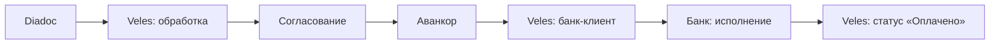
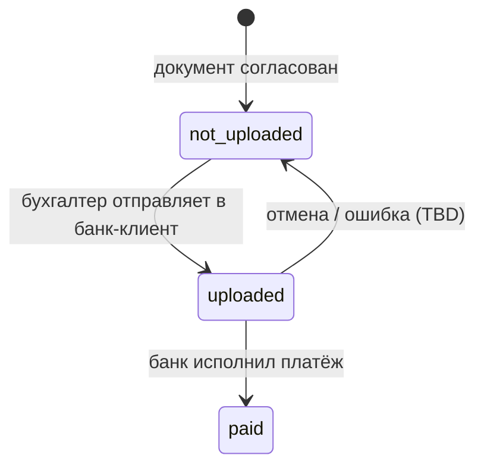
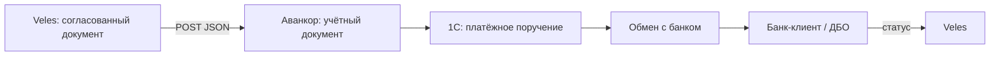
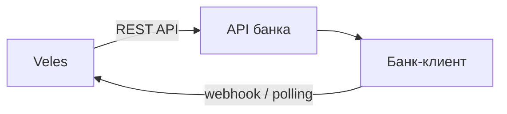
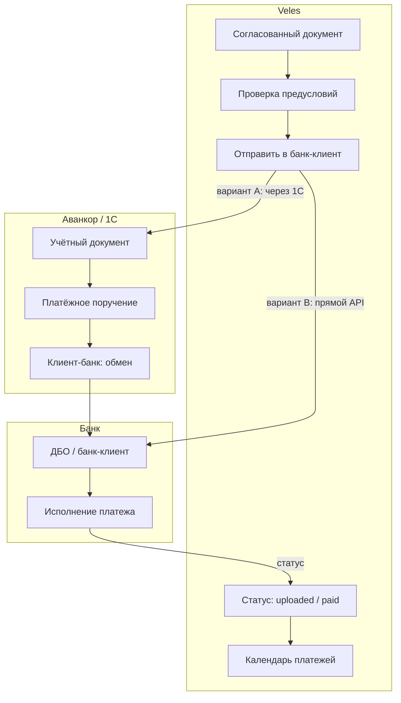

# Интеграция с Банк-клиентом

> Документ описывает передачу платёжных поручений из **Veles** в **банк-клиент** (систему дистанционного банковского обслуживания) и отслеживание статуса оплаты.  
> Связанные материалы: [PROJECT.md](1.%20Описание%20проекта.md) · [PROCESS_DIADOC_ROUTING.md](2.1%20Маршруты%20Документов%20-%20входящий%20Счет%20на%20оплату.md) · [INTEGRATION_AVANKOR.md](6.%20Интеграция%20с%20Аванкор.md) · [INTEGRATION_SPEC_DEP.md](8.%20Интеграция%20со%20Спецдепозитарием.md) · [Роли пользователей](9.%20Роли%20пользователей.md)

---

## 1. Задача для Veles

| Направление | Сценарий | Сейчас (as-is) | Цель Veles |
|-------------|----------|----------------|------------|
| **Исходящие платежи** | Оплата счетов поставщиков по ЗПИФам | Помощник бухгалтера вручную загружает платёж в банк-клиент; главный бухгалтер вручную согласует | Veles формирует платёж после согласования и Аванкора; статус оплаты виден в системе |
| **Контроль** | Проверка, что все согласовали, перед оплатой | Главный бухгалтер сверяет 6 ответов в Outlook | Veles блокирует отправку, пока маршрут не пройден полностью |
| **Планирование** | Календарь платежей по ~20 фондам | Разрозненные таблицы и напоминания | Единый реестр с датами оплаты и статусами |

Банк-клиент — **финальный этап** цепочки документооборота: после согласования в Veles и учёта в Аванкоре деньги списываются со счёта фонда через систему ДБО банка.

---

## 2. Место в процессе Veles



### Предусловия для отправки в банк-клиент

| Условие | Описание |
|---------|----------|
| Статус документа | `approved` или `sent_to_avankor` |
| Маршрут согласования | Все основные согласующие (6) согласовали; при включённом флаге «Недвижимость» — также доп. согласующие (ТЦ) |
| Данные в Аванкоре | Документ отправлен в учётную систему (рекомендуется до оплаты) |
| Реквизиты платежа | Заполнены: ЗПИФ, контрагент, сумма, назначение платежа, дата оплаты |
| Роль пользователя | Загрузка — бухгалтер; финальное согласование — главный бухгалтер |

### Двухэтапная модель (as-is → to-be)

В текущем ручном процессе оплата — **два отдельных шага**:

1. **Загрузка** — помощник бухгалтера создаёт платёжное поручение в банк-клиенте
2. **Согласование** — главный бухгалтер (или заместитель) подтверждает списание средств

Veles сохраняет эту логику разделения полномочий: бухгалтер инициирует отправку, главный бухгалтер даёт финальное разрешение (если банк поддерживает двухуровневое подписание).

---

## 3. Текущий процесс (as-is)

Подробнее: [Маршруты Документов — входящий Счёт на оплату](2.1%20Маршруты%20Документов%20-%20входящий%20Счет%20на%20оплату.md).

| Шаг | Участник | Действие |
|-----|----------|----------|
| 1 | 6 согласующих | Согласуют счёт по email |
| 2 | Помощник бухгалтера | Загружает документ на оплату в банк-клиент |
| 3 | Главный бухгалтер / заместитель | Вручную сверяет в Outlook, что все 6 согласовали |
| 4 | Главный бухгалтер / заместитель | Согласовывает платёж в банк-клиенте |
| 5 | Банк | Исполняет платёж |

### Проблемы as-is

- Нет единого статуса «загружено / согласовано / оплачено»
- Главный бухгалтер дублирует проверку согласований, уже выполненную на предыдущем этапе
- Два ручных входа в банк-клиент без связи с Veles и Аванкором
- Сложно планировать платежи по ~20 ЗПИФам и отслеживать просрочки

---

## 4. Статусы в Veles (модель данных)

В прототипе статус банк-клиента хранится в поле `bank_client_status` документа:

| Статус | Код | Отображение | Описание |
|--------|-----|-------------|----------|
| Не отправлено | `not_uploaded` | — | Платёж ещё не передан в банк |
| Загружено | `uploaded` | Загружено | Платёжное поручение создано / отправлено в банк-клиент, ожидает финального согласования или исполнения |
| Оплачено | `paid` | Оплачено | Банк исполнил платёж |



### Где используется в UI

| Экран | Поведение |
|-------|-----------|
| **Входящие** (список документов) | Колонка «Банк-клиент»: кнопка «Отправить» или бейдж статуса |
| **Календарь платежей** | Показывает неоплаченные документы (`bank_client_status != paid`) с фильтрами по дате и ЗПИФ |

> **Прототип:** кнопка «Отправить» в колонке «Банк-клиент» пока только меняет статус на `uploaded` (демо-заглушка). Реальная интеграция с API банка — этап после MVP.

---

## 5. Роли и полномочия

Подробнее: [Роли пользователей](9.%20Роли%20пользователей.md).

| Действие | Бухгалтер | Главный бухгалтер |
|----------|:---------:|:-----------------:|
| Отправить платёж в банк-клиент (создать черновик / загрузить) | ✓ | ✓ |
| Финальное согласование оплаты в банк-клиенте | — | **✓** |
| Просмотр статуса оплаты | ✓ (свои ЗПИФ) | ✓ (все) |
| Отмена платежа до исполнения | TBD | ✓ |

---

## 6. Данные для платёжного поручения

Минимальный набор полей для формирования платежа (из `DocumentFields` в Veles + справочники):

| Поле Veles | Назначение | Обязательность |
|------------|------------|:--------------:|
| `fund_name` / `fund_inn` | Плательщик (УК / ЗПИФ) | ✓ |
| `zpif_name` | Аналитика по фонду (~20 ЗПИФ) | ✓ |
| `counterparty_name` / `counterparty_inn` | Получатель платежа | ✓ |
| `amount` | Сумма платежа | ✓ |
| `description` | Назначение платежа (до 210 символов для большинства банков) | ✓ |
| `payment_date` | Плановая / фактическая дата оплаты | ✓ |
| `period_from` / `period_to` | Период услуги (в назначении платежа) | рекомендуется |
| Расчётный счёт плательщика | Счёт ЗПИФ в банке | ✓ (из справочника) |
| БИК / корр. счёт / счёт получателя | Реквизиты контрагента | ✓ (из справочника) |
| КБК, ОКТМО, основание | Для бюджетных платежей | при необходимости |
| `external_id` (Аванкор) | Связь с учётным документом | рекомендуется |

> **Точные реквизиты** (счета, БИК, типы платежей) необходимо зафиксировать при аудите у заказчика — см. [раздел 12](#12-чеклист-перед-реализацией).

---

## 7. Методы интеграции

### 7.1. Через Аванкор / 1С (обмен с банком) — рекомендуется для заказчика

**Суть:** Veles создаёт учётный документ в Аванкоре; штатный модуль **«Клиент-банк»** в 1С формирует файл обмена и отправляет платёжное поручение в банк. Veles получает статус обратно через HTTP-сервис или опрос.



**Почему рекомендуется:**

- У заказчика уже используется «Аванкор: Паевые фонды» на платформе 1С
- Модуль «Клиент-банк» — стандартный механизм 1С для обмена с банками (формат `1CClientBankExchange`)
- Проводки, контроль остатков и нумерация платежей остаются в учётной системе
- Veles не дублирует банковскую логику

**Требования:**

- Настроенный обмен с банком в 1С (сертификаты, ключи ЭЦП, профили обмена)
- Доработка HTTP-сервиса Аванкора: создание платёжного поручения + callback статуса
- Справочник «ЗПИФ → расчётный счёт» в 1С

**Ограничения:**

- Зависимость от настроек 1С и конкретного банка
- Статус «Оплачено» приходит с задержкой (после сеанса обмена с банком)

---

### 7.2. Прямой API банка (Direct Bank API)

**Суть:** Veles напрямую вызывает REST/SOAP API системы ДБО банка: создание черновика платёжного поручения, подписание, отправка на исполнение.



**Примеры API (зависят от банка заказчика):**

| Банк | API / продукт | Примечание |
|------|---------------|------------|
| Сбербанк | SberBusiness API | OAuth, платёжные поручения, статусы |
| ВТБ | VTB Business API | Корпоративное ДБО |
| Альфа-Банк | Alfa API | Open API для юрлиц |
| Тинькофф | T-Business API | Платежи, выписки |

**Плюсы:**

- Veles получает статус в реальном времени
- Можно реализовать двухуровневое подписание (бухгалтер → главбух) через API

**Минусы:**

- У каждого банка **свой** API, формат и аутентификация
- Требуются сертификаты ЭЦП / токены для каждого юрлица / ЗПИФ
- ~20 фондов могут иметь счета в разных банках — мультибанковость усложняет интеграцию
- Veles начинает дублировать функции учётной системы

**Вывод:** возможен как дополнение, если заказчик использует **один банк** и готов предоставить API-доступ. Для мультибанковой среды предпочтительнее путь через 1С.

---

### 7.3. Экспорт файла обмена (1CClientBankExchange)

**Суть:** Veles формирует файл в стандартном формате обмена 1С с банком; пользователь загружает его в банк-клиент вручную или через автоматический каталог обмена.

**Плюсы:** простой POC без API; совместим с большинством российских банков  
**Минусы:** нет автоматического статуса «Оплачено»; ручной шаг или настройка каталога обмена на рабочей станции

**Вывод:** промежуточный этап между демо-заглушкой и полной интеграцией.

---

### 7.4. Полуавтоматический режим (MVP прототипа)

**Суть:** Veles формирует платёжную форму с заполненными реквизитами; пользователь копирует данные или скачивает PDF/файл и вручную создаёт платёж в банк-клиенте. Статус «Загружено» / «Оплачено» проставляется вручную в Veles.

**Плюсы:** быстрый старт, не требует доступа к API банка  
**Минусы:** ручной труд сохраняется, риск расхождения данных

**Вывод:** текущее состояние прототипа — кнопка «Отправить» меняет статус без реальной отправки.

---

### 7.5. RPA / UI-автоматизация — не рекомендуется

**Суть:** робот эмулирует действия пользователя в веб-интерфейсе банк-клиента.

**Не рекомендуется:**

- Хрупкая интеграция при любом изменении UI банка
- Проблемы с ЭЦП и двухфакторной аутентификацией
- Сложности с аудитом и информационной безопасностью

---

## 8. Сравнение методов

| Метод | Сложность | Надёжность | Автостатус | Доработка 1С | Для Veles |
|-------|-----------|------------|------------|--------------|-----------|
| Через Аванкор / 1С Клиент-банк | Средняя | Высокая | Да (с задержкой) | Да | **Основной** |
| Прямой API банка | Высокая | Высокая | Да | Нет | При одном банке |
| Файл обмена | Низкая | Средняя | Нет | Нет | POC |
| Полуавтомат (ручной статус) | Минимальная | — | Нет | Нет | **Текущий прототип** |
| RPA | Высокая | Низкая | Частично | Нет | **Нет** |

---

## 9. Целевая архитектура



### Принципы

1. Veles **не исполняет** платежи напрямую — только инициирует и отслеживает
2. Отправка в банк **заблокирована**, пока не пройден маршрут согласования
3. Финальное подписание / согласование — только **главный бухгалтер** (если банк поддерживает)
4. Каждое действие **логируется** в журнале аудита (кто, когда, какой документ)
5. Связь с учётным документом Аванкора через `external_id`

---

## 10. Контракт API (черновик)

### Вариант A: через HTTP-сервис Аванкора

Расширение контракта из [INTEGRATION_AVANKOR.md](6.%20Интеграция%20с%20Аванкор.md):

#### POST `/hs/veles/payments`

**Request (JSON):**

```json
{
  "external_id": "veles-550e8400-e29b-41d4-a716-446655440000",
  "avankor_document_id": "00000012345",
  "payer": {
    "inn": "7701234567",
    "name": "ЗПИФ «Коммерческая недвижимость»",
    "account": "40702810100000001234",
    "bank_bic": "044525225"
  },
  "recipient": {
    "inn": "7709876543",
    "name": "ООО «Охрана Плюс»",
    "account": "40702810900000005678",
    "bank_bic": "044525999",
    "bank_name": "ПАО «Пример Банк»"
  },
  "amount": 125000.00,
  "payment_date": "2025-06-20",
  "purpose": "Оплата по счёту СЧ-004521 от 28.05.2025 за охрану, май 2025. Без НДС.",
  "priority": 5,
  "initiated_by": "ivanov@uk.ru"
}
```

**Response (202 Accepted):**

```json
{
  "payment_id": "pay-001",
  "status": "draft",
  "message": "Платёжное поручение создано, ожидает подписания"
}
```

#### GET `/hs/veles/payments/{payment_id}/status`

**Response:**

```json
{
  "payment_id": "pay-001",
  "status": "executed",
  "bank_status": "Исполнено",
  "executed_at": "2025-06-20T14:32:00+03:00",
  "bank_reference": "PP-2025-000789"
}
```

| Статус 1С / банка | Статус Veles |
|-------------------|--------------|
| `draft` | `not_uploaded` |
| `sent_to_bank` / `awaiting_signature` | `uploaded` |
| `executed` / `paid` | `paid` |
| `rejected` / `cancelled` | `not_uploaded` (с записью ошибки) |

---

### Вариант B: прямой API банка (обобщённый)

Veles реализует адаптер `integrations/bank/` с единым интерфейсом:

```python
class BankClient(Protocol):
    def create_payment(self, payment: PaymentOrder) -> str: ...
    def get_payment_status(self, payment_id: str) -> PaymentStatus: ...
    def approve_payment(self, payment_id: str, approver: str) -> None: ...
```

Конкретная реализация (`SberBankClient`, `VtbBankClient` и т.д.) подключается через конфигурацию.

---

## 11. Безопасность и аудит

| Требование | Описание |
|------------|----------|
| Разграничение ролей | Загрузка ≠ финальное согласование (см. [Роли](9.%20Роли%20пользователей.md)) |
| ЭЦП | Подписание платежей — через банк / 1С; Veles **не хранит** закрытые ключи ЭЦП |
| Секреты | Токены API банка — в переменных окружения / GitHub Secrets, не в коде |
| Аудит | Журнал: кто отправил, кто согласовал, когда, сумма, ЗПИФ |
| Двойной контроль | Veles проверяет полноту согласования **до** разрешения отправки в банк |
| Лимиты | (TBD) ограничение суммы для автоматической отправки без доп. согласования |

### Переменные окружения Veles (черновик)

| Переменная | Описание |
|------------|----------|
| `BANK_INTEGRATION_MODE` | `avankor` / `direct` / `manual` / `file` |
| `BANK_API_URL` | URL API банка (для `direct`) |
| `BANK_API_TOKEN` | Токен / client_secret |
| `BANK_POLL_INTERVAL_SEC` | Интервал опроса статуса (по умолчанию 60) |

---

## 12. Чеклист перед реализацией

- [ ] Какой **банк (банки)** обслуживают ~20 ЗПИФов? Один или несколько?
- [ ] Используется ли **модуль «Клиент-банк»** в Аванкоре? Какая версия?
- [ ] Как сейчас создаётся **платёжное поручение** в 1С — вручную или из документа?
- [ ] Есть ли **двухуровневое подписание** в банк-клиенте (инициатор + главбух)?
- [ ] Список **расчётных счетов** по ЗПИФам (ЗПИФ → счёт → банк → БИК)
- [ ] Формат **назначения платежа** — шаблон, ограничения по длине
- [ ] Нужны ли **бюджетные реквизиты** (КБК, ОКТМО) для части платежей
- [ ] Доступ к **API банка** — есть ли, какие методы, тестовая среда
- [ ] Требования **ИБ**: VPN, белый список IP, сертификаты
- [ ] Как часто нужен **статус «Оплачено»** — в реальном времени или достаточно раз в день (после обмена с банком)?

---

## 13. Этапы реализации

| Этап | Veles | Аванкор / банк |
|------|-------|----------------|
| 0 | — | Аудит: банк, счета, процесс оплаты, клиент-банк |
| 1 | Колонка «Банк-клиент», статусы, календарь платежей (демо) | — |
| 2 | Проверка предусловий перед отправкой; блокировка без согласования | — |
| 3 | Экспорт платёжных реквизитов (PDF / файл обмена) | — |
| 4 | HTTP-сервис: создание платёжного поручения в 1С | Доработка Аванкора |
| 5 | Получение статуса «Оплачено» (polling / webhook) | Обмен с банком |
| 6 | (Опционально) Прямой API банка | API-доступ |

---

## 14. Связанные документы

- [PROJECT.md](1.%20Описание%20проекта.md) — функциональные требования
- [Маршруты Документов — входящий Счёт на оплату](2.1%20Маршруты%20Документов%20-%20входящий%20Счет%20на%20оплату.md) — as-is процесс до банк-клиента
- [INTEGRATION_DIADOC.md](5.%20Интеграция%20с%20Diadoc.md) — получение входящих документов (начало цепочки)
- [INTEGRATION_AVANKOR.md](6.%20Интеграция%20с%20Аванкор.md) — создание учётного документа перед оплатой
- [INTEGRATION_SPEC_DEP.md](8.%20Интеграция%20со%20Спецдепозитарием.md) — передача документов в Спецдеп (часто до оплаты)
- [Роли пользователей](9.%20Роли%20пользователей.md) — полномочия бухгалтера и главного бухгалтера
