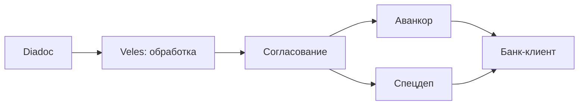
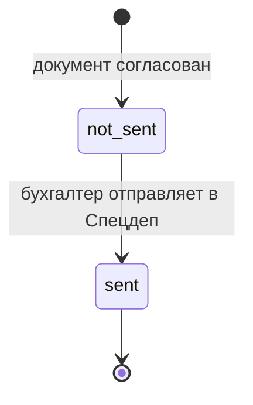
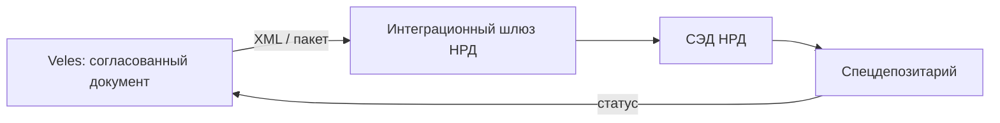
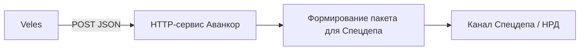
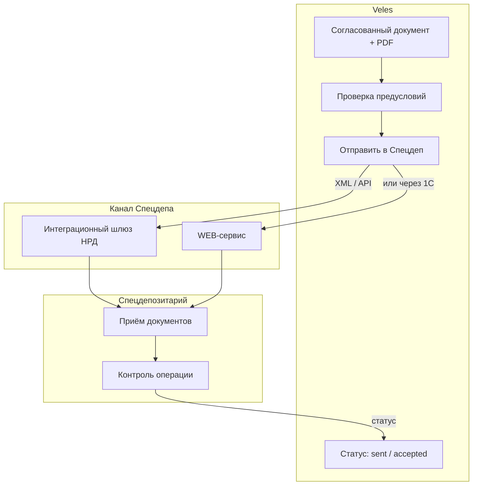
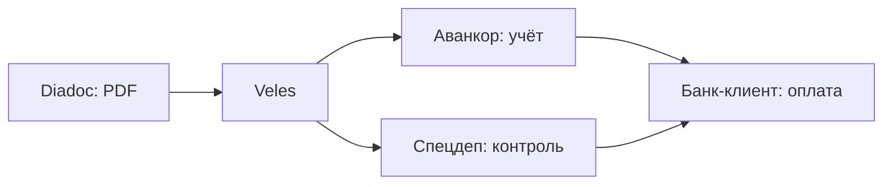

# Интеграция со Спецдепозитарием

> Документ описывает передачу первичных документов и сведений об операциях из **Veles** в **специализированный депозитарий (Спецдеп)** паевых инвестиционных фондов и отслеживание статуса отправки.  
> Связанные материалы: [PROJECT.md](1.%20Описание%20проекта.md) · [INTEGRATION_AVANKOR.md](6.%20Интеграция%20с%20Аванкор.md) · [INTEGRATION_BANK_CLIENT.md](7.%20Интеграция%20с%20Банк-клиентом.md) · [Роли пользователей](9.%20Роли%20пользователей.md)

---

## 1. Задача для Veles

| Направление | Сценарий | Сейчас (as-is) | Цель Veles |
|-------------|----------|----------------|------------|
| **Уведомление Спецдепа** | Передача первичных документов и сведений об операциях с имуществом фонда | Бухгалтер вручную отправляет документы в систему Спецдепа или по email | Veles формирует пакет после согласования и передаёт в канал Спецдепа |
| **Контроль** | Отслеживание, что документ направлен депозитарию до/параллельно с оплатой | Нет единого реестра | Статус «Отправлено в Спец.Деп» виден в списке документов |
| **Соответствие требованиям** | Соблюдение правил взаимодействия УК со Спецдепом по ~20 ЗПИФам | Разрозненные действия, риск пропуска | Единый процесс с проверкой предусловий |

Спецдепозитарий — **обязательный участник** рынка ПИФ: он хранит учётную документацию по фондам, контролирует соответствие операций УК правилам доверительного управления и законодательству. Для УК, управляющей **~20 ЗПИФами** с коммерческой недвижимостью, регулярная передача документов в Спецдеп — часть повседневного документооборота.

---

## 2. Роль спецдепозитария в контексте ПИФ

| Функция | Описание |
|---------|----------|
| **Хранение документов** | Учётная документация по каждому фонду |
| **Контроль операций** | Проверка соответствия расходов и сделок правилам фонда и закону |
| **Учёт паёв** | Ведение реестра владельцев инвестиционных паёв (часто через инфраструктуру НРД) |
| **Информирование** | Получение первичных документов и уведомлений об операциях с имуществом фонда |

### Нормативная база (ориентир)

- Федеральный закон № 156-ФЗ «Об инвестиционных фондах»
- Положение Банка России о требованиях к договору со специализированным депозитарием
- Правила внутреннего документооборота УК и регламент взаимодействия со **конкретным** Спецдепом заказчика

> **Важно:** точный перечень документов и сроки передачи определяются **договором УК со Спецдепом** и правилами фондов. Их необходимо зафиксировать на этапе аудита — см. [раздел 12](#12-чеклист-перед-реализацией).

---

## 3. Место в процессе Veles



В прототипе колонка «Спец.Деп» в списке документов расположена **между «Аванкор» и «Банк-клиент»**: передача в депозитарий логически выполняется **после согласования**, параллельно или до учёта в Аванкоре и оплаты — в зависимости от регламента заказчика.

### Предусловия для отправки в Спецдеп

| Условие | Описание |
|---------|----------|
| Статус документа | Полностью согласован (`approved` или выше) |
| Маршрут согласования | Все обязательные согласующие (6 + при необходимости доп.) поставили согласие |
| Реквизиты | Заполнены: ЗПИФ, контрагент, сумма, тип документа, назначение |
| PDF | Прикреплён первичный документ (счёт, акт, УПД) |
| Роль пользователя | Отправка — **бухгалтер** (инициатор документа) |

### Типовые документы для передачи

| Тип в Veles | Что передаётся в Спецдеп |
|-------------|--------------------------|
| Счёт | PDF счёта + реквизиты (контрагент, сумма, назначение, ЗПИФ) |
| Акт | PDF акта + сведения о выполненных работах / периоде |
| УПД | PDF УПД + реквизиты поставки / услуги |
| Товарооборот | Уточнить у бухгалтерии и Спецдепа |

---

## 4. Текущий процесс (as-is, предположительно)

Точный as-is процесс у заказчика **не описан** в репозитории и требует аудита. Типичная схема для УК ПИФ:

| Шаг | Участник | Действие |
|-----|----------|----------|
| 1 | Бухгалтер | После внутреннего согласования готовит пакет документов |
| 2 | Бухгалтер | Загружает документы в **WEB-кабинет** Спецдепа / НРД или отправляет по **email** |
| 3 | Спецдеп | Принимает документы, при необходимости запрашивает уточнения |
| 4 | Бухгалтер | Заводит документ в Аванкор и инициирует оплату |

### Проблемы as-is

- Нет единого статуса «отправлено в Спецдеп» в общем реестре документов
- Дублирование: одни и те же PDF пересылаются вручную в несколько систем
- Риск пропустить отправку при большом потоке документов по ~20 фондам
- Нет связи между статусом в Veles, Аванкоре и Спецдепе

---

## 5. Статусы в Veles (модель данных)

В прототипе статус хранится в поле `spec_dep_status` документа:

| Статус | Код | Отображение | Описание |
|--------|-----|-------------|----------|
| Не отправлено | `not_sent` | — | Документ ещё не передан в Спецдеп |
| Отправлено | `sent` | Отправлено | Пакет передан в канал Спецдепа (демо: только смена статуса) |



### Целевые статусы (для prod)

| Статус | Код | Описание |
|--------|-----|----------|
| Принято | `accepted` | Спецдеп подтвердил получение |
| Отклонено | `rejected` | Спецдеп вернул с замечаниями |
| Ошибка | `error` | Технический сбой при отправке |

### Где используется в UI

| Экран | Поведение |
|-------|-----------|
| **Документы** (список) | Колонка «Спец.Деп»: кнопка «Отправить» или бейдж «Отправлено» |
| **Обработка** (карточка) | Кнопка «Отправить в Спец.Деп» — доступна после полного согласования |

> **Прототип:** кнопки только меняют статус на `sent` (демо-заглушка). Реальная интеграция с каналом Спецдепа — этап после MVP.

---

## 6. Методы интеграции

### 6.1. СЭД НРД / Платформа ПИФ (WEB-сервис или интеграционный шлюз) — рекомендуется

**Суть:** многие Спецдепы и регистраторы паёв работают через инфраструктуру **НРД** (Национальный расчётный депозитарий). НРД предоставляет каналы электронного взаимодействия для рынка коллективных инвестиций.

| Канал НРД | Назначение | Для Veles |
|-----------|------------|-----------|
| **WEB-кабинет / Платформа ПИФ** | Ручной ввод документов | Полуавтомат: Veles формирует пакет, пользователь загружает |
| **Интеграционный шлюз** | Автоматический файловый обмен (XML) | Veles → шлюз → НРД → Спецдеп |
| **WEB-сервис (SOAP / REST)** | Прямая интеграция ПО клиента | Veles отправляет XML-пакеты по API |



**Документация НРД:**

- [Каналы электронного взаимодействия](https://www.nsd.ru/services/depozitariy/kanaly-elektronnogo-vzaimodeystviya/)
- [СЭД НРД](https://www.nsd.ru/workflow/)
- [WEB-сервис СЭД НРД](https://www.nsd.ru/workflow/system/programs/web-service/)

**Требования:**

- Договор с НРД на подключение канала
- Сертификаты ЭЦП, настройка криптографии (на стороне клиента или шлюза)
- XML-форматы сообщений по спецификации НРД для операций ПИФ

---

### 6.2. WEB-кабинет конкретного Спецдепа

**Суть:** у заказчика может быть договор с **отдельным** специализированным депозитарием (не через НРД), у которого собственный личный кабинет.

**Плюсы:** не зависит от НРД  
**Минусы:** у каждого Спецдепа свой интерфейс; API может отсутствовать

**Вывод:** на старте — полуавтомат (Veles готовит пакет, бухгалтер загружает в кабинет). При наличии API — прямая интеграция по аналогии с HTTP-сервисом Аванкора.

---

### 6.3. Через Аванкор / 1С

**Суть:** в конфигурации «Аванкор: Паевые фонды» может быть предусмотрен обмен с Спецдепом или выгрузка регламентированных форм. Veles передаёт данные в 1С, 1С формирует сообщение для депозитария.



**Плюсы:** единая точка интеграции с учётной системой; бизнес-логика в 1С  
**Минусы:** требует доработки Аванкора; не все конфигурации поддерживают исходящий обмен

---

### 6.4. Email / ручная отправка (as-is, MVP)

**Суть:** Veles формирует письмо с вложением PDF и реквизитами; бухгалтер отправляет на адрес Спецдепа. Статус «Отправлено» проставляется вручную.

**Плюсы:** минимальные технические требования  
**Минусы:** нет юридически значимого ЭДО; нет автоматического статуса приёмки

**Вывод:** допустимо как промежуточный этап, но не целевое решение для prod.

---

### 6.5. Diadoc / иной ЭДО — маловероятно

Спецдеп, как правило, **не принимает** документы через Diadoc контрагентов. Канал — собственная система депозитария или НРД. Diadoc остаётся каналом **входящих** документов от подрядчиков в Veles, а не исходящих в Спецдеп.

---

## 7. Сравнение методов

| Метод | Сложность | Надёжность | Автостатус | ЭЦП | Для Veles |
|-------|-----------|------------|------------|-----|-----------|
| WEB-сервис / шлюз НРД | Высокая | Высокая | Да | Да | **Основной** (если Спецдеп через НРД) |
| WEB-кабинет Спецдепа | Низкая | Средняя | Нет | Зависит | Полуавтомат / POC |
| Через Аванкор / 1С | Средняя | Высокая | Да | Да | **Альтернатива** |
| Email | Минимальная | Низкая | Нет | Нет | Временный as-is |
| RPA | Высокая | Низкая | Частично | Сложно | **Нет** |

---

## 8. Целевая архитектура



### Принципы

1. Veles передаёт **только согласованные** документы с полным набором реквизитов
2. PDF первичного документа включается в пакет (вложение или ссылка по регламенту)
3. Отправка **логируется** в журнале аудита
4. Связь с учётным документом Аванкора — через `external_id`
5. Veles **не хранит** закрытые ключи ЭЦП — подписание на стороне шлюза / 1С / рабочей станции с сертифицированным СКЗИ

---

## 9. Контракт данных (черновик)

### Пакет для отправки в Спецдеп

```json
{
  "external_id": "veles-550e8400-e29b-41d4-a716-446655440000",
  "document_type": "invoice",
  "fund": {
    "inn": "7701234567",
    "name": "ЗПИФ «Коммерческая недвижимость»",
    "spec_dep_code": "TBD"
  },
  "counterparty": {
    "inn": "7709876543",
    "name": "ООО «Охрана Плюс»"
  },
  "amount": 125000.00,
  "currency": "RUB",
  "period_from": "2025-05-01",
  "period_to": "2025-05-31",
  "invoice_number": "СЧ-004521",
  "invoice_date": "2025-05-28",
  "description": "Оплата услуг охраны, май 2025",
  "pdf": {
    "filename": "schet_004521.pdf",
    "content_base64": "..."
  },
  "avankor_document_id": "00000012345",
  "sent_by": "ivanov@uk.ru",
  "sent_at": "2025-06-20T10:15:00+03:00"
}
```

### Маппинг полей Veles → пакет Спецдепа

| Поле Veles | Назначение | Поле Спецдепа (TBD) |
|------------|------------|---------------------|
| `zpif_name` / `fund_inn` | Идентификация фонда (~20 ЗПИФ) | Код / ИНН фонда в системе депозитария |
| `document_type` | Тип первичного документа | Тип сообщения / документа |
| `counterparty_inn` / `counterparty_name` | Контрагент | Контрагент операции |
| `amount` | Сумма операции | Сумма |
| `period_from` / `period_to` | Период услуги | Период |
| `description` | Назначение / содержание | Назначение платежа |
| `pdf_filename` | Первичный документ | Вложение |
| `external_id` | Связь с Veles | Внешний идентификатор |

> **Точные имена полей и XML-схемы** определяются спецификацией канала НРД или регламентом конкретного Спецдепа.

---

## 10. Безопасность и аудит

| Требование | Описание |
|------------|----------|
| ЭЦП | Пакеты в НРД подписываются квалифицированной ЭЦП уполномоченного лица |
| Разграничение ролей | Отправка — бухгалтер; просмотр статуса — бухгалтер, главный бухгалтер |
| Аудит | Журнал: кто отправил, когда, какой ЗПИФ, сумма, тип документа |
| Конфиденциальность | PDF и реквизиты передаются по защищённому каналу (HTTPS, VPN, шлюз НРД) |
| Хранение | Veles хранит метаданные и копию PDF; юридически значимый оригинал — в системе Спецдепа |

### Переменные окружения Veles (черновик)

| Переменная | Описание |
|------------|----------|
| `SPEC_DEP_INTEGRATION_MODE` | `nsd_gateway` / `nsd_api` / `avankor` / `manual` |
| `NSD_GATEWAY_PATH` | Путь к каталогу интеграционного шлюза (для файлового обмена) |
| `NSD_API_URL` | URL WEB-сервиса НРД |
| `SPEC_DEP_POLL_INTERVAL_SEC` | Интервал опроса статуса (по умолчанию 300) |

---

## 11. Связь с другими интеграциями

| Интеграция | Связь со Спецдепом |
|------------|-------------------|
| **Diadoc** | Источник входящего PDF; тот же файл уходит в Спецдеп |
| **Аванкор** | Учётная запись операции; `avankor_document_id` в пакете для Спецдепа |
| **Банк-клиент** | Оплата — следующий этап; часть регламентов требует уведомления Спецдепа **до** списания средств |



Порядок «Аванкор → Спецдеп → Банк-клиент» или «Спецдеп параллельно Аванкору» **уточняется** у бухгалтерии заказчика.

---

## 12. Чеклист перед реализацией

- [ ] Кто является **Спецдепозитарем** заказчика (наименование, договор)?
- [ ] Используется ли **НРД** (СЭД, Платформа ПИФ, интеграционный шлюз)?
- [ ] Какой **канал** сейчас: WEB-кабинет, email, 1С, другое?
- [ ] **Перечень документов**, обязательных для передачи (счета, акты, договоры, все операции или только выше порога?)
- [ ] **Сроки** передачи: до оплаты, после оплаты, в течение N рабочих дней?
- [ ] Нужно ли уведомлять Спецдеп **до** отправки платежа в банк-клиент?
- [ ] Есть ли **XML-спецификации** / API от Спецдепа или НРД?
- [ ] Кто подписывает пакет **ЭЦП** (должность, сертификат)?
- [ ] Есть ли **тестовая среда** (sandbox) для отладки?
- [ ] Отличается ли процесс для **~20 ЗПИФов** (один Спецдеп или несколько)?

---

## 13. Этапы реализации

| Этап | Veles | Спецдеп / НРД |
|------|-------|---------------|
| 0 | — | Аудит: Спецдеп, канал, перечень документов, регламент |
| 1 | Колонка «Спец.Деп», кнопка на карточке, статус `sent` (демо) | — |
| 2 | Проверка предусловий (согласование, обязательные поля) | — |
| 3 | Формирование пакета (JSON + PDF) для ручной загрузки | — |
| 4 | Интеграция с интеграционным шлюзом или API НРД | Подключение канала |
| 5 | Получение статуса `accepted` / `rejected` | Обратная связь от Спецдепа |
| 6 | (Опционально) Маршрут через HTTP-сервис Аванкора | Доработка 1С |

---

## 14. Связанные документы

- [PROJECT.md](1.%20Описание%20проекта.md) — функциональные требования
- [INTEGRATION_AVANKOR.md](6.%20Интеграция%20с%20Аванкор.md) — учётная система, возможный канал передачи
- [INTEGRATION_BANK_CLIENT.md](7.%20Интеграция%20с%20Банк-клиентом.md) — следующий этап: оплата
- [INTEGRATION_DIADOC.md](5.%20Интеграция%20с%20Diadoc.md) — источник входящих PDF
- [Роли пользователей](9.%20Роли%20пользователей.md) — кто отправляет документы в Спецдеп
