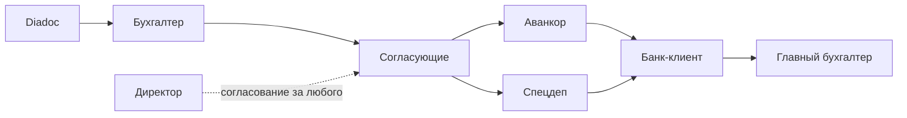

# Роли пользователей Veles

> Описание ролей и полномочий в системе автоматизации документооборота УК ПИФ.

См. также: [PROJECT.md](1.%20Описание%20проекта.md) — общий процесс; [PROCESS_DIADOC_ROUTING.md](2.%20Маршрутизация%20документов.md) — текущий as-is процесс и целевой маршрут; [INTEGRATION_SPEC_DEP.md](8.%20Интеграция%20со%20Спецдепозитарием.md) — передача документов в Спецдеп; [INTEGRATION_BANK_CLIENT.md](7.%20Интеграция%20с%20Банк-клиентом.md) — этап оплаты через банк-клиент.

---

## Общая схема процесса



**Разделение обязанностей:** бухгалтер готовит и инициирует документ; согласующие подтверждают корректность; главный бухгалтер даёт финальное разрешение на оплату; директор — один из согласующих с расширенными полномочиями.

---

## 1. Бухгалтер

**Кто это:** сотрудник бухгалтерии, закреплённый за одним или несколькими ЗПИФами (в текущем процессе — три бухгалтера на ~20 фондов). Является **инициатором** документа в системе.

### Зона ответственности

- Полный цикл **подготовки** документа до отправки на согласование
- Контроль статуса согласования и доработка при отклонении
- После полного согласования — **отправка в Аванкор** (создание учётного документа в 1С)
- При необходимости — загрузка платёжного поручения в банк-клиент (если эта функция не вынесена отдельной роли)

### Типичные действия

| Этап | Действие |
|------|----------|
| Поступление | Видит входящие документы из Diadoc (или загруженные вручную) по «своим» ЗПИФам |
| Классификация | Выбирает тип: счёт, акт, УПД, товарооборот |
| Заполнение | Проверяет/вводит реквизиты: юр. лицо, ЗПИФ, контрагент, сумма, период, назначение платежа |
| Распознавание | При наличии OCR/VLM — валидирует автозаполненные поля |
| Спец. маршрут | Для счетов по недвижимости/электричеству включает доп. согласование (сотрудники ТЦ) |
| Запуск | Нажимает «Отправить на согласование» — документ переходит в статус «На согласовании» |
| Мониторинг | Видит в реальном времени, кто уже согласовал, кто ещё нет |
| Доработка | При отклонении исправляет данные и повторно отправляет на согласование |
| После согласования | «Отправить в Аванкор» — данные уходят в «Аванкор: Паевые фонды» |
| Спецдеп | «Отправить в Спец.Деп» — первичный документ и реквизиты передаются в специализированный депозитарий |

### Чего бухгалтер не делает

- Не принимает решение о согласовании **за других** участников маршрута (кроме своей собственной записи, если он одновременно входит в маршрут)
- Не имеет права **финально согласовать платёж в банк-клиенте** — это полномочие главного бухгалтера

### Интерфейс

- **Входящие** — список документов с фильтрами по ЗПИФ, статусу, дате
- **Карточка документа** — PDF слева, форма реквизитов справа, блок согласования с индикаторами по каждому участнику

---

## 2. Согласующий

**Кто это:** сотрудник из фиксированной группы (в текущем процессе — **6 человек**), проверяющий документ **до оплаты**. Это не бухгалтерская роль: задача — подтвердить, что счёт и реквизиты корректны с точки зрения его функциональной зоны.

### Зона ответственности

- Проверка **содержания** документа и **введённых данных** перед тем, как деньги уйдут в оплату
- Принятие решения: **согласовать** или **отклонить** с указанием причины

### Типичные действия

| Действие | Описание |
|----------|----------|
| Получение задачи | Видит документы, где он указан в маршруте; уведомление **внутри системы**, без email |
| Просмотр | Открывает PDF и все заполненные поля (сумма, контрагент, ЗПИФ, период и т.д.) |
| Согласование | Подтверждает — его «галочка» фиксируется в маршруте |
| Отклонение | Отклоняет с комментарием — документ возвращается инициатору, статус «Отклонён» |
| Доп. маршрут | Для счетов по недвижимости/электричеству — дополнительно согласуют сотрудники ТЦ (2 доп. согласующих) |

### Особенности маршрута

- Согласование **параллельное**: все участники видят задачу одновременно, порядок не важен
- Документ считается согласованным только когда **все** обязательные участники (6 основных + при необходимости 2 доп.) поставили согласие
- Инициатор видит прогресс **в реальном времени** — кто согласовал, кто ещё нет

### Чего согласующий не делает

- Не редактирует реквизиты документа (только просмотр)
- Не отправляет в Аванкор и не работает с банк-клиентом
- Не согласует **за другого** участника маршрута (это право директора)

### Примеры ролей в маршруте (из справочника)

Главный бухгалтер, финансовый директор, руководитель бэк-офиса, юрист, руководитель закупок, зам. генерального директора и др. — конкретный состав настраивается в справочниках по ЗПИФ и типу документа.

---

## 3. Главный бухгалтер

**Кто это:** руководитель бухгалтерии (или его заместитель). Совмещает две функции:

1. **Один из согласующих** — входит в основной маршрут из 6 человек
2. **Единственный, кто может отправить платёж в банк-клиент** — финальный контроль перед списанием денег

### Зона ответственности

- Согласование документа на этапе маршрута (как обычный согласующий)
- **Финальное подтверждение оплаты** в банк-клиенте после полного согласования и загрузки платёжного поручения

### Типичные действия

| Этап | Действие |
|------|----------|
| Согласование | Просматривает PDF и реквизиты, согласует или отклоняет — как любой согласующий |
| Контроль полноты | Видит, что все 6 (и при необходимости доп.) согласовали |
| Аванкор | Может контролировать, что документ отправлен в учётную систему |
| Банк-клиент | **Единственная роль** с правом нажать финальное «Согласовать/Отправить» в банк-клиенте |
| Статус оплаты | Видит статусы: «Загружено в банк-клиент» → «Оплачено» |

### Зачем отдельная роль

В текущем ручном процессе главный бухгалтер **вручную сверяет 6 ответов в Outlook** и только потом согласует платёж в банк-клиенте. Veles автоматизирует проверку «все согласовали», но **финальное решение об оплате** остаётся за главным бухгалтером — это контрольная точка перед списанием средств фонда.

### Чего главный бухгалтер не делает

- Не согласует **за других** согласующих (это право директора)
- Не подменяет бухгалтера на этапе подготовки и ввода реквизитов (хотя технически может иметь доступ к просмотру)

---

## 4. Директор

**Кто это:** руководитель компании (генеральный директор или заместитель). Совмещает **три** уровня полномочий:

1. **Согласующий** — входит в маршрут как один из 6
2. **Супер-пользователь** — может согласовать **от имени любого** другого согласующего
3. Расширенный доступ к системе (просмотр всех документов, отчёты, настройки — по мере реализации)

### Зона ответственности

- Согласование документов в своей зоне (как обычный согласующий)
- **Разблокировка задержек**: если согласующий в отпуске, недоступен или затягивает — директор может поставить согласие за него
- Общий контроль документооборота и платежей по всем фондам

### Типичные действия

| Действие | Описание |
|----------|----------|
| Своё согласование | Согласует/отклоняет документы, где он указан в маршруте |
| Согласование за другого | Выбирает участника маршрута и ставит согласие от его имени — действие **логируется в аудите** |
| Мониторинг | Видит все документы на согласовании по всем ЗПИФам, а не только «свои» |
| Эскалация | Может ускорить прохождение критичных платежей, не дожидаясь недоступного согласующего |

### Ограничения (важно для аудита)

| Что может | Что не может (или не должен) |
|-----------|------------------------------|
| Согласовать за любого согласующего | Отправить платёж в банк-клиент (это право главного бухгалтера) |
| Видеть все документы | Редактировать реквизиты без возврата инициатору |
| Ускорить маршрут | Обходить отправку в Аванкор |

### Зачем нужен «супер-согласующий»

В реальности согласующие — занятые руководители. Если один из шести недоступен, весь платёж встаёт. Директор как супер-пользователь снимает такие блокировки, сохраняя при этом **прозрачность**: в журнале видно, что согласие поставил директор, а не сам участник.

---

## Сводная таблица полномочий

| Действие | Бухгалтер | Согласующий | Главный бухгалтер | Директор |
|----------|:---------:|:-----------:|:-----------------:|:--------:|
| Получение документов из Diadoc | ✓ | — | — | просмотр |
| Заполнение/редактирование реквизитов | ✓ | — | — | — |
| Запуск согласования | ✓ | — | — | — |
| Согласование своей записи в маршруте | если в маршруте | ✓ | ✓ | ✓ |
| Согласование за другого | — | — | — | ✓ |
| Отклонение с комментарием | — | ✓ | ✓ | ✓ |
| Отправка в Аванкор | ✓ | — | ✓ | — |
| Отправка в Спецдеп | ✓ | — | ✓ | — |
| Загрузка в банк-клиент | ✓* | — | ✓ | — |
| **Финальное согласование оплаты в банк-клиенте** | — | — | **✓** | — |
| Просмотр всех документов | свои ЗПИФ | свои задачи | все | все |

\* Загрузка в банк-клиент может выполняться бухгалтером-помощником; финальное согласование — только у главного бухгалтера.

---

## Жизненный цикл документа по ролям

```
Новый → [Бухгалтер: заполнение] → На согласовании → [Согласующие × 6 (+ ТЦ)]
  → Согласован → [Бухгалтер: Аванкор + Спецдеп] → Отправлен в Аванкор / Спец.Деп
  → [Бухгалтер: загрузка в банк-клиент] → [Главный бухгалтер: финальное согласование] → Оплачено
```

При отклонении на любом этапе согласования документ возвращается бухгалтеру со статусом «Отклонён» и комментарием.

---

## Связанные документы

- [PROJECT.md](1.%20Описание%20проекта.md) — функциональные требования и целевой процесс
- [PROCESS_DIADOC_ROUTING.md](2.%20Маршрутизация%20документов.md) — as-is маршрутизация и сравнение с Veles
- [INTEGRATION_AVANKOR.md](6.%20Интеграция%20с%20Аванкор.md) — отправка согласованных документов в Аванкор
- [INTEGRATION_SPEC_DEP.md](8.%20Интеграция%20со%20Спецдепозитарием.md) — передача документов в специализированный депозитарий
- [INTEGRATION_BANK_CLIENT.md](7.%20Интеграция%20с%20Банк-клиентом.md) — отправка платежей в банк-клиент и финальное согласование оплаты
