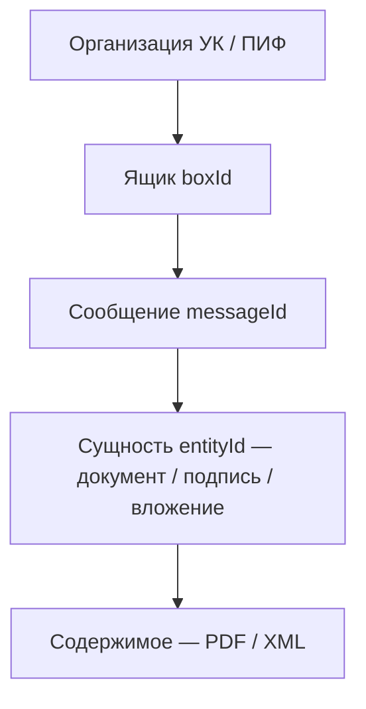
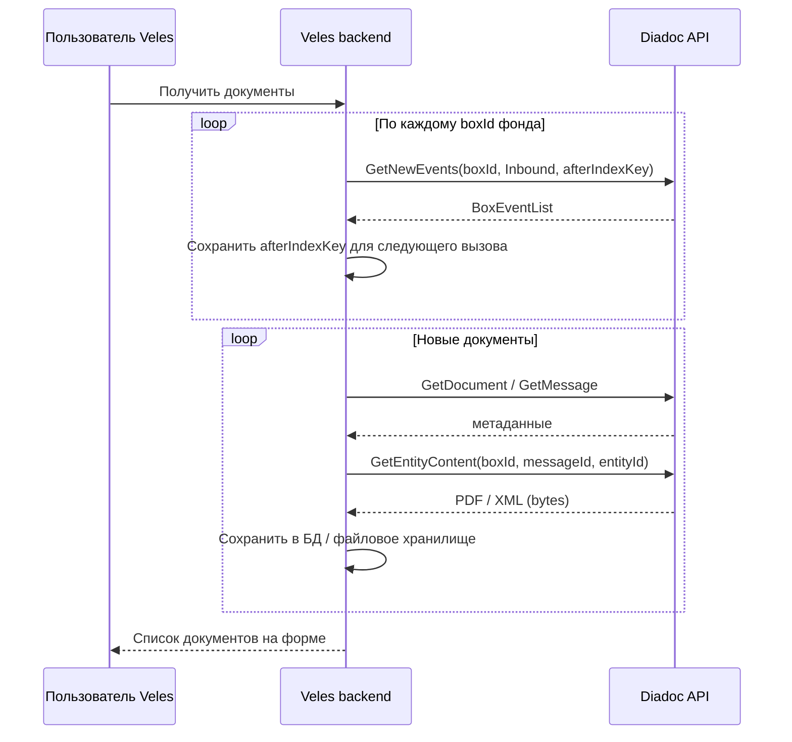
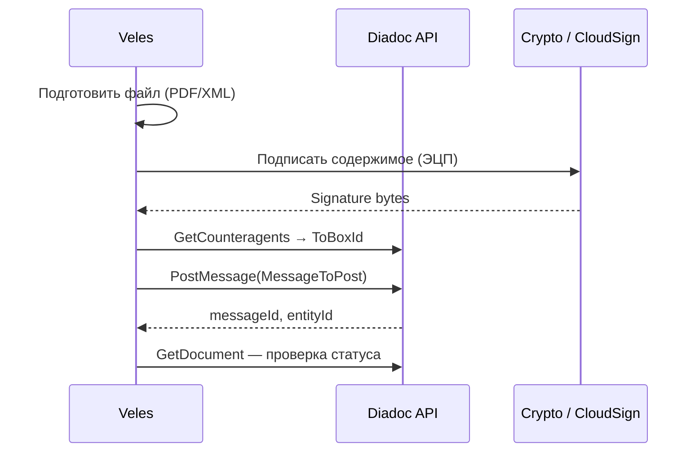
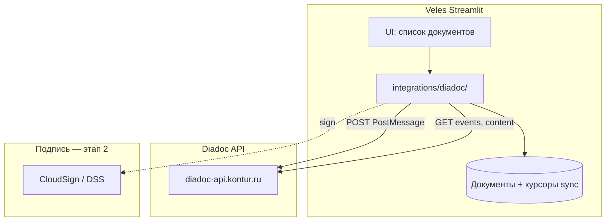

# Интеграция с Diadoc

> Документ описывает получение и отправку документов через **API Diadoc** (Кontur) для сервиса **Veles**.  
> Связанные материалы: [PROJECT.md](./PROJECT.md) · [INTEGRATION_AVANKOR.md](./INTEGRATION_AVANKOR.md)

---

## 1. Задача для Veles

| Направление | Сценарий | Сейчас (as-is) | Цель Veles |
|-------------|----------|----------------|------------|
| **Входящие** | Счета, акты, УПД от подрядчиков | Бэк-офис вручную выгружает PDF из Diadoc | Кнопка «Получить документы» → список + PDF в системе |
| **Исходящие** | Счета и акты арендаторам | Ручная работа в Diadoc / почта | Отправка из Veles после подготовки (этап 2+) |

Diadoc выбран заказчиком из‑за **юридически значимого ЭДО** с защищёнными электронными подподписями (ЭЦП).

---

## 2. Официальный API Diadoc

Интеграция строится на **HTTP API Diadoc**, документированном на портале разработчика Kontur:

| Ресурс | URL |
|--------|-----|
| Документация API | [developer.kontur.ru/doc/diadoc-api/](https://developer.kontur.ru/doc/diadoc-api/) |
| Интеграция с API (старт) | [howtostart/integration.html](https://developer.kontur.ru/doc/diadoc-api/howtostart/integration.html) |
| Быстрый старт | [howtostart/quickstart.html](https://developer.kontur.ru/docs/diadoc-api/howtostart/quickstart.html) |
| Получение документов | [instructions/documents/getdocs.html](https://api-docs.diadoc.ru/instructions/documents/getdocs.html) |
| Отправка документов | [instructions/documents/senddocs.html](https://developer.kontur.ru/doc/diadoc-api/instructions/documents/senddocs.html) |
| Лента событий | [instructions/events.html](https://developer.kontur.ru/doc/diadoc-api/instructions/events.html) |
| OpenAPI-спецификация | указана в [документации API](https://developer.kontur.ru/doc/diadoc-api/) |

### Точки входа (API host)

| Среда | URL |
|-------|-----|
| **Продакшен** | `https://diadoc-api.kontur.ru` |
| **Тест (staging)** | `https://diadoc-api-staging.kontur.ru` |

Для прототипа рекомендуется начать с **тестовой площадки** и тестовых ящиков ([быстрый старт](https://developer.kontur.ru/docs/diadoc-api/howtostart/quickstart.html)).

---

## 3. Получение доступа к API

Порядок описан в [Интеграция с API](https://developer.kontur.ru/doc/diadoc-api/howtostart/integration.html):

1. Оставить **заявку на интеграцию** на сайте Kontur / Diadoc
2. Получить доступ в **Кабинет интегратора** и `client_id`
3. Выпустить `client_secret` (хранить как секрет)
4. Выбрать **способ получения токенов** (Authorization Code Flow или Device Authorization Flow)
5. Реализовать получение и **обновление** `access_token`

### Аутентификация (актуальный способ)

Современные интеграции используют **OAuth-подобный** поток и заголовок:

```http
Authorization: Bearer <access_token>
Accept: application/json
```

Пример вызова:

```http
GET /GetMyOrganizations HTTP/1.1
Host: diadoc-api.kontur.ru
Authorization: Bearer {{access_token}}
Accept: application/json
```

> **Устаревший способ:** `DiadocAuth ddauth_api_client_id=..., ddauth_token=...` и метод `Authenticate` — описан в [документации по авторизации](https://developer.kontur.ru/doc/diadoc-api/authentication.html), но для новых проектов рекомендуется OAuth-поток из Кабинета интегратора.

### Переменные окружения Veles (черновик)

| Переменная | Описание |
|------------|----------|
| `DIADOC_API_URL` | `https://diadoc-api.kontur.ru` или staging |
| `DIADOC_CLIENT_ID` | Идентификатор приложения |
| `DIADOC_CLIENT_SECRET` | Секрет приложения |
| `DIADOC_ACCESS_TOKEN` | Токен (или механизм refresh в runtime) |
| `DIADOC_BOX_IDS` | Список ящиков фондов (через запятую), опционально |

---

## 4. Ключевые сущности Diadoc



| Сущность | Описание | Где используется в Veles |
|----------|----------|--------------------------|
| **Organization** | Юр. лицо в Diadoc | ~20 фондов → несколько организаций/ящиков |
| **Box (ящик)** | `boxId` — контейнер документооборота | Фильтр входящих по фонду |
| **Message** | Цепочка документооборота | `messageId` — ключ документа |
| **Entity** | Документ, подпись, служебная сущность | `entityId` — для скачивания файла |
| **Document** | Метаданные: тип, контрагент, статус, сумма | Список на веб-форме |
| **Counteragent** | Контрагент (подрядчик / арендатор) | ИНН, название для формы |

Идентификаторы `boxId`, `messageId`, `entityId` нужно **сохранять в Veles** для повторного скачивания, статусов и связи с Аванкор.

---

## 5. Получение документов (входящие)

### 5.1. Два подхода

| Подход | Методы | Когда использовать |
|--------|--------|---------------------|
| **A. Лента событий** (рекомендуется) | [GetNewEvents (V8)](https://developer.kontur.ru/docs/diadoc-api/http/GetNewEvents_V8.html) | Кнопка «Получить документы», фоновая синхронизация новых входящих |
| **B. Поиск по фильтрам** | [GetDocuments (V3/V4)](https://developer.kontur.ru/doc/diadoc-api/http/GetDocuments.html) | Догрузка за период, поиск по контрагенту/номеру |

Для прототипа Veles достаточно **подхода A + скачивание содержимого**. Подход B — для первичной загрузки истории или ручного фильтра.

### 5.2. Алгоритм «Получить документы» (Veles)



#### Шаг 1 — организации и ящики

```http
GET /GetMyOrganizations
Authorization: Bearer {{access_token}}
```

Возвращает список организаций и их **ящиков** (`Boxes[].BoxId`). Для ~20 фондов может быть **несколько boxId** — нужен маппинг «фонд Veles ↔ boxId».

#### Шаг 2 — новые события (входящие)

```http
GET /V8/GetNewEvents?boxId={{boxId}}&documentDirection=Inbound&afterIndexKey={{key}}&limit=100
Authorization: Bearer {{access_token}}
```

- `documentDirection=Inbound` — только **входящие**
- `afterIndexKey` — курсор для инкрементальной синхронизации (хранить в Veles per box)
- Лента описана в [инструкции по событиям](https://developer.kontur.ru/doc/diadoc-api/instructions/events.html)

Из события извлекаются `MessageId`, `EntityId`, тип документа.

#### Шаг 3 — метаданные документа

```http
GET /V3/GetDocument?boxId={{boxId}}&messageId={{messageId}}&entityId={{entityId}}
```

Или [GetMessage (V6)](https://developer.kontur.ru/Docs/diadoc-api/methods.html) — полная структура сообщения, подписи, статусы.

Полезные поля для UI Veles:

- контрагент (отправитель)
- тип документа (`TypeNamedId`, версия формата)
- номер, дата, сумма (если есть в метаданных)
- статус документооборота (`DocflowStatus`)
- признак необходимости подписи получателя

#### Шаг 4 — содержимое файла (PDF)

```http
GET /V4/GetEntityContent?boxId={{boxId}}&messageId={{messageId}}&entityId={{entityId}}
Authorization: Bearer {{access_token}}
```

Метод [GetEntityContent (V4)](https://developer.kontur.ru/docs/diadoc-api/http/GetEntityContent.html) возвращает **бинарное содержимое** (PDF, XML и т.д.).

> `GetDocuments` **не возвращает** содержимое файлов — поле `Content.Data` будет `null`. PDF всегда скачивается отдельным вызовом `GetEntityContent`.

#### Шаг 5 — альтернатива: поиск за период

```http
GET /V3/GetDocuments?boxId={{boxId}}&filterCategory=Any.Inbound&counteragentBoxId=...&fromDocumentDate=...&toDocumentDate=...
```

См. [Получение документов — поиск GetDocuments](https://api-docs.diadoc.ru/instructions/documents/getdocs.html).

### 5.3. Модель данных документа в Veles

| Поле Veles | Источник Diadoc |
|------------|-----------------|
| `id` | внутренний UUID Veles |
| `diadoc_box_id` | `boxId` |
| `diadoc_message_id` | `messageId` |
| `diadoc_entity_id` | `entityId` |
| `direction` | `inbound` / `outbound` |
| `document_type_diadoc` | `TypeNamedId` (nonformalized, invoice, utd, …) |
| `counterparty_inn` | из метаданных / контрагента |
| `counterparty_name` | из метаданных |
| `document_number` | Metadata / DocumentNumber |
| `document_date` | DocumentDate |
| `total_amount` | TotalSum (если доступно) |
| `status` | DocflowStatus |
| `pdf_path` или `pdf_blob` | результат GetEntityContent |
| `synced_at` | время загрузки в Veles |
| `veles_status` | new → classified → approval → sent_to_avankor |

---

## 6. Отправка документов (исходящие)

Исходящие документы (счета арендаторам, акты) отправляются через [PostMessage (V3)](https://developer.kontur.ru/doc/diadoc-api/instructions/documents/senddocs.html).

### 6.1. Алгоритм отправки



#### Шаг 1 — ящик получателя

```http
GET /V3/GetCounteragents?myOrgId={{orgId}}&counteragentStatus=IsMyCounteragent
```

Или поиск организации контрагента по ИНН через API организаций.

#### Шаг 2 — формирование сообщения

Тело запроса — структура **`MessageToPost`**:

| Поле | Описание |
|------|----------|
| `FromBoxId` | Ящик отправителя (фонд / УК) |
| `ToBoxId` | Ящик контрагента |
| `DocumentAttachments[]` | Вложения |

Каждое вложение — **`DocumentAttachment`**:

| Поле | Описание |
|------|----------|
| `TypeNamedId` | Тип: `nonformalized`, счёт-фактура, УПД и т.д. |
| `SignedContent.Content` | Байты файла |
| `SignedContent.Signature` | **Файл подписи** (обязательно для prod) |
| `Metadata` | FileName, DocumentNumber, … |

```http
POST /V3/PostMessage HTTP/1.1
Host: diadoc-api.kontur.ru
Authorization: Bearer {{access_token}}
Content-Type: application/json
```

Пример и пошаговое описание — [Отправка сообщения с документом](https://developer.kontur.ru/doc/diadoc-api/instructions/documents/senddocs.html), [Быстрый старт](https://developer.kontur.ru/docs/diadoc-api/howtostart/quickstart.html).

#### Шаг 3 — отложенная отправка (опционально)

При `DelaySend = true` документ сохраняется как **исходящий неотправленный** (`WaitingForSenderSignature`) — можно подписать и отправить позже через [SendDraft](https://developer.kontur.ru/Docs/diadoc-api/methods.html).

### 6.2. Критично: электронная подпись

**API Diadoc не создаёт файл подписи** — его нужно сгенерировать на стороне интеграции ([быстрый старт](https://developer.kontur.ru/docs/diadoc-api/howtostart/quickstart.html)).

| Способ | Описание | Для Veles |
|--------|----------|-----------|
| **Локальная КЭП** | CryptoPro + сертификат на сервере/рабочей станции | Сложно для Streamlit на Linux |
| **Кontur.CloudSign** | [API облачной подписи](https://developer.kontur.ru/doc/diadoc-api/CloudSignApi.html) | Предпочтительно для серверного приложения |
| **DSS (сертификат без носителя)** | [API DSS](https://developer.kontur.ru/doc/diadoc-api/API_Dss.html) | Альтернатива CloudSign |
| **Тестовая подпись** | `SignWithTestSignature = true` | Только **staging**, для разработки |

**Вывод для прототипа:**

- **Приём документов** — реализуем первым (подпись не нужна)
- **Отправка в prod** — требует отдельного решения по подписи (CloudSign / DSS + договор с Kontur)

### 6.3. Формализованные vs неформализованные документы

| Тип | Содержимое | Сложность |
|-----|------------|-----------|
| **Неформализованный** (`nonformalized`) | PDF + подпись | Ниже — подходит для простых счетов/актов |
| **Формализованный** (УПД, счёт-фактура XML) | XML по XSD ФНС + подпись + метаданные | Выше — нужен генератор XML |

Алгоритм работы описан в документации: **«Алгоритм работы с документами»** (ссылка из [quickstart](https://developer.kontur.ru/docs/diadoc-api/howtostart/quickstart.html)).

Для первой версии исходящих документов Veles разумно начать с **`nonformalized`** (PDF счёта/акта).

---

## 7. Подписание входящих / ответ контрагенту

Если документ требует **подписи получателя** (статус `WaitingForRecipientSignature`), ответ отправляется через [PostMessagePatch (V4)](https://developer.kontur.ru/doc/diadoc-api/http/PostMessagePatch_V4.html):

- **`Signatures`** — подпись под документом
- **`RecipientTitles`** — ответный титул (для формализованных документов, в т.ч. УПД)

Инструкция: [Дополнение сообщения](https://developer.kontur.ru/doc/diadoc-api/instructions/documents/messagepatch.html).

Для Veles на первом этапе можно **не автоматизировать** подписание входящих — пользователь подписывает в веб-интерфейсе Diadoc. Автоподпись — отдельный этап с CloudSign.

---

## 8. Целевая архитектура Veles ↔ Diadoc



### Модули Python (план)

```
integrations/
└── diadoc/
    ├── __init__.py
    ├── client.py          # HTTP-клиент, auth, retry
    ├── auth.py            # OAuth token refresh
    ├── inbox.py           # GetNewEvents, GetEntityContent
    ├── outbox.py          # PostMessage, PostMessagePatch
    ├── models.py          # dataclass Document, BoxEvent
    └── config.py          # DIADOC_* из env
```

### Рекомендуемый стек

| Компонент | Выбор |
|-----------|--------|
| HTTP | `httpx` (sync для Streamlit) или `requests` |
| SDK | Официальные SDK упоминаются в [документации](https://developer.kontur.ru/doc/diadoc-api/howtostart/integration.html); для Python — тонкая обёртка над REST (готового официального pip-пакета может не быть — проверить актуальный список SDK) |
| Хранение PDF | локальная папка `data/documents/` или S3 |
| Курсор sync | таблица `diadoc_sync_state(box_id, after_index_key, updated_at)` |

---

## 9. Сценарии Veles по этапам

| Этап | Функция | API Diadoc |
|------|---------|------------|
| **1** | Авторизация, список организаций/ящиков | `GetMyOrganizations` |
| **2** | Кнопка «Получить документы» | `GetNewEvents` → `GetEntityContent` |
| **3** | Отображение PDF + метаданные | локальное хранилище |
| **4** | Классификация, согласование | без Diadoc |
| **5** | Отправка в Аванкор | см. INTEGRATION_AVANKOR.md |
| **6** | Исходящие счета арендаторам | `PostMessage` + подпись |
| **7** | Автоподпись входящих / исходящих | `PostMessagePatch` + CloudSign |

---

## 10. Обработка ~20 фондов

У управляющей компании ~20 ПИФ — в Diadoc это может быть:

- **несколько организаций** с отдельными ящиками, или
- **одна организация** с подразделениями

Действия:

1. Вызвать `GetMyOrganizations` и зафиксировать полный список `boxId`
2. Создать справочник в Veles: `fund_id` ↔ `box_id` ↔ `inn` ↔ название
3. При «Получить документы» — обход **всех** ящиков или выбор ящика пользователем
4. Хранить **курсор `afterIndexKey` отдельно для каждого boxId**

---

## 11. Ошибки, лимиты, надёжность

| Тема | Рекомендация |
|------|--------------|
| **401** | Обновить `access_token` |
| **403** | Нет прав на ящик / документ — проверить пользователя интеграции |
| **404** | Неверные messageId/entityId или нет содержимого |
| **Пагинация** | `GetNewEvents` — до 500 событий; использовать `afterIndexKey` |
| **Идемпотентность** | Не скачивать повторно по `(box_id, message_id, entity_id)` |
| **Retry** | Exponential backoff для 5xx |
| **Логи** | Логировать вызовы API без токенов и без содержимого PDF |

---

## 12. Безопасность

- `client_secret`, `access_token`, refresh token — только в `.env` / secrets manager
- Не коммитить сертификаты и ключи подписи
- PDF и персональные данные — хранить с ограничением доступа
- Prod API — только через HTTPS; доступ к Veles — авторизация пользователей УК
- Тестовая площадка staging — для разработки и CI

---

## 13. Чеклист перед разработкой

- [ ] Заявка на интеграцию, `client_id` / `client_secret` в Кабинете интегратора
- [ ] Выбран OAuth flow (Authorization Code / Device)
- [ ] Тестовые ящики на **staging**
- [ ] Список `boxId` всех фондов заказчика
- [ ] Учётная запись Diadoc для интеграции — права на все нужные ящики
- [ ] Какие типы входящих документов бывают (nonformalized, УПД, счёт-фактура)
- [ ] Нужна ли в Veles **исходящая** отправка в v1 или только приём
- [ ] Решение по **подписи** для исходящих (CloudSign / DSS / ручная подпись в Diadoc)
- [ ] Согласование с ИБ: где крутится Veles, как хранятся PDF

---

## 14. Открытые вопросы

- [ ] Один пользователь OAuth на все фонды или несколько?
- [ ] Есть ли уже модуль Diadoc в 1С Аванкор — не дублировать ли приём?
- [ ] Нужно ли в Veles показывать **статус документооборота** из Diadoc в реальном времени?
- [ ] Автоматическая подпись входящих актов/УПД — в scope или нет?
- [ ] Максимальный объём входящих документов в день (для sizing)

---

## 15. Ссылки

### Diadoc API

- [Документация API Diadoc](https://developer.kontur.ru/doc/diadoc-api/)
- [Интеграция с API — получение доступа](https://developer.kontur.ru/doc/diadoc-api/howtostart/integration.html)
- [Авторизация](https://developer.kontur.ru/doc/diadoc-api/authentication.html)
- [Быстрый старт (отправка)](https://developer.kontur.ru/docs/diadoc-api/howtostart/quickstart.html)
- [Получение документов](https://api-docs.diadoc.ru/instructions/documents/getdocs.html)
- [Отправка документов](https://developer.kontur.ru/doc/diadoc-api/instructions/documents/senddocs.html)
- [Лента событий](https://developer.kontur.ru/doc/diadoc-api/instructions/events.html)
- [GetNewEvents V8](https://developer.kontur.ru/docs/diadoc-api/http/GetNewEvents_V8.html)
- [GetEntityContent V4](https://developer.kontur.ru/docs/diadoc-api/http/GetEntityContent.html)
- [PostMessagePatch V4](https://developer.kontur.ru/doc/diadoc-api/http/PostMessagePatch_V4.html)
- [CloudSign API](https://developer.kontur.ru/doc/diadoc-api/CloudSignApi.html)

### Связанные материалы Veles

- [PROJECT.md](./PROJECT.md)
- [INTEGRATION_AVANKOR.md](./INTEGRATION_AVANKOR.md)

---

*Последнее обновление: 2025-06-14*
