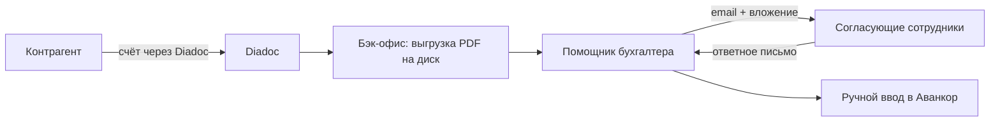
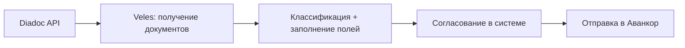

# Veles — автоматизация документооборота УК ПИФ

> Справочный документ проекта. Использовать как контекст при разработке прототипа.

## 1. Обзор

**Veles** — IT-продукт для автоматизации рутинных операций управляющей компании паевых инвестиционных фондов (ПИФ).

**Роль консультанта:** разработка прототипа системы, которая сокращает ручной труд бухгалтерского отдела и отдела сопровождения операций.

**Масштаб:** в управлении компании находится около **20 фондов**. Автоматизация распознавания и внесения документов критична для скорости работы и масштабирования бизнеса.

---

## 2. Контекст бизнеса

Управляющая компания занимается управлением недвижимостью, в том числе **коммерческой недвижимостью**.

### 2.1. Блок: обслуживание зданий

- Найм персонала (обслуживание, охрана, ремонт торговых помещений)
- Оплата коммунальных и прочих расходов (вода, газ, электричество и т.д.)
- Прочие операционные расходы по объектам

### 2.2. Блок: сдача помещений в аренду

- Взаимодействие с арендаторами
- Выставление счетов
- Подписание актов и прочих документов с арендаторами

---

## 3. Текущий процесс (as-is)



### Шаги

1. Подрядчик или контрагент присылает счёт (или другой документ) через **Diadoc** (используются защищённые цифровые подписи — поэтому выбран именно этот канал).
2. Сотрудники бэк-офиса **выгружают PDF** из Diadoc в папку на диске.
3. PDF передаётся **помощнику бухгалтера**.
4. Помощник бухгалтера **отправляет файл по email** на согласование нескольким сотрудникам и **ждёт ответного письма** с согласованием.
5. После согласования помощник бухгалтера **вручную заводит счёт** в **Аванкор** (программа на базе 1С, специализированная для управления ПИФами).

### Проблемы

- Лишние операции пересылки файлов по почте
- Согласование через email без единого статуса и истории
- Ручной ввод данных из PDF в Аванкор
- Процесс плохо масштабируется при росте числа фондов и документов

---

## 4. Целевое решение (to-be)

Единый веб-сервис, который:

1. Получает документы из **Diadoc** по API
2. Показывает список документов и позволяет классифицировать их
3. Отображает PDF и форму для ввода/проверки реквизитов
4. Отправляет документ на **согласование** внутри системы (без email)
5. После согласования создаёт документ в **Аванкор**



---

## 5. Функциональные требования прототипа

### 5.1. Получение документов из Diadoc

- Кнопка «Получить документы»
- Отображение списка входящих документов на веб-форме
- Diadoc предоставляет API для получения и отправки документов

### 5.2. Классификация документа

Пользователь выбирает тип документа:

| Тип | Примечание |
|-----|------------|
| Счёт | |
| Акт | |
| УПД | Универсальный передаточный документ |
| Товарооборот | |

Для разных типов — **разный набор полей** формы.

### 5.3. Просмотр и заполнение реквизитов

- Отображение PDF документа
- Поля для ручного ввода (на первом этапе), например:
  - **Юр. лицо**
  - **Сумма счёта**
  - **Период по счёту**
- Кнопка «Согласовать» — документ уходит на согласование нескольким пользователям

### 5.4. Согласование

- Несколько согласующих получают задачу в системе (не по email)
- Инициатор видит статус согласования
- После полного согласования доступна следующая операция

### 5.5. Отправка в Аванкор

- Кнопка «Отправить в Аванкор»
- Сервис создаёт соответствующий документ в **«Аванкор: Паевые фонды»**
- Способ интеграции: HTTP-сервис в 1С (рекомендуется) — см. [INTEGRATION_AVANKOR.md](./INTEGRATION_AVANKOR.md)

### 5.6. Авторизация

- Настройка аутентификации пользователей
- Разграничение ролей (инициатор, согласующий, администратор — уточнить)

---

## 6. Будущее развитие (не прототип, но заложить в архитектуру)

### 6.1. Распознавание документов (OCR / VLM)

- Использование модели распознавания, например **QwenVL**
- Поля формы заполняются автоматически
- Пользователь **валидирует** распознанные данные и подтверждает

### 6.2. Масштабирование на ~20 фондов

- Привязка документа к конкретному фонду / юр. лицу
- Единый процесс для всех фондов с фильтрацией и маршрутизацией

---

## 7. Технический стек (предварительно)

| Компонент | Выбор | Обоснование |
|-----------|-------|-------------|
| UI / веб-приложение | **Streamlit** | Быстрый прототип; удобная интеграция с LLM/VLM |
| Diadoc | REST API (Kontur) | См. [INTEGRATION_DIADOC.md](./INTEGRATION_DIADOC.md) |
| Аванкор | HTTP-сервис 1С («Аванкор: Паевые фонды») | См. [INTEGRATION_AVANKOR.md](./INTEGRATION_AVANKOR.md) |
| Распознавание (v2) | QwenVL или аналог | Автозаполнение полей из PDF |
| Авторизация | TBD | Streamlit-совместимое решение |

---

## 8. Интеграции — открытые вопросы

- [ ] Доступ к **Diadoc API** — см. [INTEGRATION_DIADOC.md](./INTEGRATION_DIADOC.md)
- [ ] HTTP-сервис в **«Аванкор: Паевые фонды»** — см. [INTEGRATION_AVANKOR.md](./INTEGRATION_AVANKOR.md)
- [ ] Маппинг полей формы → сущности Аванкор (имя документа, реквизиты)
- [ ] Список согласующих: фиксированный по типу документа / по фонду / настраиваемый
- [ ] Хранение PDF и метаданных (локально / S3 / БД)
- [ ] Требования к аудиту и журналу действий

---

## 9. Пользователи и роли (черновик)

| Роль | Действия |
|------|----------|
| Помощник бухгалтера / бэк-офис | Получение документов, классификация, заполнение полей, запуск согласования, отправка в Аванкор |
| Согласующий | Просмотр документа, approve / reject |
| Администратор | Пользователи, маршруты согласования, настройки интеграций |

---

## 10. Этапы разработки прототипа

### Этап 1 — Каркас

- Streamlit-приложение, базовая навигация
- Заглушка авторизации
- Модель данных документа (тип, статус, поля, PDF)

### Этап 2 — Diadoc

- Интеграция с Diadoc API: список входящих, скачивание PDF
- UI: кнопка «Получить документы», таблица документов

### Этап 3 — Обработка документа

- Выбор типа документа
- Просмотр PDF + форма полей (разные наборы по типу)
- Сохранение черновика

### Этап 4 — Согласование

- Workflow согласования внутри приложения
- Статусы: новый → на согласовании → согласован → отклонён

### Этап 5 — Аванкор

- Исследование интеграции
- Создание документа в Аванкор по кнопке

### Этап 6 (опционально) — VLM

- Автозаполнение полей из PDF через QwenVL
- UI подтверждения распознанных данных

---

## 11. Структура репозитория (план)

```
veles/
├── PROJECT.md          # этот файл
├── README.md           # краткое описание и запуск
├── app/                # Streamlit-приложение
├── integrations/       # Diadoc, Аванкор
├── models/             # доменные модели, типы документов
├── config/             # настройки, секреты (.env)
└── tests/
```

---

## 12. Глоссарий

| Термин | Описание |
|--------|----------|
| **ПИФ** | Паевой инвестиционный фонд |
| **УК** | Управляющая компания |
| **Diadoc** | Система электронного документооборота с ЭЦП |
| **Аванкор** | «Аванкор: Паевые фонды» — ПО на базе 1С для учёта ПИФ |
| **УПД** | Универсальный передаточный документ |
| **VLM** | Vision Language Model — модель для понимания изображений/PDF |

---

*Последнее обновление: 2025-06-14*
