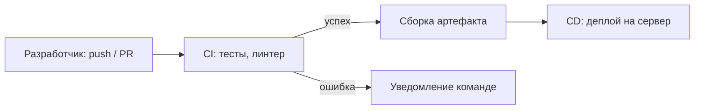

# Veles — технические требования и инфраструктура

> Предполагаемые технические условия, которые должны быть настроены для разработки, тестирования и эксплуатации системы Veles.

См. также: [PROJECT.md](./PROJECT.md) — функциональный план; [IMPLEMENTATION_RECOMMENDATIONS.md](./IMPLEMENTATION_RECOMMENDATIONS.md) — организация проекта; [INTEGRATION_DIADOC.md](./INTEGRATION_DIADOC.md), [INTEGRATION_AVANKOR.md](./INTEGRATION_AVANKOR.md) — интеграции.

---

## 1. Обзор

Для реализации Veles помимо прикладного кода необходимо подготовить:

| Область                  | Что настраивается                               |     |
| ------------------------ | ----------------------------------------------- | --- |
| **Репозиторий и CI/CD**  | GitHub, автоматическая сборка и проверки        |     |
| **Сервер приложения**    | Python, Streamlit, доступ к БД и интеграциям    |     |
| **Сервер распознавания** | GPU, QwenVL для извлечения полей из PDF         |     |
| **База данных**          | Хранение метаданных, статусов, аудита           |     |
| **Интеграции**           | Diadoc API, HTTP-сервис «Аванкор: Паевые фонды» |     |
| **Команда**              | Разработка, ML, БД, интеграции, тестирование    |     |

---

## 2. GitHub и репозиторий

### 2.1. Требования к репозиторию

- Единый репозиторий `veles` (монорепозиторий прототипа) в **GitHub** организации УК или подрядчика.
- Ветвление: `main` — стабильная ветка; `develop` или feature-ветки — разработка.
- Защита ветки `main`: merge только через pull request, обязательное прохождение CI.
- Секреты (токены Diadoc, ключи Аванкор, пароли БД) — **не в коде**; хранение в GitHub Secrets / `.env` на сервере.
- `.gitignore` для `.env`, `__pycache__`, локальных PDF с реальными данными.

### 2.2. Что хранится в репозитории

| Каталог / файл | Назначение |
|----------------|------------|
| `app/` | Streamlit-приложение |
| `integrations/` | Клиенты Diadoc, Аванкор |
| `models/` | Доменные модели документов |
| `config/` | Настройки, шаблоны `.env.example` |
| `tests/` | Автотесты |
| `*.md` | Проектная и техническая документация |

---

## 3. CI/CD

### 3.1. Что такое CI/CD

**CI/CD** (*Continuous Integration / Continuous Delivery* — непрерывная интеграция и доставка) — набор практик и автоматизации, при которых изменения в коде регулярно собираются, проверяются и доставляются на тестовый или продуктивный сервер.

| Этап | Суть | Зачем Veles |
|------|------|-------------|
| **CI** (Continuous Integration) | При каждом push/PR автоматически запускаются проверки: линтер, тесты, сборка | Раннее обнаружение ошибок до попадания в `main` |
| **CD** (Continuous Delivery / Deployment) | После успешного CI артефакт разворачивается на dev/stage/prod | Быстрый и предсказуемый выпуск новых версий без ручного копирования файлов |

### 3.2. Рекомендуемый CI/CD-процесс для Veles

Инструмент: **GitHub Actions** (нативно для GitHub).

| Триггер | Действия |
|---------|----------|
| Pull Request | `pip install`, `pytest`, линтер (`ruff` / `flake8`), проверка импортов |
| Merge в `main` | Сборка Docker-образа (опционально), деплой на **dev** |
| Тег / ручной запуск | Деплой на **stage** или **prod** с подтверждением |

Минимальный pipeline на этапе прототипа:

1. Установка Python 3.11+.
2. `pip install -r requirements.txt`.
3. Запуск `pytest`.
4. (Позже) Проверка типов `mypy`, сканирование зависимостей на уязвимости.

Для CD потребуется **DevOps-инженер** или администратор, настраивающий runner, секреты и целевые серверы.

---

## 4. Сервер приложения (Python)

### 4.1. Назначение

Хостинг Streamlit-приложения Veles: UI, workflow согласования, вызовы API Diadoc и Аванкор, очередь задач на распознавание.

### 4.2. Предполагаемые требования

| Параметр | Прототип / dev | Stage / prod (ориентир) |
|----------|----------------|-------------------------|
| ОС | Linux (Ubuntu 22.04 LTS или аналог) | Linux LTS |
| CPU | 2 vCPU | 4+ vCPU |
| RAM | 4 GB | 8+ GB |
| Диск | 40 GB SSD | 100+ GB SSD (PDF, логи, бэкапы) |
| Python | 3.11+ | 3.11+ |
| Сеть | HTTPS, исходящий доступ к Diadoc API | То же + ограничение по IP при необходимости |

### 4.3. Программное окружение

- Python, `venv` или Docker-контейнер.
- **Streamlit** — веб-интерфейс.
- Зависимости из `requirements.txt`.
- Reverse proxy (**nginx** / **Caddy**) перед Streamlit для HTTPS и единой точки входа.
- Переменные окружения: `VELES_AUTH_*`, URL БД, токены интеграций.

### 4.4. Дополнительно на prod

- Мониторинг доступности (health-check).
- Ротация логов, резервное копирование БД и каталога PDF.
- Журнал аудита действий пользователей (требование из [PROJECT.md](./PROJECT.md)).

---

## 5. Сервер распознавания (QwenVL)

### 5.1. Назначение

Отдельный узел для **Vision Language Model** — автоматическое извлечение реквизитов из PDF (счёт, УПД, акт и т.д.). На этапе 6 разработки ([PROJECT.md](./PROJECT.md)); архитектуру заложить заранее.

### 5.2. Требования к железу

Модели семейства **Qwen-VL** требуют **GPU с достаточным объёмом видеопамяти (VRAM)**.

| Параметр | Минимум (dev / эксперименты) | Рекомендуется (prod) |
|----------|------------------------------|----------------------|
| GPU | NVIDIA с **≥ 16 GB VRAM** (например, RTX 4090, A10) | **≥ 24 GB VRAM** (A10 24GB, L4, A100) |
| RAM | 32 GB | 64 GB |
| CPU | 8 vCPU | 16 vCPU |
| Диск | 100 GB SSD (модель + кэш) | 200+ GB NVMe |
| CUDA | Совместимый драйвер NVIDIA + CUDA toolkit | То же |

Точные требования уточняются **data scientist** после выбора конкретной версии Qwen-VL (размер модели, квантизация, batch size).

### 5.3. Программное окружение

- Python 3.10+.
- **PyTorch** с поддержкой CUDA.
- Библиотеки для инференса VLM (Hugging Face Transformers, vLLM или аналог).
- Отдельный **HTTP/gRPC-сервис** распознавания: приложение Veles отправляет PDF/страницы, получает JSON с полями.
- Изоляция от публичного интернета: доступ только с сервера приложения.

### 5.4. Эксплуатация

- Очередь задач при пиковой нагрузке (много документов из Diadoc).
- Логирование качества распознавания для дообучения и настройки промптов.
- План обновления модели без простоя критичного процесса (blue-green или canary).

---

## 6. База данных

### 6.1. Назначение

Хранение метаданных документов, статусов согласования, пользователей, маршрутов, журнала аудита. PDF — в файловом хранилище или object storage (S3-совместимое); в БД — ссылки и метаданные.

### 6.2. Предполагаемый выбор

| Вариант        | Когда уместен                                               |
| -------------- | ----------------------------------------------------------- |
| **PostgreSQL** | Prod: надёжность, JSON-поля, аудит, ~20 фондов              |
| SQLite         | Только локальный прототип без многопользовательского режима |

### 6.3. Задачи администратора БД

- Развёртывание и настройка PostgreSQL (репликация, бэкапы).
- Роли и права доступа для приложения (минимальные привилегии).
- Миграции схемы (Alembic или аналог).
- Мониторинг размера БД, индексы, план восстановления.

---

## 7. Интеграции

### 7.1. Diadoc

| Требование | Ответственный |
|------------|---------------|
| Доступ к API Kontur Diadoc (ключи, ящик организации) | Настройщик Diadoc + заказчик |
| Исходящие запросы с сервера Veles к API | Python-разработчик |
| Соответствие требованиям ЭЦП и хранения документов | ИБ / юрист (при необходимости) |

Подробности: [INTEGRATION_DIADOC.md](./INTEGRATION_DIADOC.md).

### 7.2. «Аванкор: Паевые фонды» (1С)

| Требование | Ответственный |
|------------|---------------|
| Публикация **HTTP-сервиса** в конфигурации 1С | Разработчик / настройщик 1С |
| Маппинг полей Veles → документы Аванкор | Настройщик 1С + бизнес-аналитик |
| Тестовый и продуктивный контуры 1С | Администратор 1С |

Подробности: [INTEGRATION_AVANKOR.md](./INTEGRATION_AVANKOR.md).

---

## 8. Команда для реализации

### 8.1. Обязательные роли

| Роль | Задачи в проекте Veles |
|------|------------------------|
| **Python-разработчик** | Streamlit UI, бизнес-логика, workflow согласования, клиенты Diadoc/Аванкор, API к сервису распознавания, тесты |
| **Data scientist / ML-инженер** | Выбор и настройка Qwen-VL, промпты под типы документов (счёт, УПД, акт), оценка точности, дообучение при необходимости |
| **Администратор баз данных (DBA)** | PostgreSQL: установка, бэкапы, миграции, производительность, безопасность |
| **Настройщик интеграции Diadoc** | Получение доступа к API, настройка ящика, сертификаты, согласование с Kontur |
| **Настройщик 1С / Аванкор** | HTTP-сервис в 1С, создание документов из Veles, тестирование на тестовой базе |
| **Тестировщики от бизнеса** | Приёмочное тестирование на реальных PDF: полнота полей, маршруты согласования, корректность данных в Аванкор |

### 8.2. Дополнительные роли (рекомендуется)

| Роль | Зачем нужен |
|------|-------------|
| **Руководитель проекта** | Сроки, требования, документация — см. [IMPLEMENTATION_RECOMMENDATIONS.md](./IMPLEMENTATION_RECOMMENDATIONS.md) |
| **DevOps / инженер инфраструктуры** | GitHub Actions, Docker, деплой, nginx, мониторинг, секреты |
| **Администратор 1С** | Обновления платформы, права, резервное копирование баз Аванкор |
| **Специалист по информационной безопасности** | Аутентификация, разграничение ролей, аудит, работа с ЭЦП и персональными данными |
| **Бизнес-аналитик / методолог учёта** | Формализация полей по типам документов, соответствие учётной политике УК ПИФ |
| **Технический лид / архитектор** | Целевая архитектура при масштабировании на ~20 фондов, границы сервисов |

### 8.3. Сводка по этапам

| Этап (PROJECT.md) | Ключевые роли |
|-------------------|---------------|
| 1–4 — каркас, Diadoc, обработка, согласование | Python-разработчик, DBA, настройщик Diadoc, DevOps |
| 5 — Аванкор | + настройщик 1С, тестировщики от бизнеса |
| 6 — QwenVL | + data scientist, GPU-сервер, DevOps |

---

## 9. Среды развёртывания

| Среда | Назначение | Состав |
|-------|------------|--------|
| **Local** | Разработка на машине разработчика | Python venv, локальные PDF, заглушки API |
| **Dev** | Интеграционная отладка | Сервер приложения, тестовая БД, sandbox Diadoc / копия 1С |
| **Stage** | Предпрод, приёмка бизнесом | Конфигурация близка к prod, обезличенные или ограниченные реальные данные |
| **Prod** | Эксплуатация УК | Полный контур: приложение, БД, GPU-сервис, prod Diadoc и Аванкор |

---

## 10. Чек-лист готовности инфраструктуры

- [ ] Репозиторий GitHub создан, настроены права и защита `main`
- [ ] GitHub Actions: CI на pull request (тесты, линтер)
- [ ] CD: деплой на dev-сервер после merge
- [ ] Сервер приложения: Python, Streamlit, nginx, HTTPS
- [ ] PostgreSQL: инстанс, бэкапы, учётная запись для приложения
- [ ] Хранилище PDF (диск / S3) и политика хранения
- [ ] Доступ к Diadoc API настроен и проверен
- [ ] HTTP-сервис Аванкор опубликован на тестовой базе 1С
- [ ] GPU-сервер для QwenVL (на этапе распознавания)
- [ ] Секреты вынесены из кода (GitHub Secrets / vault)
- [ ] Назначены ответственные по ролям из раздела 8

---

## 11. Открытые технические вопросы

- [ ] Docker vs bare-metal для Streamlit и VLM-сервиса
- [ ] Единый сервер vs отдельные VM для app / ML / БД
- [ ] Object storage (MinIO, S3) для PDF на prod
- [ ] SSO / LDAP для авторизации вместо логина-пароля
- [ ] SLA и RTO/RPO для БД и документов

---

*Последнее обновление: 2025-06-14*
